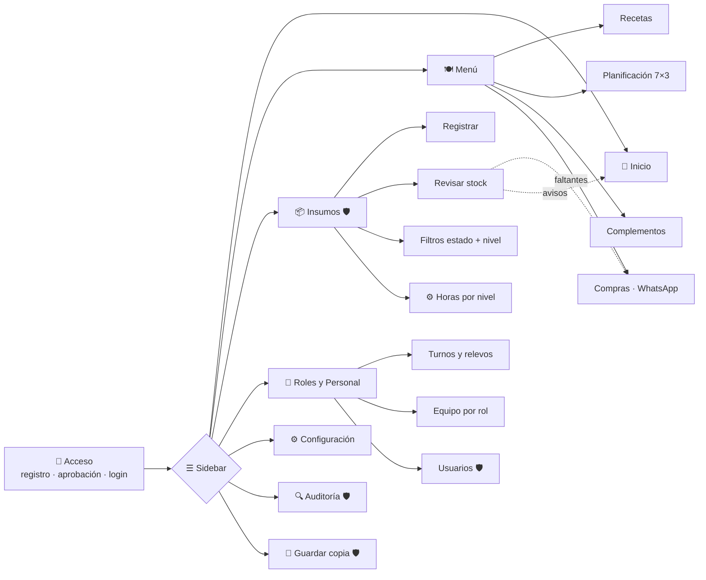
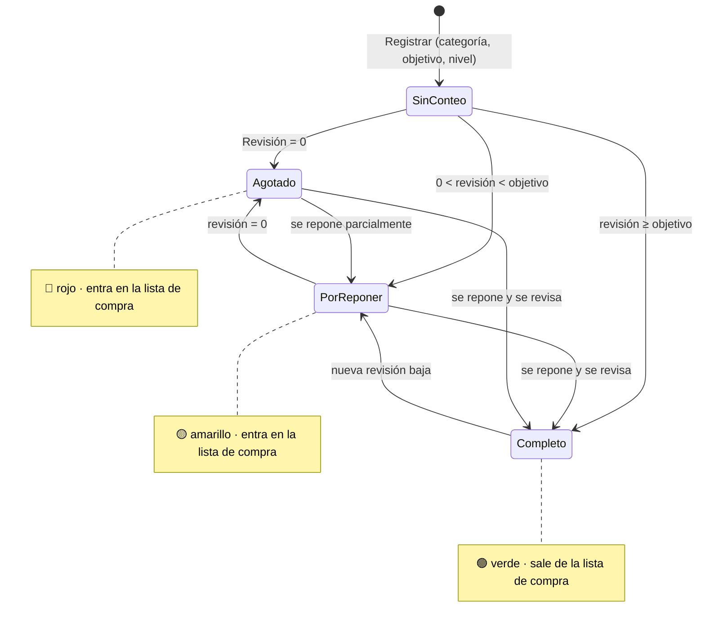
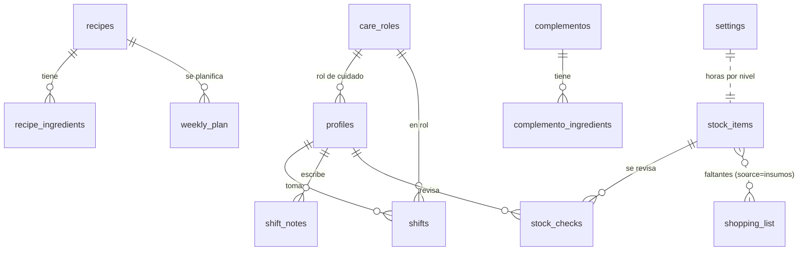

# CuidApp — Plano del MVP

Qué tiene hoy la aplicación, en una página. Los diagramas se muestran directamente en GitHub.

## 1. Propuesta de valor

> Un solo lugar, desde el iPhone, para que el equipo que cuida a un paciente en casa sepa **qué hay que comprar, qué insumos revisar, qué come hoy el paciente y quién está a cargo**, con un registro de todo lo que se hizo.

| Para | Problema que resuelve |
|---|---|
| Familia y cuidadores | Coordinar turnos, relevos y comidas sin depender de chats dispersos |
| Administrador del cuidado | Que nunca falte un insumo crítico: revisiones periódicas según la prioridad y reposición automática en la lista de compra |
| Todos | Trazabilidad: quién hizo qué y cuándo |

## 2. Mapa de módulos

🛡️ = solo administrador.

## 3. Funcionalidades incluidas

| Módulo | Incluye |
|---|---|
| **Acceso** | Registro con aprobación de un admin · login · recuperación de contraseña · dos roles (admin / cuidador) |
| **Navegación** | Sidebar: cajón en iPhone, fijo desde 900 px · opciones según rol · campana de alertas · contador de revisiones pendientes |
| **Inicio** | Avisos de insumos por revisar y por reponer · resumen de insumos · menú de hoy · lista de compra · notas de relevo · alertas · accesos rápidos |
| **Menú** | Recetario con ingredientes · planificación semanal de desayuno, almuerzo y cena · complementos con disponibilidad ("Se acabó") · lista de compras consolidada · envío por WhatsApp y copia |
| **Insumos** | 6 categorías · stock objetivo · prioridad 1/2/3 · revisión con − / + · historial con consumo o reposición · color por estado (verde / amarillo / rojo / gris) · filtros por estado y nivel · horas por nivel configurables · editar y eliminar · sincronización con la lista de compra |
| **Roles y Personal** | Roles de cuidado (7 predeterminados + propios) · tomar, cambiar y cerrar turno · notas de entrega · historial de turnos · aprobar y desactivar cuentas · cambiar permisos |
| **Configuración** | Perfil propio · nombre del paciente y contacto de emergencia · exportación JSON · cerrar sesión |
| **Auditoría** | Registro automático de todo cambio · lenguaje llano · filtros por módulo, usuario y fechas · purga de más de 24 meses |
| **Plataforma** | PWA instalable · pensada para Safari en iPhone (sin zoom al escribir, zonas seguras, botones de 44 px) · aviso sin conexión |

## 4. Ciclo de un insumo

Además del estado de stock, cada insumo pasa a **"Revisar ahora"** cuando se cumplen las horas de su nivel (por defecto 24 / 48 / 72).

## 5. Modelo de datos en uso

Además: `audit_log` (todo cambio), `settings` y `patient_status` (una fila cada una).

## 6. Arquitectura en una línea

`iPhone (PWA)` → `Vercel (HTML/CSS/JS estático)` → `Supabase (Auth + PostgreSQL + RLS + triggers de auditoría)`

## 7. Fuera del MVP actual

| Idea | Estado |
|---|---|
| Registrar entradas o compras de insumos (para distinguir consumo de reposición) | Propuesta, no implementada |
| Stock mínimo de alerta, distinto del objetivo | Propuesta |
| Unidad de medida y vencimientos de medicamentos | Propuesta |
| Permisos de Insumos para cuidadores | Pendiente de definir |
| Notificaciones push y recordatorios | No incluido |
| Modo sin conexión con sincronización | No incluido |
| Dosis, tareas, agenda médica, gastos, inventario por ubicaciones | Retirados en `fix-analisis` |

## 8. Pendientes conocidos

Detalle en la [documentación técnica §9–10](DOCUMENTACION-TECNICA.md#9-límites-y-problemas-conocidos):

1. El borrado en lote de la lista de compra no se guarda en Supabase.
2. Las categorías y la disponibilidad de complementos se guardan solo en cada teléfono.
3. La insignia de estado del paciente no tiene editor, y el contacto de emergencia ya no se usa.
4. Hay tablas heredadas de los módulos retirados en la base de datos.
