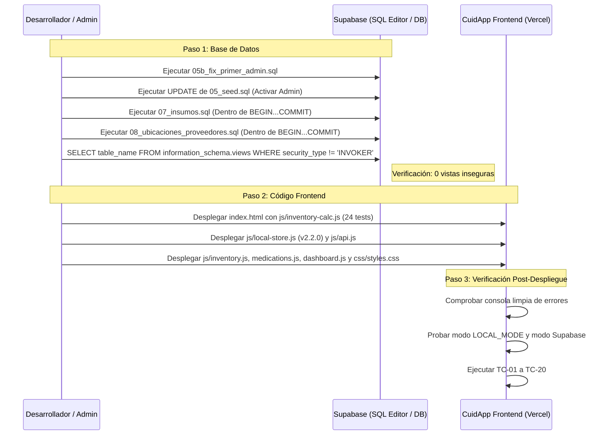

# 📋 Plan de Implementación Definitivo: Módulo «Gestión Insumos» (CuidApp v2)

> **Versión:** 3.1 (Incorporación Vinculante de la Adenda: Gestión de Ubicaciones y Proveedores)  
> **Fuentes de Verdad:** `ADENDA_ANTIGRAVITY_ubicaciones_proveedores.md` > `PROMPT_ANTIGRAVITY_modulo_insumos.md` > `supabase/08_ubicaciones_proveedores.sql` > `supabase/07_insumos.sql` > `js/inventory-calc.js` (24 pruebas) > Código Base CuidApp v2  
> **Política de Seguridad:** Corrección clínica y protección del historial sobre la velocidad. Cero bloqueos de dosis al paciente por inconsistencias contables.  

---

## 📌 Cambios Respecto a la Versión Anterior del Plan (v3.0 ➔ v3.1)

En cumplimiento estricto de la Adenda sobre **Gestión de Ubicaciones y Proveedores**, se incorporan los siguientes cambios integrales:

1. **Nuevo Archivo Fuente de Verdad:**
   - Se incorpora [supabase/08_ubicaciones_proveedores.sql](file:///c:/Users/LilianaSiracusa/OneDrive%20-%20Parmenides,%20S.A/Documentos/Documentos/101_Proyectos/Antigravity/CuidApp/supabase/08_ubicaciones_proveedores.sql) como script SQL inmutable de máxima prioridad junto a 07.
   - Nuevo orden de despliegue en Supabase: **`05b_fix_primer_admin.sql` $\rightarrow$ Repetir `UPDATE` de 05 $\rightarrow$ `07_insumos.sql` $\rightarrow$ `08_ubicaciones_proveedores.sql`**.
2. **Motor de Cálculo Actualizado (24 Pruebas):**
   - [js/inventory-calc.js](file:///c:/Users/LilianaSiracusa/OneDrive%20-%20Parmenides,%20S.A/Documentos/Documentos/101_Proyectos/Antigravity/CuidApp/js/inventory-calc.js) y [js/inventory-calc.test.js](file:///c:/Users/LilianaSiracusa/OneDrive%20-%20Parmenides,%20S.A/Documentos/Documentos/101_Proyectos/Antigravity/CuidApp/js/inventory-calc.test.js) actualizados. `summarizeItemStock` ahora ignora ubicaciones archivadas al evaluar antigüedad de conteos y devuelve `archivedWithStock`. Requiere que cada ubicación pasada al contexto posea su propiedad booleana `active`.
3. **Fases Afectadas y Tareas Añadidas:**
   - **Fase 1 (Base de Datos):** Incluye la aplicación y validación de `08_ubicaciones_proveedores.sql` y sus triggers (`guard_supply_location`, `guard_supply_supplier`, `require_active_location`, `require_active_supplier`).
   - **Fase 3 (`LocalStore`):** Añade la emulación atómica de `archive_supply_location` (con traslado completo de stock y reubicación de referencias), `restore_supply_location`, `set_special_location` (restringido a admin local), `archive_supply_supplier` y `restore_supply_supplier`. Bloqueo estricto de movimientos y asignaciones hacia entidades archivadas.
   - **Fase 4 (`api.js`):** Nuevos métodos para CRUD, archivo, restauración y asignación especial de ubicaciones y proveedores. Mapeo ampliado de `supply_locations_view` (`hasHistory`, `itemsWithStock`, `itemsDefault`, etc.). Patrones específicos en `traducirError` para prefijos `UBICACION_*` y `PROVEEDOR_*`. `getSupplyPlanContext` incluye **todas** las ubicaciones con su campo `active`.
   - **Fase 9 (Catálogo / Pestaña 4):** Se añade la sección «Ubicaciones y Proveedores» con:
     * Lista de ubicaciones con badge de estado, funciones especiales y filtro «Mostrar archivadas».
     * **Asistente de Archivación de Ubicación en 3 pasos:** 1) Mostrar dependencias; 2) Seleccionar ubicación activa destino; 3) Confirmar y procesar traslado masivo.
     * Restricción: Borrar solo si `has_history = false` y no es especial; Habitación y Armario protegidos contra borrado/archivo; reasignación de función especial exclusiva para `admin`.
     * Gestión de proveedores con control de pedidos en tránsito (`PROVEEDOR_CON_PEDIDOS`) y reasignación de insumos huérfanos.
   - **Fases 6, 7 y 8 (Pestañas 1, 2 y 3):** Filtrado de ubicaciones y proveedores archivados en todos los selectores de captura, recepción y traslados, manteniéndolos visibles en históricos con etiqueta «[Archivada]».
4. **Matriz de Pruebas Ampliada:** Se integran 7 nuevos casos de prueba específicos (**TC-14 a TC-20**) para ciclo de vida de ubicaciones y proveedores.
5. **Nuevas Preguntas Abiertas:** Añadidas preguntas sobre roles para archivar y tiempo de visibilidad en filtros históricos.

---

## 1. Resumen de la Arquitectura Resultante (Máx. 10 líneas)

El módulo «Gestión Insumos» transforma CuidApp en un sistema de inventario clínico de doble capa guiado por un libro contable *append-only* (`inventory_movements`), donde el stock visible es una caché derivada de solo lectura que rechaza mutaciones directas (`STOCK_LEDGER`). El motor matemático puro `InventoryCalc` (24 pruebas) calcula coberturas, semáforos de 6 estados y órdenes sugeridas a partir del consumo real y pautas médicas, ignorando ubicaciones archivadas. La interfaz móvil se organiza en 4 pestañas accesibles (Relevo Habitación <30s con omisión no bloqueante, Auditoría a Demanda de Otras Ubicaciones, Kanban Antiduplicidad con bloqueo previo a WhatsApp, y Catálogo con sección de Ubicaciones/Proveedores con asistente de archivado). La arquitectura opera bajo dos modos mutuamente excluyentes (`LOCAL_MODE` en `localStorage` con migración 2.2.0 y modo remoto sobre PostgreSQL 16 / Supabase con RLS y RPCs seguras), garantizando idempotencia estricta mediante `clientEventId`.

---

## 2. Inventario de Archivos y Análisis de Riesgo

| Archivo | Tipo de Cambio | Riesgo | Justificación y Medidas de Mitigación |
| :--- | :---: | :---: | :--- |
| `supabase/05b_fix_primer_admin.sql` | Existente | Bajo | Corrige `guard_profile_update` para permitir activación del primer admin en SQL Editor. |
| `supabase/07_insumos.sql` | Existente | Alto | Transaccional (`begin...commit`). Crea tablas maestras, vistas, RPCs y adapta transacciones de dosis y restock. Inmutable. |
| `supabase/08_ubicaciones_proveedores.sql` | **Nuevo (Existente)** | Alto | Transaccional. Ciclo de vida de ubicaciones y proveedores, guardas de seguridad, traslados masivos atómicos en archivado. Inmutable. |
| `js/inventory-calc.js` | **Actualizado (24 tests)** | Crítico | Motor de cálculo puro. `summarizeItemStock` actualizado para ignorar ubicaciones archivadas. |
| `js/inventory-calc.test.js` | **Actualizado (24 tests)** | Bajo | Suite de 24 pruebas unitarias de cálculo puro (`node --test`). |
| `index.html` | Modificado | Medio | Carga de `inventory-calc.js` antes de `local-store.js` y maquetación de `#panel-inventory` con las 4 pestañas. |
| `css/styles.css` | Modificado | Bajo | Touch targets $\ge 48\text{px}$, semáforo accesible con gris «desconocido», estilos de wizard de archivado y chips de estado. |
| `js/local-store.js` | Modificado | Crítico | Migración v2.2.0, 7 colecciones nuevas, emulación fiel de RPCs de 07 y 08 (incluyendo `archive_supply_location`), retiro de bloqueo en dosis. |
| `js/api.js` | Modificado | Crítico | Mapeos camelCase, métodos de ubicaciones/proveedores, ampliación de `traducirError` con prefijos, corrección de alertas duplicadas. |
| `js/inventory.js` | Reescrito / Modular | Alto | Implementación de los 5 controladores clínicos (`SharedState`, `RoomRelay`, `OtherLocations`, `Kanban`, `SpotCatalog` con subsección Ubicaciones/Proveedores). |
| `js/medications.js` | Modificado | Medio | Retiro de campo editable `currentStock` en modal para evitar error `STOCK_LEDGER`. |
| `js/dashboard.js` | Modificado | Medio | Inserción del widget modular con contadores reactivos y selector de vaciado de cilindro. |
| `js/administration.js` | Verificado | Bajo | No requiere cambios directos en llamadas; se beneficia del no bloqueo en la capa de datos. |

---

## 3. Fases de Implementación

### Fase 0: Correcciones Previas de Infraestructura y Fechas Locales
* **Objetivo:** Subsanar vulnerabilidades y anomalías críticas de fecha en la base existente antes de desplegar insumos.
* **Tareas Concretas:**
  1. **Activación Admin en Supabase:** Ejecutar `supabase/05b_fix_primer_admin.sql` en el proyecto Supabase, seguido del `UPDATE` de activación de `05_seed.sql`.
  2. **Corrección de Fechas Locales:** Sustituir `todayStr()` en `js/api.js` (L73) y `js/local-store.js` (L25) por `localDateStr()` basado en la fecha local del paciente para evitar el salto artificial a "mañana" a partir de las 19:00–20:00 locales.
* **Archivos:** `supabase/05b_fix_primer_admin.sql`, `js/api.js`, `js/local-store.js`.
* **Criterios de Aceptación:** `localDateStr()` a las 23:30 locales devuelve la fecha local actual. El primer admin queda activo en Supabase.
* **Riesgo:** Alto en programación de tareas/dosis si no se prueba exhaustivamente.
* **Cómo revertir:** Restaurar función `todayStr()` original.

---

### Fase 1: Base de Datos y Verificación en Supabase de Pruebas (07 y 08)
* **Objetivo:** Desplegar y validar `supabase/07_insumos.sql` y `supabase/08_ubicaciones_proveedores.sql` asegurando cero vistas inseguras y triggers íntegros.
* **Tareas Concretas:**
  1. Ejecutar en transacción `supabase/07_insumos.sql` en el proyecto Supabase de prueba.
  2. Ejecutar en transacción `supabase/08_ubicaciones_proveedores.sql`.
  3. Ejecutar la consulta de verificación de seguridad:
     ```sql
     select table_name, security_type from information_schema.views 
     where table_schema = 'public' and security_type != 'INVOKER';
     ```
     Debe retornar exactamente 0 filas.
  4. Comprobar que las guardas y triggers de 08 operen:
     - `guard_supply_location`: bloquea borrado/archivo de `Habitación` y `Armario` (`UBICACION_ESPECIAL`); bloquea mutaciones directas de `active` (`UBICACION_ESTADO`).
     - `require_active_location`: impide asignar o mover stock a una ubicación archivada (`UBICACION_ARCHIVADA`).
     - `guard_supply_supplier`: impide borrar proveedores con historial (`PROVEEDOR_CON_HISTORIAL`) o mutar `active` sin RPC (`PROVEEDOR_ESTADO`).
     - `archive_supply_location`: traslada stock, reubica insumos y archiva atómicamente.
* **Archivos:** `supabase/07_insumos.sql`, `supabase/08_ubicaciones_proveedores.sql`.
* **Criterios de Aceptación:** Ambas migraciones finalizan con `COMMIT`. Cero vistas inseguras.
* **Riesgo:** Conflicto de restricciones con datos previos.
* **Cómo revertir:** `ROLLBACK` de la transacción o reinstalar schema desde 01 a 06.

---

### Fase 2: Integración del Motor `InventoryCalc` (24 Pruebas)
* **Objetivo:** Incorporar la biblioteca de cálculo puro actualizada en el pipeline de la aplicación web y validar suites de prueba.
* **Tareas Concretas:**
  1. Verificar que `js/inventory-calc.js` esté presente y exporte globalmente `window.InventoryCalc` con soporte para ubicaciones archivadas.
  2. En `index.html`, agregar `<script src="js/inventory-calc.js"></script>` **antes** de `js/local-store.js`.
  3. Ejecutar las 24 pruebas de `js/inventory-calc.test.js` asegurando que pasen al 100%.
* **Archivos:** `index.html`, `js/inventory-calc.js`, `js/inventory-calc.test.js`.
* **Criterios de Aceptación:** `InventoryCalc` disponible en el navegador. 24 pruebas unitarias en verde.
* **Riesgo:** Mínimo.
* **Cómo revertir:** Quitar la etiqueta `<script>` en `index.html`.

---

### Fase 3: Capa de Datos Local (`LocalStore` v2.2.0)
* **Objetivo:** Emular fielmente el libro contable de 07 y el ciclo de vida de ubicaciones y proveedores de 08 en `LOCAL_MODE`.
* **Tareas Concretas:**
  1. **Migración `sanitizeAndMigrate`:** Elevar versión a `'2.2.0'` en `js/local-store.js`.
     - Sembrar colecciones: `supplyLocations`, `supplySuppliers`, `supplyRelays`, `supplyOrderBatches`, `supplyOrderLines`, `supplyOpenContainers`, `supplyExpiryRecords`.
     - Sembrar 3 ubicaciones obligatorias: `Habitación` (`isPointOfCare: true`, `active: true`), `Armario Central` (`isDefaultStorage: true`, `active: true`), `Nevera` (`active: true`).
     - Crear ítem de inventario para cada medicamento que no lo posea (`medicationId`).
     - Convertir `currentStock` existente de cada ítem en un movimiento inicial de tipo `count`.
     - Normalizar movimientos antiguos (`actorId` $\rightarrow$ `profileId`, `reason` $\rightarrow$ `note`).
  2. **Eliminar Bloqueo de Dosis:** En `LocalStore.recordAdministration`, suprimir la excepción por stock insuficiente y registrar consumo en negativo si es necesario.
  3. **Emulación de RPCs de 07:** `recordSupplyMovements`, `saveSupplyRelay`, `markSupplyInTransit`, `receiveSupplyOrderLine`, `cancelSupplyOrderLine`, `voidSupplyMovement`.
  4. **Emulación de RPCs de 08:**
     - `archive_supply_location(locationId, transferToId, note)`:
       * Si tiene stock o referencias activas y `transferToId` es null $\rightarrow$ lanzar error `UBICACION_CON_STOCK` con detalle.
       * Con destino válido $\rightarrow$ trasladar stock con movimientos `transfer`, saldar negativos a 0, mover `defaultLocationId` y `reserveLocationId` de insumos, reasignar pedidos en camino, envases abiertos y vencimientos, marcar `active = false` y `archivedAt = now`. Retornar resumen.
       * Si ya está archivada $\rightarrow$ retornar `{ alreadyArchived: true }`.
     - `restore_supply_location(locationId)`: reactivar (`active = true`, `archivedAt = null`).
     - `set_special_location(locationId, role)`: restringido a `admin` local. Desactiva la función previa y la asigna a la nueva ubicación.
     - `archive_supply_supplier(supplierId)`: rechazar si tiene pedidos en tránsito (`PROVEEDOR_CON_PEDIDOS`). Retornar `itemsStillAssigned`.
     - `restore_supply_supplier(supplierId)`: reactivar.
     - Rechazar inserciones de movimientos o asignaciones hacia ubicaciones archivadas (`UBICACION_ARCHIVADA`).
* **Archivos:** `js/local-store.js`.
* **Criterios de Aceptación:** Archivar una ubicación traslada su stock y dependencias íntegramente en modo local. La dosis no se bloquea por falta de stock.
* **Riesgo:** Alto de corrupción si la lógica de traslado en memoria no es atómica.
* **Cómo revertir:** Restaurar backup de `localStorage`.

---

### Fase 4: Capa de Acceso y Servicios (`js/api.js`)
* **Objetivo:** Exponer la API unificada del módulo tanto para Supabase como para `LocalAdapter` respetando el contrato camelCase.
* **Tareas Concretas:**
  1. **Actualización de `traducirError`:** Insertar patrones específicos **antes** de los genéricos:
     - `/UBICACION_ESPECIAL:\s*(.*)/` $\rightarrow$ muestra el mensaje en español extraído tras los dos puntos.
     - `/UBICACION_ESTADO:\s*(.*)/` $\rightarrow$ muestra el mensaje en español extraído tras los dos puntos.
     - `/UBICACION_ARCHIVADA:\s*(.*)/` $\rightarrow$ muestra el mensaje en español extraído tras los dos puntos.
     - `/UBICACION_CON_STOCK:\s*(.*)/` $\rightarrow$ muestra el mensaje en español extraído tras los dos puntos.
     - `/PROVEEDOR_CON_HISTORIAL:\s*(.*)/` $\rightarrow$ muestra el mensaje en español extraído tras los dos puntos.
     - `/PROVEEDOR_ESTADO:\s*(.*)/` $\rightarrow$ muestra el mensaje en español extraído tras los dos puntos.
     - `/PROVEEDOR_ARCHIVADO:\s*(.*)/` $\rightarrow$ muestra el mensaje en español extraído tras los dos puntos.
     - `/PROVEEDOR_CON_PEDIDOS:\s*(.*)/` $\rightarrow$ muestra el mensaje en español extraído tras los dos puntos.
     - `/violates foreign key constraint.*supply_locations/` $\rightarrow$ *"Esta ubicación tiene historial: archívala en lugar de borrarla."*
     - `/supply_locations_special_active_ck/` $\rightarrow$ *"El punto de uso y el almacén por defecto no se pueden archivar."*
     - Patrones de 07: `STOCK_LEDGER`, `one_open_order_per_item`, `supply_relays_not_future`, `No se puede cambiar la unidad`.
  2. **Métodos de Ubicaciones y Proveedores en `Api` y `LocalAdapter`:**
     - `getSupplyLocations({ includeArchived = false } = {})`: consulta `supply_locations_view` mapeando `hasHistory`, `itemsWithStock`, `itemsDefault`, `itemsReserve`, `ordersInTransit`.
     - `addSupplyLocation(data)`: inserta sin funciones especiales.
     - `updateSupplyLocation(id, data)`: omite estrictamente `active`, `isPointOfCare` e `isDefaultStorage`.
     - `deleteSupplyLocation(id)`: eliminación directa (falla si tiene FK).
     - `archiveSupplyLocation(id, transferToId, note)`: ejecuta RPC.
     - `restoreSupplyLocation(id)`: ejecuta RPC.
     - `setSpecialLocation(id, role)`: ejecuta RPC.
     - `getSupplySuppliers({ includeArchived = false } = {})`, `addSupplySupplier`, `updateSupplySupplier`, `deleteSupplySupplier`, `archiveSupplySupplier`, `restoreSupplySupplier`.
     - `getSupplyPlanContext()`: asegura incluir **todas** las ubicaciones (activas y archivadas) con su propiedad booleana `active`.
  3. **Métodos de Operaciones de Insumos:**
     - `recordSupplyMovements`, `saveSupplyRelay`, `markSupplyInTransit`, `receiveSupplyOrderLine`, `cancelSupplyOrderLine`, `voidSupplyMovement`, `uploadRelayPhoto`.
  4. **Filtro Antiduplicidad en Alertas (`getActiveAlerts`):** Excluir insumos con `medicationId`.
  5. **Actualizar `apiInstance` Proxy y `exportAllData`.**
* **Archivos:** `js/api.js`.
* **Criterios de Aceptación:** Todos los métodos de 07 y 08 responden idénticamente en ambos modos.
* **Riesgo:** Alto.
* **Cómo revertir:** Git checkout de `js/api.js`.

---

### Fase 5: Adaptación de Módulos Existentes (Medicamentos e Inventario Simple)
* **Objetivo:** Desacoplar la edición manual de stock en los formularios existentes.
* **Tareas Concretas:**
  1. En `js/medications.js`, convertir `currentStock` en campo de solo lectura con botón `[ Registrar Conteo ]`. Retirar `currentStock` del payload de `updateMedication`.
  2. En `js/inventory.js` (legado), retirar edición directa de stock; canalizar ajustes por `adjust_inventory`.
* **Archivos:** `js/medications.js`, `js/inventory.js`.
* **Criterios de Aceptación:** Guardar cambios en un medicamento no dispara `STOCK_LEDGER`.
* **Riesgo:** Medio.
* **Cómo revertir:** Restaurar código previo en modales.

---

### Fase 6: Módulo Nuevo — Pestaña 1: Relevo Habitación (< 30s)
* **Objetivo:** Transcripción ultrarrápida del relevo restringida exclusivamente a la ubicación «Habitación».
* **Tareas Concretas:**
  1. Renderizar `RoomRelayController`.
  2. Cargar ítems cuyo `defaultLocationId` sea el punto de uso activo (`isPointOfCare: true`). Ocultar ubicaciones archivadas.
  3. Teclado continuo con `inputmode="numeric"` y `enterkeyhint="next"`.
  4. Parseo con `InventoryCalc.parseCountInput` y construcción con `InventoryCalc.buildRelayCounts`.
  5. Casillas vacías pasan a `omittedItemIds` y semáforo gris («desconocido»).
  6. Respaldo fotográfico mediante `uploadRelayPhoto` (Storage privado o IndexedDB).
  7. Guardado con `clientEventId`.
* **Archivos:** `js/inventory.js`, `css/styles.css`.
* **Criterios de Aceptación:** Relevo de 15 ítems en menos de 30 segundos en teléfono real.
* **Riesgo:** Medio.
* **Cómo revertir:** Revertir `js/inventory.js`.

---

### Fase 7: Módulo Nuevo — Pestaña 2: Auditoría Otras Ubicaciones (A Demanda)
* **Objetivo:** Conteo no apresurado de depósitos secundarios (Armario, Nevera) jerarquizado por Ubicación $\rightarrow$ Categoría.
* **Tareas Concretas:**
  1. Renderizar `OtherLocationsController`.
  2. Ocultar estrictamente ubicaciones archivadas.
  3. Acordeones por ubicación activa, clasificados por categoría.
  4. Conteo a demanda con actualización de `lastAuditedAt`.
* **Archivos:** `js/inventory.js`.
* **Criterios de Aceptación:** Las ubicaciones archivadas no figuran en la lista de auditoría.
* **Riesgo:** Bajo.
* **Cómo revertir:** Ocultar pestaña.

---

### Fase 8: Módulo Nuevo — Pestaña 3: Kanban Granular Antiduplicidad
* **Objetivo:** Compras fraccionadas, bloqueo en camino antiduplicidad y recepción domiciliaria con canje.
* **Tareas Concretas:**
  1. Renderizar `KanbanController` con sub-pestañas: `Por Comprar` y `En Camino`.
  2. Alimentar mediante `InventoryCalc.buildSupplyPlan`. Proveedores archivados no aparecen en filtros de compra nueva.
  3. **Paso 3:** `markSupplyInTransit` bloquea y detecta conflictos.
  4. **Paso 4:** `buildWhatsAppUrl` genera enlace `https://wa.me/` sin sacar al usuario de la app.
  5. Sub-vista "En Camino": liberación de pedidos atrasados (`cancelSupplyOrderLine`) y recepción parcial con selector de destino activo (`receiveSupplyOrderLine`).
* **Archivos:** `js/inventory.js`, `css/styles.css`.
* **Criterios de Aceptación:** No se puede seleccionar una ubicación archivada como destino de recepción.
* **Riesgo:** Alto.
* **Cómo revertir:** Revertir controlador.

---

### Fase 9: Módulo Nuevo — Pestaña 4: Catálogo, Spot y Gestión de Ubicaciones/Proveedores
* **Objetivo:** Catálogo con selector de consumo, PAO, reporte de vaciado en caliente y gestión completa de ubicaciones y proveedores según Adenda 08.
* **Tareas Concretas:**
  1. **Sección Maestro de Insumos:** Selector `Tipo de Consumo: Continuo / Variable`, selectores de ubicación principal y de reserva filtrados (solo activas), switch de retornable y switch PAO.
  2. **Modal Ajuste Spot:** Reporte rápido `[ 🔄 Se Vació Cilindro ]` y apertura de envases con chips PAO (+7d, +15d, +30d, +60d) y alerta 48h.
  3. **Sección «Ubicaciones y Proveedores»:**
     - **Lista de Ubicaciones:** Renderizada desde `supply_locations_view` con métricas (`items_with_stock`, `orders_in_transit`). Switch «Mostrar archivadas».
     - **Acciones Ubicaciones:** Crear, Editar (nombre, tipo, max_audit_age_hours), Restaurar, Borrar (solo visible si `has_history = false` y no es especial).
     - **Asistente de Archivación de Ubicación (Wizard 3 pasos):**
       * *Paso 1:* Mostrar dependencias (insumos con stock, pedidos en camino, insumos asignados).
       * *Paso 2:* Selector de ubicación activa destino.
       * *Paso 3:* Confirmar con nombre explícito y procesar traslado masivo vía `archiveSupplyLocation`.
     - **Asignación Especial:** Botones «Asignar como Punto de Uso» y «Asignar como Almacén por Defecto» visibles exclusivamente para `admin`, con advertencia explicativa previa.
     - **Lista de Proveedores:** Crear, Editar (canal, WhatsApp, lead time), Restaurar, Borrar (`!has_history`).
     - **Archivar Proveedor:** Validación de pedidos en tránsito (`PROVEEDOR_CON_PEDIDOS`); si `items_still_assigned > 0`, ofrecer modal de reasignación a otro proveedor activo.
* **Archivos:** `js/inventory.js`, `css/styles.css`.
* **Criterios de Aceptación:** El asistente traslada stock y reubica insumos limpiamente. Las ubicaciones archivadas quedan bloqueadas.
* **Riesgo:** Alto en integridad referencial.
* **Cómo revertir:** Revertir sub-componente.

---

### Fase 10: Integración del Widget Modular en Dashboard
* **Objetivo:** Ofrecer visibilidad ejecutiva y atajos de acción en la pantalla de inicio de CuidApp.
* **Tareas Concretas:**
  1. Insertar tarjeta "Insumos y Suministros" en `js/dashboard.js`.
  2. Contadores consolidados: Óptimo, Reorden, Crítico, Desconocido/Omitido, PAO $\le 48\text{h}$, Por Comprar, Vacíos, En Camino.
  3. Botón de vaciado de cilindro con micro-selector si hay múltiples retornables.
  4. Atajos directos ($\ge 48\text{dp}$) a Relevo y Spot.
* **Archivos:** `js/dashboard.js`, `css/styles.css`.
* **Criterios de Aceptación:** Reflejo reactivo del estado sin errores en consola.
* **Riesgo:** Bajo.
* **Cómo revertir:** Ocultar widget.

---

### Fase 11: Pruebas Integrales en Ambos Modos y Dispositivos Reales
* **Objetivo:** Certificar la robustez del sistema completo en iOS Safari, Android Chrome, `LOCAL_MODE` y Supabase.
* **Tareas Concretas:**
  1. Ejecutar matriz completa de pruebas (TC-01 a TC-20).
  2. Validar manejo de desconexión de red y reintentos idempotentes.
  3. Validar ergonomía con una sola mano en iPhone real.
* **Archivos:** Todos los involucrados.
* **Criterios de Aceptación:** 100% de la matriz en verde en ambos modos.
* **Riesgo:** Medio.
* **Cómo revertir:** Corrección puntual según caso fallido.

---

## 4. Matriz de Pruebas Ampliada (Ejecución en `LOCAL_MODE` y Supabase)

| ID | Escenario de Prueba | Procedimiento y Datos | Resultado Esperado | Modo Local | Modo Supabase |
| :---: | :--- | :--- | :--- | :---: | :---: |
| **TC-01** | Administración y deshecho de dosis | Registrar dosis de 1 tableta de Paracetamol. Luego pulsar "Deshacer". | Descuenta 1 en Medicamentos y en Insumos; deshacer restituye el stock en ambos. | ✅ | ✅ |
| **TC-02** | Dosis con stock contable cero | Administrar dosis de fármaco con stock 0. | La dosis se registra con éxito (no se bloquea); el stock pasa a -1 y se muestra como anomalía. | ✅ | ✅ |
| **TC-03** | Vaciado y relevo asincrónicos | Reportar vaciado de cilindro a las 14:00. Transcribir relevo contado a las 13:30. | El cálculo final respeta la cronología de movimientos dando el balance exacto. | ✅ | ✅ |
| **TC-04** | Conflicto antiduplicidad Kanban | Usuario A marca "En Camino" el Ítem X. Usuario B intenta marcar el Ítem X. | Usuario B recibe conflicto indicando: *«En camino por: Usuario A»*. | ✅ | ✅ |
| **TC-05** | Idempotencia ante fallo de red | Enviar `saveSupplyRelay` dos veces con el mismo `clientEventId`. | No se duplican movimientos ni registros de relevo. | ✅ | ✅ |
| **TC-06** | Recepción parcial con canje y gasto | Recibir 2 cilindros llenos canjeando 2 vacíos con costo 50€. | Llenos +2, Vacíos -2, gasto de 50€ creado en `expenses` categoría 'Farmacia'. | ✅ | ✅ |
| **TC-07** | Traslado y deshecho | Trasladar 5 gasas de Armario a Habitación. Luego anular movimiento. | Habitación +5 y Armario -5. La anulación restituye ambos stocks. | ✅ | ✅ |
| **TC-08** | Relevo con omisiones | Dejar casillas vacías en relevo; ingresar '0' en otra. | Casilla vacía pasa a «Pendientes por Revisar» (gris); casilla '0' registra stock cero (rojo). | ✅ | ✅ |
| **TC-09** | Fármaco pausado / suspendido | Pausar tratamiento médico de un antibiótico. | No aparece en la lista de compras sugeridas del Kanban. | ✅ | ✅ |
| **TC-10** | RLS de usuario inactivo | Intentar consultar o transcribir con usuario `active = false`. | Rechazo total de lectura y escritura; no ve datos ni puede operar. | N/A (Admin local) | ✅ |
| **TC-11** | Intento de edición manual de stock | Ejecutar `updateInventoryItem({ currentStock: 10 })`. | Servidor rechaza con `STOCK_LEDGER`; UI muestra mensaje comprensible en español. | ✅ | ✅ |
| **TC-12** | Ergonomía iOS Safari en iPhone | Operar cuadrícula de relevo en Safari iOS. | Teclado numérico permanece activo; botón WhatsApp abre app sin bloqueo de popups. | ✅ | ✅ |
| **TC-13** | Prueba de estrés de velocidad | Transcribir relevo de 15 ítems en teléfono físico. | Tiempo total cronometrado inferior a 30 segundos. | ✅ | ✅ |
| **TC-14** | Archivar ubicación sin destino | Crear ubicación "Cajón", contar 5 insumos en ella e intentar archivarla sin destino. | Rechazo con error `UBICACION_CON_STOCK` detallando insumos dependientes. | ✅ | ✅ |
| **TC-15** | Archivar ubicación con destino | Archivar "Cajón" eligiendo como destino "Armario Central". | Stock, ubicación principal/reserva y pedidos pasan a "Armario Central". Insumos no quedan en gris. | ✅ | ✅ |
| **TC-16** | Bloqueo de ubicación archivada | Intentar registrar un conteo o asignar un insumo a "Cajón" archivado. | Rechazo inmediato con mensaje: *«Cajón está archivada; restáurala o elige otra ubicación»*. | ✅ | ✅ |
| **TC-17** | Borrado condicional de ubicación | Borrar ubicación nueva sin movimientos; luego intentar borrar una con historial. | La nueva se borra con éxito; la que tiene historial muestra advertencia de archivar en vez de borrar. | ✅ | ✅ |
| **TC-18** | Protección de ubicaciones especiales | Intentar borrar o archivar "Habitación" o "Armario Central". Cuidador intenta reasignar rol. | Rechazo con `UBICACION_ESPECIAL`. Cuidador no puede reasignar; admin sí y nuevos insumos van a la nueva. | ✅ | ✅ |
| **TC-19** | Ciclo de vida de proveedor | Intentar archivar proveedor con pedido en camino; archivar proveedor sin pedidos pero con insumos. | Con pedido en camino se rechaza (`PROVEEDOR_CON_PEDIDOS`); con insumos ofrece reasignarlos. | ✅ | ✅ |
| **TC-20** | Idempotencia de archivado | Ejecutar `archiveSupplyLocation` dos veces seguidas para la misma ubicación. | Segunda ejecución retorna `{ already_archived: true }` sin duplicar movimientos de traslado. | ✅ | ✅ |

---

## 5. Orden de Despliegue y Lista de Verificación Posterior



### Lista de Verificación Posterior:
1. `inventory_items_view`, `inventory_stock_view`, `supply_in_transit_view` y `supply_locations_view` creadas con `security_invoker = true`.
2. Storage bucket privado `supply-relay-photos` configurado con RLS.
3. Caché de localStorage migrada a `2.2.0` con colecciones de ubicaciones y proveedores sembradas.
4. Exportación de backup JSON en `Configuración` incluye las entidades y ubicaciones.
5. Cero errores de CSP o scripts bloqueados en consola de Safari y Chrome.

---

## 6. Preguntas Abiertas Clínicas y de Diseño (Requieren tu Confirmación)

Antes de autorizar el inicio de la Fase 0, se somete a tu revisión y confirmación técnica las siguientes decisiones:

### Pregunta 1: Turnos del Relevo
* **Opciones:**
  * **Opción A (Recomendada):** Utilizar los 3 turnos del enum existente en la base de datos `shift_slot_t` (`morning`, `afternoon`, `night`), enlazando el relevo con el turno activo de `shifts`.
  * **Opción B:** Mostrar en la interfaz 2 turnos (`día` / `noche`) mapeados internamente a `morning` y `night`.
* **Recomendación Técnica:** Opción A, preserva consistencia relacional con el módulo de enfermería existente.

### Pregunta 2: Permisos de Edición del Catálogo de Insumos
* **Opciones:**
  * **Opción A (Recomendada):** Restringir la creación de insumos, edición de umbrales, días de seguridad y proveedores exclusivamente al rol `admin` (Coordinador Familiar). Cuidadores y enfermeros solo cuentan, reportan vaciados, marcan en camino y reciben.
  * **Opción B:** Permitir a cualquier usuario activo (`is_active_user()`) editar umbrales y proveedores.
* **Recomendación Técnica:** Opción A, previene descalibraciones accidentales en puntos de pedido.

### Pregunta 3: Gestión de Fotos de Libreta en `LOCAL_MODE`
* **Opciones:**
  * **Opción A (Recomendada):** Almacenar las imágenes en **IndexedDB** local (base de datos binaria del navegador con cuota de cientos de MB) referenciadas por ID, manteniendo `localStorage` 100% libre de strings base64 pesados.
  * **Opción B:** Deshabilitar el respaldo fotográfico en `LOCAL_MODE`, permitiéndolo únicamente cuando se opera conectado a Supabase Storage.
* **Recomendación Técnica:** Opción A, mantiene paridad funcional sin riesgo de agotar la cuota de localStorage.

### Pregunta 4: Visibilidad de Medicamentos en el Módulo Inventario
* **Opciones:**
  * **Opción A (Recomendada):** Mostrar los medicamentos también en Gestión Insumos con una etiqueta distintiva `[ 💊 Fármaco ]`, permitiendo auditar sus cajas en reserva en el Armario y sus dosis en Habitación, pero centralizando su prescripción médica en el módulo Medicamentos.
  * **Opción B:** Ocultar medicamentos en Gestión Insumos y gestionarlos exclusivamente desde el módulo Medicamentos.
* **Recomendación Técnica:** Opción A, esencial para que el tablero Kanban consolide las compras en farmacia en un solo pedido.

### Pregunta 5: Nomenclatura de Categoría de Gastos para Insumos
* **Opciones:**
  * **Opción A (Recomendada):** Unificar bajo **«Farmacia»** para fármacos e insumos sanitarios, y **«Gases Medicinales»** para recargas de oxígeno.
  * **Opción B:** Mantener «Medicamentos» para fármacos y «Farmacia» para apósitos/gasas.
* **Recomendación Técnica:** Opción A, simplifica la contabilidad familiar en el módulo de Gastos.

### Pregunta 6: Valores por Defecto de Días de Seguridad y Tiempo de Entrega
* **Propuesta Técnica:**
  * **Farmacia de turno / delivery:** Tiempo de entrega = 24 h (`lead_time_hours = 24`), Días de seguridad = 2 días (`safety_days = 2`).
  * **Proveedor de Oxígeno / Gases:** Tiempo de entrega = 48 h (`lead_time_hours = 48`), Días de seguridad = 3 días (`safety_days = 3`).
  * **Supermercado / Distribuidor pañales:** Tiempo de entrega = 72 h (`lead_time_hours = 72`), Días de seguridad = 4 días (`safety_days = 4`).
* *¿Apruebas estos valores iniciales o deseas calibrarlos?*

### Pregunta 7: Permisos para Archivar Ubicaciones y Proveedores (Adenda 08)
* **Opciones:**
  * **Opción A (Recomendada):** Restringir la acción de **archivar** y **restaurar** ubicaciones y proveedores exclusivamente al rol `admin`. Cualquier usuario activo puede crear y editar nombres/tiempos, pero el archivado implica traslados masivos de stock que deben ser controlados.
  * **Opción B:** Permitir archivar y restaurar a cualquier usuario activo (`is_active_user()`), como se permite la creación.
* **Recomendación Técnica:** Opción A, protege la topología del domicilio de cambios no coordinados.

### Pregunta 8: Visibilidad de Ubicaciones Archivadas en Historiales (Adenda 08)
* **Opciones:**
  * **Opción A (Recomendada):** Las ubicaciones archivadas permanecen visibles indefinidamente en los filtros de movimientos históricos, relevos pasados y reportes de gastos, etiquetadas claramente como `[Archivada]`, pero desaparecen de inmediato de los selectores operativos (relevo activo, recepción, transferencias).
  * **Opción B:** Ocultar ubicaciones archivadas de los filtros históricos tras 90 días de inactividad.
* **Recomendación Técnica:** Opción A, garantiza trazabilidad y auditoría clínica histórica inmutable.

---

## 7. Advertencia de Seguridad y Riesgo Fuera de Alcance

> [!NOTE]
> **Hallazgo en Módulo Alimentación (Solo Informativo):**  
> En `js/api.js` (L3280–3297), los métodos `getComplementCategories`, `add/update/deleteComplementCategory`, `get/setAvailableComplementos`, `deleteShoppingItemsBatch` y `getDailyMenu` están delegados de forma fija a `LocalAdapter`. En modo Supabase, estos datos quedan aislados en el dispositivo local y no se comparten en la nube entre cuidadores. Esto queda registrado como deuda técnica del módulo Alimentación y **no será intervenido** en este módulo para no introducir regresiones.
