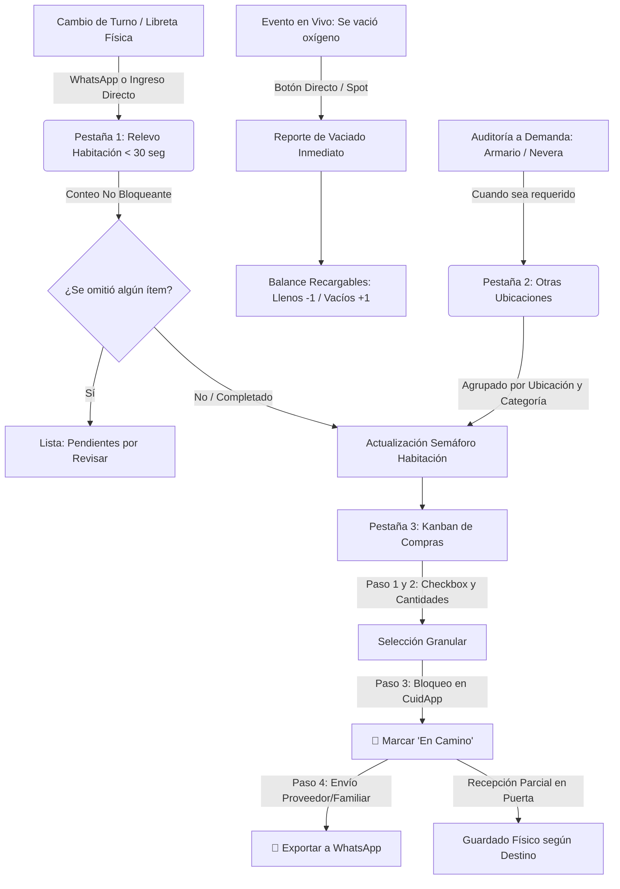

# Plan definitivo de implementación — Módulo «Gestión Insumos» para CuidApp v2

> **Para quien entrega este documento a Antigravity**
>
> - Este archivo **reemplaza** al prompt inicial y a las dos adendas anteriores. Si Antigravity ya recibió alguno de ellos, abre una **conversación nueva** y entrega solo este documento.
> - Es autocontenido. Incluye, en los anexos, el contenido íntegro de todos los archivos que hay que crear: `05b`, `07`, `08` y `09` en SQL, el motor de cálculo y sus pruebas, y las secciones de interfaz de tu plan v2.2.
> - Uso: guarda este archivo en el repositorio como `docs/PLAN_DEFINITIVO_modulo_insumos.md`, abre Antigravity en modo **Planning** y escribe: *«Lee y ejecuta `docs/PLAN_DEFINITIVO_modulo_insumos.md`»*. Si prefieres pegarlo, pega el documento completo.
> - Antigravity te hará preguntas antes de escribir código (§12). Respóndelas antes de aprobar.

---

## 0. Rol, objetivo y forma de trabajo

Actúa como ingeniero de software sénior y responsable de calidad de **CuidApp v2**, una aplicación web para coordinar el cuidado domiciliario de un paciente de alta dependencia médica. Vas a implementar el módulo **«Gestión Insumos»**: inventario de medicamentos, insumos médicos y oxígeno en el hogar, relevo de turno, compras sin duplicados y alertas de reposición.

Un error en este módulo puede dejar al paciente sin un medicamento o sin oxígeno. **La corrección tiene prioridad sobre la velocidad.**

Trabaja en este orden estricto:

1. **Crea los archivos de los anexos B, C y D** con su contenido **exacto**: final de línea LF y sin reformatear. Comprueba cada uno con `sha256sum` contra la tabla del Anexo B y ejecuta `node --test`, que debe dar 29 pruebas en verde. Crear estos archivos es la única escritura permitida antes de la aprobación.
2. **Lee completos** los archivos existentes: `js/api.js`, `js/local-store.js`, `supabase/01…06`, `index.html`, `css/styles.css` y los módulos JS que implementan hoy Inventario, Medicamentos, Dashboard y Turnos. Localízalos tú mismo; no supongas sus nombres.
3. **Entrega tu *Implementation Plan*** siguiendo la estructura del §9: fases con tareas función por función, archivos, criterios de aceptación y cómo revertir. Añade la matriz de pruebas del §10 y las preguntas del §12. Cita archivo y función cuando te apoyes en código existente.
4. **Espera mi aprobación.** Después implementa **fase por fase**. Al terminar cada fase, muestra la evidencia de sus pruebas y espera mi confirmación antes de pasar a la siguiente.

Si algo de este documento contradice el código real, **detente y pregúntame con evidencia**. No lo resuelvas por tu cuenta.

### Jerarquía de fuentes de verdad

1. **Este documento.**
2. **SQL de los anexos (`05b`, `07`, `08`, `09`).** Está probado en PostgreSQL 16 sobre 01–06, incluida la re-ejecución. **No se modifica.** Si encuentras un error, descríbelo con evidencia y propón el cambio mínimo en un archivo nuevo `10_…sql`.
3. **`js/inventory-calc.js` y sus pruebas (anexos C y D).** Contienen toda la lógica de cálculo. La interfaz **no reimplementa** ninguno de esos cálculos. Si necesitas uno nuevo, se añade al motor **con su prueba**.
4. **Código existente de CuidApp.** Es la referencia de patrones y convenciones.
5. **Anexo A (plan v2.2 de interfaz).** Es la referencia visual y de flujos, con las sustituciones indicadas en su encabezado.

---

## 1. Contexto: cómo funciona CuidApp hoy

- **Un solo paciente.** No hay hogares ni multi-inquilino. El acceso se controla con `is_active_user()` y la administración con `is_admin()` (02_functions.sql). Los perfiles nuevos quedan inactivos hasta que un admin los activa.
- **Dos modos excluyentes, no sincronizados.** En `LOCAL_MODE` todo se guarda en localStorage vía `LocalStore`, en una sola clave. En modo Supabase todo va a la base de datos y requiere conexión. **No existe cola offline ni sincronización**, y no hay que construirla.
- **`api.js`.** Cada método existe en versión remota y en `LocalAdapter`. Un `Proxy` elige según `isLocal()`. Las lecturas devuelven objetos mapeados a camelCase; las escrituras devuelven `{ ok: true, … }` o `{ ok: false, error: traducirError(error) }`, todo a través de `wrap()`.
- **Base de datos.** Regla del proyecto: LEER de las vistas `*_view` y ESCRIBIR en tablas base o por RPC. Toda vista lleva `with (security_invoker = true)` y toda RPC comprueba `is_active_user()`. La auditoría la hace el trigger `audit_trigger` (03_audit.sql). RLS en todas las tablas (04_rls.sql).
- **Turnos.** La tabla `shifts` admite como máximo un turno abierto (`take_shift`, `end_shift`). Los turnos reales duran **24 o 48 horas**.
- **Medicamentos.** Tablas `medications`, `medication_schedules` (pauta), `medication_administrations` (dosis) y `medication_restocks`. Las RPC son `record_administration`, `undo_administration` y `record_restock`.
- **Inventario previo.** `inventory_items` e `inventory_movements`, más la RPC `adjust_inventory`. Aún no hay datos cargados en este módulo.
- **Estilo del código.** Módulos `const Nombre = (() => { 'use strict'; … return {…}; })();`. Vanilla JS, sin dependencias ni herramientas de compilación. Todo texto interpolado en HTML pasa por `Api.escapeHtml`. Mensajes en español llano.

---

## 2. Decisiones de diseño definitivas

### 2.1 El stock es un libro de movimientos

- `inventory_movements` es la **única fuente de verdad**. Solo se inserta: nunca se edita ni se borra. «Deshacer» **anula** un movimiento (`voided_at`) junto con todo su grupo.
- Tipos de movimiento y signo:

  | Tipo | Signo | Detalle |
  |---|---|---|
  | `count` | — | cantidad absoluta (`qty_absolute`) |
  | `consume` | − | |
  | `receive` | + | |
  | `transfer` | ± | 2 filas: −n en el origen, +n en el destino |
  | `emptied` | ± | 2 filas en la misma ubicación: llenos −1, vacíos +1 |
  | `exchange_out` | − | vacíos entregados en canje |
  | `discard` | − | |
  | `adjust` | ± | corrección; no cuenta como consumo |

- **Regla de cálculo:** stock = último conteo no anulado (por la hora en que se contó, `occurred_at`) + movimientos con `occurred_at` **estrictamente posterior**. El resultado no depende del orden en que llegan los datos. Está implementada igual en `inventory_stock_view` (SQL) y en `InventoryCalc.deriveStock` (JS).
- `inventory_items.current_stock` y `medications.current_stock` son **caché de solo lectura** que mantiene un trigger. Editarlas directamente devuelve un error `STOCK_LEDGER:`. El stock inicial al **crear** un ítem o un medicamento se acepta y se convierte en un conteo inicial.
- Todas las cantidades del libro están en **unidad base** (tableta, ml, unidad, cilindro). El ítem declara `purchase_unit` y `units_per_purchase` para convertir a unidades de compra.
- Cada acción genera su `clientEventId` con `LocalStore.uuid()` **en el momento en que el usuario pulsa**. Un reintento usa **el mismo** id: las RPC son idempotentes. Los botones se deshabilitan mientras la operación está en curso.

### 2.2 Medicamentos integrados

- Al crear un medicamento, un trigger crea su ítem en `inventory_items` (`medication_id`), con punto de uso en la **Habitación** y reserva en el **Armario**. Si se renombra el medicamento, el ítem se sincroniza. Si se borra, el ítem queda inactivo y conserva su historial. No se puede cambiar la unidad de un medicamento que ya tiene movimientos.
- **Método de control por medicamento (`stock_control`):**
  - **`dosis`** (valor por defecto): cada dosis registrada descuenta stock en el punto de uso; «deshacer» la anula.
  - **`conteo`**: para dosis variables que controla la enfermera. Registrar la dosis queda como historial clínico, **pero no descuenta**; el stock lo fijan los conteos.
- **Una dosis nunca se bloquea por falta de stock contable.** Si el libro queda en negativo, se muestra como anomalía.
- `record_restock` genera una recepción en el libro y conserva el historial en `medication_restocks` y el gasto en `expenses`.
- `record_administration`, `undo_administration`, `record_restock` y `adjust_inventory` **mantienen su firma**. `adjust_inventory` admite un 4.º parámetro opcional, `p_location_id`.

### 2.3 Ubicaciones y circuito almacén → habitación

- Ubicaciones iniciales: **Habitación** (punto de uso, revisión cada 50 h), **Armario Central** (almacén por defecto, verificación mensual de 720 h) y **Nevera** (168 h).
- **Circuito:**
  1. Las compras entran en la reserva del insumo (el Armario) o, si no tiene reserva, en su punto de uso.
  2. Pasar del Armario a la Habitación es un **traslado**: resta en el Armario y suma en la Habitación.
  3. La Habitación se controla por **conteo** en el relevo.
  4. El Armario no se cuenta en cada relevo: su stock es el último conteo más compras menos traslados, con una verificación física mensual.
- **Traslados no registrados:** si en un conteo de la Habitación hay más de lo esperado y hay stock en la reserva, `InventoryCalc.inferTransferFromCount` propone el traslado. Lo redondea a unidades de compra, sin superar la reserva, y lo fecha 1 s antes del conteo. `save_supply_relay_full` lo guarda junto al relevo en una transacción.
- **Traslado mayor que lo disponible:** `InventoryCalc.checkTransferAvailability` avisa. Si el usuario confirma, se registra igual y queda la anomalía visible.
- **Regla operativa** que la app muestra como ayuda: *«Nada se consume directamente del Armario: tráelo primero a la habitación o registra un ajuste.»*
- **Gestión de ubicaciones** (08):
  - Crear: cualquier usuario activo. Nombre único; tipo `habitacion`, `armario`, `nevera` u `otro`.
  - Editar nombre, tipo, orden y frecuencia de revisión: libre.
  - `active`, `archived_at`, `is_point_of_care` e `is_default_storage` solo cambian por RPC.
  - **Archivar** (`archive_supply_location`) exige un destino si la ubicación tiene stock o referencias. En una transacción traslada el stock, deja en cero los saldos negativos y reubica ubicación principal, reserva, pedidos en camino, envases abiertos y vencimientos. Es idempotente. Una ubicación archivada no acepta nada nuevo, conserva su historial y se puede **restaurar**.
  - **Borrar** solo si la ubicación nunca se usó (`supply_locations_view.has_history`).
  - Habitación y Armario **no se borran ni se archivan**. Solo un **admin** puede reasignar su función (`set_special_location`); reasignarla no mueve stock ni cambia los insumos existentes.
- **Proveedores:**
  - Archivar se rechaza si hay pedidos en camino. Si quedan insumos que lo tienen asignado, se ofrece reasignarlos.
  - No se asigna un proveedor archivado.
  - No se borra un proveedor con historial.
  - Restaurar es posible.

### 2.4 Relevo y revisión

- **El relevo se hace en la entrega de turno**, no a una hora del día. Se vincula al turno de `shifts` que se abre con `take_shift`, y `shift_slot` se guarda siempre como `'any'`: no hay selector de mañana/tarde/noche. Al pulsar «Tomar turno», la app abre el Relevo de Habitación o muestra un aviso persistente hasta completarlo.
- **Casilla vacía = omitida, no cero.** Está prohibido `Number(v)`, `+v` o `parseInt(v)` sobre los inputs de conteo: se usan `InventoryCalc.parseCountInput` y `buildRelayCounts`. Los omitidos se guardan en `omitted_item_ids`, van a «Pendientes por Revisar» y el ítem pasa a gris, nunca a verde. **El relevo nunca se bloquea.**
- **Frecuencia de revisión por insumo (`review_every_hours`):**
  - Rige en su punto de uso; si es nula, se usa la de la ubicación.
  - **Al marcar un insumo como crítico pasa a 26 h (diaria)**, salvo que tenga otra fijada. Al desmarcarlo, vuelve a la de la ubicación salvo que se haya fijado a mano.
  - Un crítico con la revisión vencida genera `reviewDue` y `alertActive`, con el motivo «Revisión diaria pendiente…». No es solo un gris.
- **Conteo de críticos:** formulario corto con `buildReviewList(rows, { onlyCritical: true, withinHours: 2 })`. Se abre desde un aviso del Dashboard cuando algún crítico vence en menos de 2 h o ya venció, típicamente a mitad de un turno de 48 h.

### 2.5 Reposición por días de cobertura

- **Consumo diario**, por prioridad:
  1. medicamento pausado o suspendido → 0 (no se repone);
  2. flujo del oxígeno (L/min × horas ÷ capacidad del cilindro);
  3. **pauta** del medicamento (horarios activos), salvo con control por conteo;
  4. consumo configurado: con dosis variable, el **máximo** diario esperado;
  5. consumo estimado de los conteos (ventana de 14 días, mínimo 3).
  - Los medicamentos de uso ocasional llevan mínimo y óptimo fijos, sin consumo.
- **Cálculo:**
  - Punto de pedido = consumo × (tiempo de entrega + días de seguridad).
  - Objetivo = consumo × (entrega + seguridad + periodo de revisión).
  - **Posición = en casa + en camino.** Restar lo que ya viene en camino es lo que evita las compras dobles.
  - Con fecha de fin de tratamiento, nunca se sugiere más de lo que falta tomar.
- **Semáforo:**

  | Estado | Significado |
  |---|---|
  | `critico` | lo que hay no alcanza para esperar un pedido |
  | `reorden` | hay que pedir |
  | `desconocido` (gris) | sería óptimo, pero el dato está viejo u omitido |
  | `optimo` | cobertura suficiente |
  | `sin_configurar` | faltan datos para calcular |
  | `finalizado` | tratamiento terminado |

  El gris no depende solo del color. Un rojo o un amarillo nunca se ocultan por dato viejo: se marcan con baja confianza.
- **Oxígeno:** el cilindro conectado se asume a medio uso. Canje de vacíos al recibir y balance de llenos + vacíos contra el total en circuito.
- **Caducidad tras apertura, PAO a 48 h:** «abrir envase nuevo» si hay cerrados; «comprar» solo si no los hay, y antes si el proveedor tarda (`evaluateOpenContainer`).

### 2.6 Kanban de compras

- **Paso 1:** seleccionar. **Paso 2:** ajustar cantidades (sugeridas por `buildSupplyPlan`). **Paso 3:** «Marcar en camino» con `mark_supply_in_transit`, atómico e idempotente. **Paso 4:** exportar abriendo `https://wa.me/…?text=…` (`buildWhatsAppUrl`); el portapapeles queda solo como alternativa, porque en iOS falla después de un `await`.
- Si el Paso 3 devuelve `conflicts`, se muestra quién ya lo pidió (*«En camino por Laura P.»*). Solo puede haber **un pedido abierto por ítem**.
- **Pedidos atrasados** (`evaluateOrderLine`): se escalan y se pueden **liberar** con `cancel_supply_order_line`.
- **Recepción** (`receive_supply_order_line`): total o parcial, con destino (por defecto la reserva), canje de vacíos y costo opcional, que crea el gasto y, si es fármaco, el registro en `medication_restocks`.

### 2.7 Fotos de libreta

- **Modo Supabase:** bucket privado `supply-relay-photos`, ruta `{clientEventId}.jpg`, comprimidas en el cliente. La tabla guarda solo `photo_path`.
- **`LOCAL_MODE`:** **nunca** en localStorage. En base64 agotan la cuota, y como `LocalStore` guarda todo en una sola clave, se pierden **todos** los datos. Propón una alternativa (por ejemplo, IndexedDB) y pregúntame.

---

## 3. Modelo de datos (resumen de 07, 08 y 09)

**Tablas ampliadas:**

- `inventory_items`: catálogo. Añade presentación, ubicación principal y de reserva, proveedor, `medication_id`, `consumption_type`, unidades, consumo diario, fin de tratamiento, días de seguridad y de revisión, tiempo de entrega propio, óptimo, mínimo en el punto de uso, retornables (circuito, capacidad, flujo, horas/día), PAO, `is_critical`, `active`, `review_every_hours` y `stock_control`. `unit` es la unidad base y `min_threshold` el mínimo en unidad base.
- `inventory_movements`: el libro. Añade ubicación, `stock_state` (full/empty), `movement_type`, `qty_absolute`, `occurred_at`, `relay_id`, `order_line_id`, `administration_id`, `group_id`, `client_event_id` (único) y la anulación.

**Tablas nuevas:** `supply_locations`, `supply_suppliers`, `supply_relays`, `supply_order_batches`, `supply_order_lines` (índice único: un pedido `in_transit` por ítem), `supply_open_containers` y `supply_expiry_records`.

**Vistas:**

- `inventory_items_view`: conserva todas sus columnas anteriores y añade nombres de ubicación y proveedor, `supplier_lead_time_hours`, `supplier_whatsapp`, `medication_status`, `pauta_daily_amount`, `empty_quantity`, `in_transit_base`, `next_expected_by`, `effective_review_hours` y `point_of_care_last_counted_at`.
- `inventory_stock_view`: stock por ítem, ubicación y estado, con `raw_quantity` y `last_counted_at`.
- `supply_in_transit_view`.
- `supply_locations_view`: contadores y `has_history`.
- `inventory_consumption_stats`: solo consumo real.

**RPC:**

| RPC | Uso |
|---|---|
| `record_supply_movements(p_rows)` | movimientos atómicos e idempotentes; no admite `receive` |
| `save_supply_relay(p_relay, p_counts)` | relevo sin movimientos adicionales |
| `save_supply_relay_full(p_relay, p_counts, p_movements)` | relevo + traslados inferidos; **usar esta en la interfaz** |
| `mark_supply_in_transit(p_supplier_id, p_lines, p_client_event_id, p_expected_by)` | Paso 3 del Kanban |
| `receive_supply_order_line(p_line_id, p_received_qty_base, p_client_event_id, p_location_id, p_empties_sent, p_cost, p_received_at)` | recepción |
| `cancel_supply_order_line(p_line_id, p_reason)` | liberar un pedido |
| `void_supply_movement(p_movement_id)` | deshacer; no anula recepciones ni dosis |
| `archive_supply_location` / `restore_supply_location` / `set_special_location` (admin) | ubicaciones |
| `archive_supply_supplier` / `restore_supply_supplier` | proveedores |
| `record_administration`, `undo_administration`, `record_restock`, `adjust_inventory` | adaptadas, misma firma |

**Storage:** bucket `supply-relay-photos`.

**Prefijos de error del servidor** (el texto tras los dos puntos ya está en español llano): `STOCK_LEDGER`, `UBICACION_ESPECIAL`, `UBICACION_ESTADO`, `UBICACION_ARCHIVADA`, `UBICACION_CON_STOCK`, `PROVEEDOR_CON_HISTORIAL`, `PROVEEDOR_ESTADO`, `PROVEEDOR_ARCHIVADO` y `PROVEEDOR_CON_PEDIDOS`.

**Mantenimiento:** en el Editor SQL de Supabase, sin sesión de usuario, las guardas de ubicaciones y proveedores no actúan (mismo criterio que 05b). Siempre se bloquea borrar la Habitación o el Armario.

---

## 4. Motor de cálculo `InventoryCalc` (Anexo C)

Funciones puras. `now` se pasa como parámetro. Los campos van en camelCase, igual que los objetos de `api.js`.

- **Unidades y formato:** `toBase`, `toPurchaseUnitsCeil`, `formatQty`, `formatDuration`.
- **Entrada del relevo:** `parseCountInput`, `checkPlausibility` (detecta errores de tipeo, como 12 → 120) y `buildRelayCounts`.
- **Constructores de movimientos:** `buildEmptiedMovements`, `buildTransferMovements` y `toRpcMovementRows` (camelCase → JSON de las RPC).
- **Stock:** `deriveStock` (libro completo, para `LOCAL_MODE`), `stockMapFromRows` (filas de `inventory_stock_view`) y `summarizeItemStock`.
- **Consumo:** `estimateDailyConsumption`, `resolveDailyConsumption` y `cylindersPerDay`.
- **Reposición y estado:** `computeReorder`, `evaluateStatus` y `suggestPointOfCareTransfer`.
- **Revisión y traslados:** `buildReviewList`, `inferTransferFromCount` y `checkTransferAvailability`.
- **PAO y pedidos:** `evaluateOpenContainer`, `computePaoExpiry` y `evaluateOrderLine`.
- **WhatsApp:** `buildWhatsAppMessage` y `buildWhatsAppUrl`.
- **Orquestador:** `buildSupplyPlan(ctx)`. Devuelve filas ordenadas por gravedad, con `summary`, `consumption`, `reorder`, `status`, `transfer` y `suggestedLine`.

**Contexto de `buildSupplyPlan`:**

- **Modo Supabase:**
  - `items` ← `inventory_items_view`;
  - `stockRows` ← `inventory_stock_view`;
  - `movements` ← solo los **últimos 30 días** no anulados;
  - `orderLines` ← líneas `in_transit`;
  - `locations` ← **todas**, incluidas las archivadas, con `active`;
  - `suppliers`;
  - `pendingReviewItemIds` ← `omitted_item_ids` del último relevo.
- **`LOCAL_MODE`:** el libro completo en `movements`, sin `stockRows`.
- **PostgREST no anida vistas.** Para embeber nombres, usa las tablas base con claves foráneas, por ejemplo: `supply_order_lines` → `inventory_items(name, unit, purchase_unit)` y `profiles(full_name)`.

---

## 5. Especificación funcional por pantalla

La referencia visual está en el **Anexo A**. Lo que se indica aquí prevalece.

**Contenedor:** `#panel-inventory` con 4 pestañas superiores y áreas táctiles de al menos 48 px.

### 5.1 Pestaña 1 — Relevo de Habitación

- Lista solo los ítems cuyo punto de uso es la Habitación, con teclado numérico y salto al siguiente campo. En iOS, `inputmode="numeric"` no tiene tecla Enter: valida `enterkeyhint` y la navegación del formulario en un iPhone real.
- Retornables: dos campos, llenos y vacíos.
- Al anotar cada cantidad:
  - `checkPlausibility` avisa de posibles errores de tipeo, sin bloquear;
  - `inferTransferFromCount` propone en línea el traslado olvidado (*«Hay 6 tabletas más de lo esperado. ¿Trajiste 1 caja de la reserva?»*) con **Sí**, **No** y la cantidad editable.
- Guardado con `save_supply_relay_full`. La foto de la libreta es opcional (§2.7). El nombre de quien contó puede no ser usuario de la app.
- Lista «Pendientes por Revisar» (omitidos) con acceso rápido para completarlos.
- Se abre o se recuerda al pulsar «Tomar turno».

### 5.2 Conteo de críticos (formulario corto)

Mismo motor de entrada y misma detección de traslados, pero solo con `buildReviewList(..., { onlyCritical: true, withinHours: 2 })`. Se accede desde el aviso del Dashboard y desde la Pestaña 1.

### 5.3 Pestaña 2 — Otras Ubicaciones

- Acordeones por **ubicación activa → categoría**. Conteo a demanda y auditoría completa de una ubicación.
- El Armario muestra «Verificación mensual pendiente» cuando vence su conteo.
- Acción **«Traer a la habitación»**: cantidad en unidades de compra, validada con `checkTransferAvailability` y registrada con `buildTransferMovements` + `recordSupplyMovements`.
- Texto de ayuda visible sobre no consumir directamente del Armario.

### 5.4 Pestaña 3 — Compras (Kanban)

- Sub-vistas **«Por pedir»**, alimentada por `buildSupplyPlan` y filtrable por proveedor o canal, y **«En camino / Por recibir»**.
- Pasos 1 a 4 del §2.6, con avisos de conflicto, pedidos atrasados con «Liberar» y recepción parcial con destino, canje y costo.
- Solo aparecen proveedores activos.

### 5.5 Pestaña 4 — Catálogo y ajustes rápidos

- **Formulario del insumo:**
  - datos básicos, unidades (base, de compra y unidades por compra), ubicación principal y reserva (solo activas), proveedor (solo activos);
  - selector Continuo/Variable (`consumption_type`, dato descriptivo);
  - consumo diario o mínimo/óptimo, fin de tratamiento, días de seguridad y tiempo de entrega propio;
  - retornables (circuito, capacidad, flujo, horas por día);
  - PAO;
  - interruptor **Crítico**;
  - selector **«Revisar cada»**: Diaria (26 h) / Cada entrega de turno (la de la ubicación) / Personalizado.
  - En medicamentos: **Método de control: por dosis registrada / por conteo**, con una frase explicativa. Con control por conteo, pide «Consumo máximo diario esperado», o mínimo y óptimo para los de uso ocasional.
- **Ajuste rápido** (3 toques): consumo, descarte, ajuste, **«Se vació cilindro/recipiente»** (si hay varios retornables, pregunta **cuál**), apertura de envase con chips +7d, +15d, +30d y +60d, y **«Deshacer»** con `void_supply_movement`.
- **Sección «Ubicaciones y proveedores»:**
  - lista de `supply_locations_view` con contadores y filtro «Mostrar archivadas» (desactivado por defecto);
  - acciones: Crear, Editar, **Archivar** como asistente de tres pasos (qué depende de la ubicación → elegir destino → confirmar y mostrar el resumen), Restaurar, Borrar (solo si `has_history` es falso y no es especial) y «Asignar como punto de uso / almacén por defecto» (solo admin, explicando que no mueve stock);
  - proveedores: Crear, Editar (nombre, canal, WhatsApp, tiempo de entrega), Archivar (ofreciendo reasignar si `items_still_assigned > 0`), Restaurar y Borrar.
  - Las acciones destructivas piden confirmación con el nombre del elemento.

### 5.6 Dashboard

- Widget con contadores de **críticos**, **reorden**, **desconocidos**, **pendientes por revisar**, **revisión pendiente de críticos**, **en camino** y **pedidos atrasados**.
- Aviso de «Conteo de críticos» y botón **«Se vació cilindro»**.
- En `getActiveAlerts`, los ítems con `medicationId` se excluyen del bloque de inventario para no duplicar alertas.

### 5.7 Módulos existentes

- **Medicamentos:**
  - los formularios dejan de enviar `currentStock` al editar y ofrecen «Registrar conteo»;
  - el stock inicial al crear se mantiene;
  - en Administración de dosis, los medicamentos con control por conteo muestran: *«Este medicamento se controla por conteo: registrar la dosis no descuenta stock.»*
- **Inventario existente:** «Ajustar» sigue funcionando vía `adjust_inventory`, y «Editar stock» pasa a ser «Registrar conteo». Decide con mi aprobación si su listado incluye los medicamentos (§12).

---

## 6. `api.js` — métodos y mapeos

Cada método va en versión remota **y** en `LocalAdapter`, y se agrega a `apiInstance`. Si falta en `LocalAdapter`, en `LOCAL_MODE` se ejecuta la versión Supabase y falla con «Cliente de base de datos no inicializado». En el plan, indica para cada método su firma, la RPC o vista que usa y el mapeo de campos.

- **Lecturas:**
  - `getSupplyLocations({ includeArchived })`, sobre `supply_locations_view`;
  - `getSupplySuppliers({ includeArchived })`;
  - `getInventoryStock()`;
  - `getRecentInventoryMovements(days)`;
  - `getSupplyRelays()`;
  - `getSupplyOrderLines(status)`;
  - `getOpenContainers()`;
  - `getSupplyPlanContext()`, que reúne todo lo del §4.
- **Escrituras:**
  - `recordSupplyMovements(rows)`;
  - `saveSupplyRelayFull(relay, counts, movements)`;
  - `markSupplyInTransit(supplierId, lines, clientEventId)`;
  - `receiveSupplyOrderLine(...)`;
  - `cancelSupplyOrderLine(id, reason)`;
  - `markOrderBatchExported(batchId)`;
  - `voidSupplyMovement(id)`;
  - `openContainer(...)`;
  - `closeContainer(...)`;
  - `uploadRelayPhoto(clientEventId, blob)`.
- **Ubicaciones y proveedores:**
  - `addSupplyLocation`;
  - `updateSupplyLocation`, que **nunca** envía `active` ni las funciones especiales;
  - `deleteSupplyLocation`;
  - `archiveSupplyLocation(id, transferToId, note)`;
  - `restoreSupplyLocation(id)`;
  - `setSpecialLocation(id, role)`;
  - `addSupplySupplier`, `updateSupplySupplier`, `archiveSupplySupplier`, `restoreSupplySupplier` y `deleteSupplySupplier`.
- **Métodos existentes:**
  - `getInventory` mapea las columnas nuevas de `inventory_items_view`;
  - `updateInventoryItem` acepta los campos nuevos (incluidos `isCritical`, `reviewEveryHours` y `stockControl`) y no envía `currentStock` si cambió;
  - `updateMedication` no envía `currentStock`;
  - `getActiveAlerts` según el §5.6;
  - `exportAllData` incluye las tablas nuevas.
- **`traducirError`:** patrones específicos **antes** de los genéricos que ya existen (hoy cualquier `duplicate key` se muestra como «dosis ya registrada» y cualquier `check constraint` como «stock menor a cero»):
  - para los prefijos del §3, mostrar el texto que sigue a los dos puntos;
  - `violates foreign key constraint` sobre `supply_locations` → «Esta ubicación tiene historial: archívala en lugar de borrarla»;
  - `supply_locations_special_active_ck` → «El punto de uso y el almacén por defecto no se pueden archivar»;
  - `one_open_order_per_item` → «Este insumo ya está en camino»;
  - `inventory_movements_ledger_ck` y `inventory_items_supply_checks` → «Hay un dato fuera de rango; revisa cantidades y configuración»;
  - `inventory_movements_client_event_uq` → tratarlo como éxito (reintento);
  - `supply_relays_not_future` → «La hora del conteo no puede ser futura»;
  - `supply_locations_name_key` y `supply_suppliers_name_key` → «Ya existe uno con ese nombre»;
  - «No se puede cambiar la unidad» y «Los movimientos del relevo deben ser anteriores…» → texto tal cual.

---

## 7. `LocalStore` (LOCAL_MODE)

- **Colecciones nuevas** en camelCase: `supplyLocations`, `supplySuppliers`, `supplyRelays`, `supplyOrderBatches`, `supplyOrderLines`, `supplyOpenContainers` y `supplyExpiryRecords`. Campos nuevos en `inventoryItems` e `inventoryMovements`, iguales a 07–09.
- **`sanitizeAndMigrate` sube a la versión `2.3.0`.** Debe:
  - sembrar las 3 ubicaciones con sus frecuencias (50, 720 y 168 h);
  - crear el ítem de cada medicamento que no lo tenga;
  - convertir cada `currentStock` existente en un conteo inicial;
  - normalizar los movimientos antiguos (`reason`, `previousStock`, `newStock` y `actorId` → `note`, `profileId`, `movementType`, `locationId`).
- **Emular todas las RPC de 07, 08 y 09 con la misma semántica y los mismos mensajes:**
  - idempotencia por `clientEventId` y atomicidad (si algo falla, no se aplica nada);
  - conflicto de «en camino»; recepción con canje, gasto y `medicationRestocks`;
  - anulación por grupo;
  - caché de stock recalculada con `InventoryCalc.deriveStock`;
  - bloqueo de edición directa del stock;
  - método de control en `recordAdministration`;
  - frecuencia automática de críticos (asignar y restablecer);
  - `saveSupplyRelayFull` con validación de fechas;
  - archivado y restauración con traslado;
  - guardas de ubicaciones especiales y de proveedores.
- **Auditoría local:** usar `insert`, `update` y `remove` con `auditTableName`. `recordAudit` no está exportada; si hace falta, propón exportarla.
- **Admin en modo local:** propón cómo tratar `set_special_location`, con el perfil local de rol `admin` o sin restricción.

---

## 8. Hallazgos en el código existente

1. **Primer admin: corregido con `05b`.** El `UPDATE` de `05_seed.sql` no tiene efecto: en el Editor SQL `auth.uid()` es nulo y `guard_profile_update` restaura `app_role` y `active`. Después de ejecutar 05b, **repetir el `UPDATE` de 05**.
2. **Fechas en UTC.** `todayStr()` en `api.js` y `local-store.js` usa `toISOString()`. En América, a partir de las 19:00–20:00 locales devuelve **la fecha de mañana**. Afecta a las dosis del día (`uniq_admin_slot`), las tareas recurrentes, los gastos y este módulo. `current_date` en el servidor también es UTC. **Propón la corrección como Fase 0**, pendiente de aprobación.
3. **`traducirError` usa patrones demasiado genéricos** (ver §6).
4. **`LocalStore.recordAdministration` bloquea la dosis** si el stock es insuficiente, y el SQL no. Debe dejar de bloquearla (§2.2).
5. **Consumo calculado distinto en cada modo.** `LocalStore.getInventoryItemsView` divide entre 30 días fijos si hay 3 o más salidas; la vista SQL divide entre los días transcurridos, con al menos 7. Las pantallas nuevas usan solo `InventoryCalc`; decide si la antigua también migra.
6. **Campos distintos entre modos:** `LocalStore` usa `reason`, `previousStock`, `newStock` y `actorId`; Supabase usa `note` y `profile_id` (§7).
7. **Alertas duplicadas** de fármacos tras la integración (§5.6).
8. **Fuera de alcance, solo informar.** En `apiInstance`, `getComplementCategories`, `add/update/deleteComplementCategory`, `get/setAvailableComplementos`, `deleteShoppingItemsBatch` y `getDailyMenu` apuntan siempre a `LocalAdapter`. En modo Supabase guardan datos solo en el dispositivo. Descríbelo como riesgo del módulo Alimentación, sin corregirlo.

---

## 9. Fases de implementación

Para cada fase, tu plan debe indicar objetivo, tareas función por función, archivos, criterios de aceptación verificables, pruebas, riesgos y cómo revertir. **Ninguna fase se da por terminada sin sus pruebas en verde.**

| Fase | Alcance | Criterio de aceptación principal |
|---|---|---|
| **0** | 05b y repetición del `UPDATE` de 05 (en el proyecto de pruebas). Propuesta de corrección de fechas locales (hallazgo 2), **solo con aprobación**. | El admin queda activo. Hay un plan de fechas aprobado o descartado. |
| **1** | Base de datos en un **proyecto Supabase de pruebas**: 07 → 08 → 09. Ejecutar dos veces para comprobar que son re-ejecutables. | Consulta final con cero vistas inseguras. Casos SQL de §10 (grupo A) verificados. |
| **2** | Motor: archivos del Anexo C y D en el repositorio, carga de `js/inventory-calc.js` en `index.html` **antes** de `local-store.js` y de los módulos de inventario. | `node --test` con 29/29 en verde. `window.InventoryCalc` disponible. |
| **3** | `LocalStore`: migración 2.3.0 y emulación completa (§7). | Matriz §10 en `LOCAL_MODE` para la capa de datos. |
| **4** | `api.js`: métodos, mapeos, `traducirError`, alertas y exportación (§6). | Cada método en ambos modos. Errores en español. |
| **5** | Adaptación de los módulos existentes de Medicamentos e Inventario (§5.7). | Ningún formulario envía `currentStock` al editar. Aviso visible en fármacos por conteo. |
| **6** | Pestaña 1: relevo, traslados inferidos, pendientes, foto y vínculo con «Tomar turno». Conteo de críticos (§5.1, §5.2). | 15 ítems en menos de 30 s en un teléfono real. Casilla vacía ≠ 0. |
| **7** | Pestaña 2: Otras Ubicaciones, traslados y verificación mensual (§5.3). | Traslado y deshacer. Aviso de insuficiencia. |
| **8** | Pestaña 3: Kanban completo (§5.4). | Conflicto visible, reintento sin duplicar, recepción parcial con canje. |
| **9** | Pestaña 4: catálogo, ajustes rápidos, PAO, ubicaciones y proveedores (§5.5). | Asistente de archivado. Reglas de borrado. Admin para la función especial. |
| **10** | Dashboard: widget, avisos y botón de vaciado (§5.6). | Contadores coinciden con `buildSupplyPlan`. |
| **11** | `css/styles.css`: 48 px, semáforo con 4.º estado gris que no dependa solo del color, respetando el tema existente. | Revisión visual en móvil claro/oscuro. |
| **12** | Pruebas integrales en ambos modos y en dispositivos reales (iPhone con Safari y Android con Chrome). Despliegue a producción (§11). | Matriz §10 completa. |

---

## 10. Matriz de pruebas

Cada caso se ejecuta en **`LOCAL_MODE` y en Supabase**. Los del grupo A ya están verificados en SQL; en la Fase 1 basta con repetirlos en el proyecto de pruebas. Los demás exigen probar la interfaz.

**A. Datos y dosis**

1. Una dosis dada (control por dosis) descuenta en Medicamentos y en Insumos; deshacerla la restituye.
2. Una dosis con stock contable 0 se registra igual y el ítem muestra la anomalía.
3. Un medicamento con control por conteo: registrar la dosis no cambia el stock; el siguiente conteo sí.
4. Editar el stock directamente muestra un mensaje en español, no un error técnico.
5. Un medicamento pausado no aparece en compras sugeridas.
6. Un usuario inactivo no ve ni escribe nada.

**B. Relevo y revisión**

7. Un vaciado registrado antes que un relevo contado antes da el stock correcto.
8. En un relevo con casillas vacías, el ítem va a «Pendientes por Revisar» y a gris; un «0» se registra como cero.
9. Un relevo con 6 unidades más de lo esperado y una caja de 10 en el Armario: aceptar la sugerencia deja la Habitación en lo contado y el Armario con una caja menos; rechazarla deja el Armario igual.
10. Un crítico diario contado hace 30 h aparece como «Revisión pendiente» y en el Dashboard; un insumo normal contado a la misma hora sigue en verde (vence a las 50 h).
11. Al marcar un insumo como crítico toma 26 h; al desmarcarlo vuelve a la frecuencia de la ubicación; una frecuencia fijada a mano se conserva.
12. «Tomar turno» abre o recuerda el relevo, y el relevo queda vinculado a ese turno.

**C. Traslados y ubicaciones**

13. Traslado armario → habitación y su «Deshacer». Uno mayor que lo disponible avisa y, si se confirma, queda la anomalía.
14. El Armario no pasa a gris durante el mes siguiente a su conteo, y sí después.
15. Archivar una ubicación con stock sin destino se rechaza con el detalle; con destino, traslada stock, reubica insumos y redirige pedidos, y el ítem **no** queda en gris.
16. Tras archivarla, un conteo o una asignación hacia ella se rechazan; restaurarla la habilita.
17. Borrar una ubicación nunca usada funciona; una con historial muestra «archívala».
18. La Habitación y el Armario no se borran ni se archivan. Un cuidador no puede reasignar su función; un admin sí, y un insumo nuevo sin ubicación va al nuevo almacén por defecto.
19. Repetir cualquier archivado no cambia nada.

**D. Compras**

20. Si dos usuarios marcan el mismo ítem «en camino», el segundo ve el conflicto con el nombre del primero.
21. Reintentar con el mismo `clientEventId` no duplica nada (relevo, en camino, recepción).
22. Una recepción parcial con canje de vacíos y costo genera el gasto y, si es fármaco, el registro en `medication_restocks`.
23. Un pedido atrasado se escala y se puede liberar.
24. Un proveedor con pedido en camino no se archiva; uno archivado no aparece en los selectores; uno con historial no se borra.

**E. Dispositivos reales**

25. En un iPhone real: teclado numérico del relevo (sin tecla Enter; `enterkeyhint` y navegación), exportación a WhatsApp y foto.
26. Relevo de 15 ítems en menos de 30 s en un teléfono real.

---

## 11. Despliegue

1. **Proyecto Supabase de pruebas:**
   1. 05b;
   2. repetir el `UPDATE` de 05 con el email real;
   3. 07 → 08 → 09.
   
   La consulta final de cada script debe devolver **cero** vistas inseguras.
2. Pruebas de la Fase 1 y, más adelante, la matriz completa.
3. **Producción:** mismo orden. Haz antes una copia de seguridad del proyecto.
4. **Si alguna vez se vuelve a ejecutar 07, hay que ejecutar después 08 y 09**, en ese orden, porque 09 reemplaza `record_administration` e `inventory_items_view`.
5. Lista de verificación posterior:
   - admin activo;
   - 3 ubicaciones con sus frecuencias;
   - cada medicamento con su ítem;
   - bucket `supply-relay-photos` privado;
   - `node --test` en verde.

---

## 12. Preguntas abiertas (formúlamelas antes de implementar)

1. ¿Quién edita el catálogo (umbrales, frecuencias, tiempos de entrega)? Hoy puede hacerlo cualquier usuario activo; ¿se restringe a admin?
2. ¿Archivar ubicaciones y proveedores lo puede hacer cualquier usuario activo, o solo un admin?
3. ¿Quién puede cambiar el método de control de un medicamento (dosis/conteo)?
4. ¿El aviso de críticos pendientes aparece solo en el Dashboard, o también como notificación del teléfono (requiere instalar la PWA; en iOS, 16.4 o superior)?
5. ¿Qué insumos y medicamentos se marcan como críticos en la carga inicial?
6. ¿Qué hacer con las fotos de libreta en `LOCAL_MODE`?
7. ¿Los medicamentos deben aparecer también en el listado del módulo Inventario existente, o solo en Gestión Insumos?
8. ¿Qué categorías de gasto usar? Hoy conviven «Medicamentos» y «Farmacia», y 07 usa la categoría de inventario del ítem.
9. Valores por defecto de días de seguridad y tiempo de entrega por tipo de proveedor.
10. ¿Cuánto tiempo siguen visibles las ubicaciones archivadas en el filtro del historial?
11. ¿Se aprueba la corrección de fechas locales de la Fase 0? ¿En qué zona horaria vive el paciente?

---

## 13. Restricciones

- No modifiques `supabase/01…09` ni `05b`. Todo cambio de base de datos va en archivos nuevos numerados, desde `10_…sql`.
- No introduzcas dependencias, frameworks ni herramientas de compilación.
- No dupliques en la interfaz cálculos que existan en `InventoryCalc`.
- No uses localStorage para imágenes ni para nada que pueda superar unos pocos KB por registro.
- No escribas código antes de la aprobación del plan, salvo crear los archivos de los anexos B, C y D.
- No marques una fase como terminada sin sus pruebas en verde.
- Si una instrucción de este documento te parece incorrecta a la luz del código, dilo con evidencia antes de continuar.

---

# ANEXOS

## Anexo A — Referencia de interfaz y casos de uso (plan v2.2)

> **Uso de este anexo.** Son las secciones 1 (casos de uso), 2 (interfaz y wireframes) y 4 (arquitectura del código) del plan v2.2, sin cambios. Sirven de **referencia visual y de flujos**. Se omitieron el modelo de datos (sección 3) y la matriz de fases (sección 5), que quedan reemplazados por los §3 y §9 de este documento.
>
> **Dónde prevalece el cuerpo de este documento sobre el anexo:**
>
> | En el anexo dice | Se implementa así |
> |---|---|
> | Dual Storage / pruebas offline | Dos modos excluyentes, sin sincronización (§1) |
> | Selector de turno «Día / Noche» y relevo cada 12 h | Relevo en cada entrega de turno de 24 o 48 h, sin selector (§2.4) |
> | Salto de campo con Enter/Siguiente | Validar `enterkeyhint` y la navegación en iOS, que no tiene tecla Enter con teclado numérico (§5.1) |
> | «Comprar = Óptimo − Cerrados contados» y JIT de «1 unidad si dosis ≤ umbral crítico» | Reposición por días de cobertura, restando lo que está en camino (§2.5). Continuo/Variable queda como dato descriptivo |
> | «Umbral crítico: N tabletas» | Cobertura en días frente al tiempo de entrega; umbrales fijos solo como respaldo (§2.5) |
> | Copiar el pedido al portapapeles | Abrir `wa.me` con el texto; portapapeles como alternativa (§2.6) |
> | «Elimina al 100 % las compras dobles» | Garantizado en el servidor con un índice único y una RPC atómica (§2.6) |
> | Recepción: Continuos → Armario, Variables → Habitación | Destino = reserva del insumo, o su punto de uso si no tiene reserva; editable (§2.6) |
> | PAO: comprar a las 48 h aunque reste contenido | Abrir nuevo si hay cerrados; comprar solo si no los hay (§2.5) |
> | Editar el stock como número | Registrar un conteo; el stock es un libro de movimientos (§2.1) |
> | `js/dashboard.js`, `js/inventory.js` | Nombres por confirmar contra el código real (§0) |
> | Balance de retornables con «En camino» | Canje en la puerta: llenos + vacíos en casa = total en circuito (§2.5) |

#### 1. Justificación Clínica y Nuevos Casos de Uso



---

##### Caso de Uso 1: Relevo de Guardia Ultrarrápido (< 30s) en «Habitación»
> **[🔄 MODIFICACIÓN FEEDBACK]:** El relevo obligatorio de turno se circunscribe **únicamente a los insumos y medicamentos ubicados en «Habitación»**. El cuidador no pierde tiempo revisando el armario del pasillo durante la entrega del paciente. Asimismo, el conteo es **no bloqueante**: si por urgencia clínica no se contó un ítem, se omite y la app lo envía a una lista de **«Pendientes por Revisar»** sin impedir el guardado del relevo.

* **Actor Principal:** Cuidador presencial, Enfermero en entrega de guardia o Gestor Remoto transcribiendo la foto.
* **Flujo Operativo:**
  1. El usuario toca en el Dashboard: `[ 📝 Transcribir Relevo ]`.
  2. La pantalla carga exclusivamente los artículos de la **Habitación** (punto de atención activa: mesa de noche, soporte de sueros, pastillero activo).
  3. Los campos poseen `inputmode="numeric"` continuo: al teclear el número y pulsar **Enter/Siguiente**, el foco salta al siguiente renglón.
  4. **Omisión Flexible:** Si la enfermera saliente no anotó un ítem o hubo una emergencia médica, la casilla puede quedar en blanco.
  5. Presiona el botón flotante `[ 💾 Guardar Relevo Habitación ]`.
  6. **Resultado:** Se actualiza el semáforo de los ítems contados en menos de 30 segundos. Si hubo casillas omitidas, se genera una tarjeta de alerta suave: *«⚠️ [N] ítems de habitación pendientes por revisar»*.

---

##### Caso de Uso 2: Estrategia de Reposición Flexible (Selector Continuo vs Variable)
> **[🔄 MODIFICACIÓN FEEDBACK]:** Se elimina la restricción que impedía tener reserva de fármacos en armario. La decisión de manejo es clínica y configurable. En el catálogo se añade el selector obligatorio:  
> **`Tipo de Consumo: [ (•) Continuo ]  [ ( ) Variable ]`**

* **Opción A — Tipo Consumo: Continuo (Modelo Two-Bin / Stock de Seguridad):**
  - Para pañales, gasas, soluciones parenterales, agujas y medicación crónica estable que el paciente toma indefinidamente (ej. Losartán, Levotiroxina).
  - Admite definir stock mínimo y óptimo de empaques cerrados en Armario/Depósito.
  - Cálculo de reposición: $\text{Comprar} = \text{Stock Óptimo} - \text{Empaques Cerrados Contados}$.
* **Opción B — Tipo Consumo: Variable (Modelo Justo a Tiempo - JIT):**
  - Para antibióticos con fecha de término, corticoides en titulación, analgésicos de rescate o fármacos con riesgo de ajuste de dosis.
  - Se audita por dosis restantes en el pastillero/frasco de la habitación.
  - Cálculo de reposición: Dispara compra de **1 unidad comercial** únicamente si $\text{Dosis Restantes} \le \text{Umbral Crítico}$.
  - *Flexibilidad:* Si el médico o familiar decide que también se mantendrá una caja de respaldo en el armario para este fármaco, el sistema lo permite sin restricciones.

---

##### Caso de Uso 3: Recargables con Reporte de Vaciado Inmediato y Balance Cerrado
> **[🔄 MODIFICACIÓN FEEDBACK]:** Además de auditar los cilindros de oxígeno durante el relevo de turno, se incorpora la acción inmediata: **`[ 🔄 Se Vació Cilindro / Recipiente ]`**, accesible en cualquier momento desde el Dashboard, Pestaña 1 o Ajuste Spot.

* **Flujo en Caliente:**
  1. A las 15:30 se agota un cilindro portátil de oxígeno tipo E.
  2. La enfermera pulsa `[ ⚡ Ajuste Spot / Abrir ]` $\rightarrow$ `[ 🔄 Se Vació Cilindro ]`.
  3. En 2 segundos, el sistema descuenta 1 unidad de **Llenos**, suma 1 unidad a **Vacíos por Canje**, recalcula el semáforo y dispara la alerta de reposición si los llenos cayeron al mínimo.
* **Ecuación de Balance Cerrado:**
  $$\text{Llenos en Casa} + \text{Vacíos en Casa} + \text{En Camino (Proveedor)} = \text{Total en Circuito}$$
  Si hay discrepancia física en el conteo, la app muestra un aviso informativo no bloqueante indicando cilindros no justificados.

---

##### Caso de Uso 4: Auditoría a Demanda de Otras Ubicaciones
> **[🔄 MODIFICACIÓN FEEDBACK]:** Se independiza el conteo de áreas no críticas del relevo diario. Los almacenes secundarios (Armario Central, Depósito Pasillo, Nevera) cuentan con su propia vista jerarquizada: **Ubicación $\rightarrow$ Categoría**.

* **Flujo Operativo:**
  1. Los conteos de estas ubicaciones no se exigen cada 12 horas; se realizan de forma semanal, quincenal o **cuando sea necesario/requerido** (ej. tras recibir una compra grande o en auditoría de fin de semana).
  2. El usuario ingresa a la **`Pestaña 2: Otras Ubicaciones`**.
  3. Navega por acordeones colapsables:
     - 🏢 **Armario Central / Depósito**
       - 📦 *Insumos Médicos y Curaciones*
       - 💊 *Medicamentos en Reserva*
       - 🧴 *Higiene y Protección*
     - ❄️ **Nevera**
       - 💉 *Insulinas y Termolábiles*
  4. Registra los conteos a su propio ritmo sin la presión del cambio de turno.

---

##### Caso de Uso 5: Flujo Kanban Antiduplicidad Reordenado (Paso 3 y 4)
> **[🔄 MODIFICACIÓN FEEDBACK]:** Para asegurar la trazabilidad y mantener al usuario enfocado en CuidApp sin perder el contexto al salir a WhatsApp, el flujo se ejecuta estrictamente en este orden:
> **Paso 1:** Filtros y Selección por Checkbox $\rightarrow$ **Paso 2:** Confirmación de cantidades $\rightarrow$ **Paso 3: Marcar en Camino** $\rightarrow$ **Paso 4: Exportar a WhatsApp**.

* **Flujo Operativo Paso a Paso:**
  1. El familiar abre la **Pestaña 3: Compras y Recargas**.
  2. Filtra por comercio: `[ 💊 Farmacia ]` o `[ 💨 Gases ]`.
  3. **Paso 1 y 2 (Selección Granular):** Marca con checkbox los 2 medicamentos que adquirirá.
  4. **Paso 3 (Asegurar Bloqueo en CuidApp):** Pulsa el botón primario **`[ 🚚 Marcar Selección como "En Camino" ]`**.
     - Los ítems pasan inmediatamente a la sub-pestaña *"En Camino"*.
     - Se les asigna el responsable actual (ej. *«En camino por: Laura P.»*).
     - Quedan bloqueados para el resto de la familia, eliminando al 100% el riesgo de compras dobles.
  5. **Paso 4 (Generar Mensaje Exterior):** Inmediatamente después (o mediante el botón continuo visible), pulsa **`[ 📲 Exportar Pedido a WhatsApp ]`**.
     - CuidApp copia al portapapeles el texto perfectamente tabulado para enviar al delivery o farmacia.
     - El usuario permanece dentro de CuidApp con sus datos confirmados y resguardados.
  6. **Recepción Domiciliaria Parcial:** Al llegar los insumos a casa, se confirman individualmente y se direccionan a su destino:
     - Continuos $\rightarrow$ *«Almacén / Armario Central»*.
     - Variables $\rightarrow$ *«Mesa de Noche / Habitación»*.

---

##### Caso de Uso 6: Apertura Spot y Vencimiento Secundario (PAO 48h)
* Al abrir colirios, cremas, insulinas o jarabes, se registra la apertura en 3 toques con chips: `[ +7d ]`, `[ +15d ]`, `[ +30d ]`, `[ +60d ]`.
* **Regla Clínica:** Cuando faltan **48 horas** para la caducidad post-apertura, el sistema activa el estado **Crítico/Desecho** y genera orden de compra aunque reste contenido en el envase.

---

#### 2. Especificación de Interfaz de Usuario y Navegación

##### 2.1. Arquitectura de Navegación: 4 Pestañas Superiores

La sección **Gestión Insumos** (`#panel-inventory`) se estructura en 4 pestañas accesibles tipo *Segmented Control*:

```
┌────────────────────────────────────────────────────────────────────────┐
│ 📦 GESTIÓN DE INSUMOS Y SUMINISTROS                                   │
├──────────────────┬──────────────────┬─────────────────┬────────────────┤
│ [ 📝 Habitación ]│ [ 🏢 Otras Ubic.]│ [ 🚚 Compras ]  │ [ ⚙️ Catálogo ]│
└──────────────────┴──────────────────┴─────────────────┴────────────────┘
```

---

##### 2.2. Wireframes de Pantalla Móvil (Ergonomía ≥ 48dp)

###### A. Widget Modular en el Dashboard Principal (`js/dashboard.js`)

```
┌──────────────────────────────────────────────────────────────┐
│ 📦 INSUMOS Y SUMINISTROS              Último relevo: Hoy 07:15│
│                                       Enf. Laura · 🟢 Sinc    │
├──────────────────────────────────────────────────────────────┤
│ SEMÁFORO GLOBAL DE SUMINISTROS:                              │
│ ┌───────────────┐ ┌───────────────┐ ┌──────────────────────┐ │
│ │ 🟢 14 Óptimo  │ │ 🟡 3 Reorden  │ │ 🔴 1 Crítico         │ │
│ └───────────────┘ └───────────────┘ └──────────────────────┘ │
│ ┌──────────────────────────────────────────────────────────┐ │
│ │ ⏳ 2 Abiertos por vencer (Colirio: 14h · Insulina: 4d)   │ │
│ └──────────────────────────────────────────────────────────┘ │
│ ┌──────────────────────────────────────────────────────────┐ │
│ │ ⚠️ 1 ítem en Habitación pendiente por revisar (Omitido)   │ │
│ └──────────────────────────────────────────────────────────┘ │
├──────────────────────────────────────────────────────────────┤
│ FLUJO LOGÍSTICO Y CANJES:                                    │
│  🛒 [ 4 ] Por Comprar   🔄 [ 3 ] Vacíos Canje   🚚 [ 2 ] En Camino│
├──────────────────────────────────────────────────────────────┤
│ ACCIONES RÁPIDAS (Touch targets ≥ 48dp):                     │
│ ┌───────────────────────────┐  ┌───────────────────────────┐ │
│ │  📝 Transcribir Relevo    │  │ ⚡ Ajuste Spot / Abrir    │ │
│ └───────────────────────────┘  └───────────────────────────┘ │
│ ┌──────────────────────────────────────────────────────────┐ │
│ │ [ 🔄 Se Vació Cilindro Oxígeno (Reportar Ahora) ]        │ │
│ └──────────────────────────────────────────────────────────┘ │
│                                                              │
│ [ Ir a Gestión Insumos ➔ ]                                  │
└──────────────────────────────────────────────────────────────┘
```

---

###### B. Pestaña 1: Relevo de Guardia — Solo Ubicación «Habitación» (`#tab-relay-room`)
> **[🔄 MODIFICACIÓN FEEDBACK]:** Cuadrícula continua exclusiva para la habitación. Los campos pueden omitirse sin detener el flujo.

```
┌──────────────────────────────────────────────────────────────┐
│ 📝 RELEVO DE GUARDIA — HABITACIÓN / PACIENTE                 │
│ Turno: [ (•) Día ]  [ ( ) Noche ]     Fecha: 24/09/2026 19:15│
│ [ 📷 Adjuntar / Ver Foto de Libreta WhatsApp ]               │
│ ℹ️ Solo ítems en Habitación. Puedes dejar campos en blanco.  │
├──────────────────────────────────────────────────────────────┤
│ 🛏️ MEDICACIÓN ACTIVA EN PUNTO DE USO (MESA DE NOCHE)         │
│                                                              │
│ ┌──────────────────────────────────────────────────────────┐ │
│ │ Levofloxacino 500mg (Tratamiento Variable)   🔴 2 dosis  │ │
│ │ Umbral crítico: 4 tabletas                               │ │
│ │ Quedan en blíster:                       [    2    ] tab │ │
│ └──────────────────────────────────────────────────────────┘ │
│ ┌──────────────────────────────────────────────────────────┐ │
│ │ Omeprazol 20mg (Consumo Continuo)            🟢 12 cáps  │ │
│ │ Mínimo en habitación: 7 cápsulas                         │ │
│ │ Quedan en pastillero:                    [   12    ] cap │ │
│ └──────────────────────────────────────────────────────────┘ │
├──────────────────────────────────────────────────────────────┤
│ 🛏️ INSUMOS DE ATENCIÓN DIRECTA                               │
│                                                              │
│ ┌──────────────────────────────────────────────────────────┐ │
│ │ Pañales Adulto M (En uso activo)             🟡 3 unid.  │ │
│ │ Pañales sueltos listos en mesa:          [    3    ]     │ │
│ └──────────────────────────────────────────────────────────┘ │
│ ┌──────────────────────────────────────────────────────────┐ │
│ │ Cilindro Oxígeno Portátil Tipo E             🟡 1 lleno  │ │
│ │ Llenos en habitación: [ 1 ]   Vacíos por canje: [ 1 ]      │ │
│ └──────────────────────────────────────────────────────────┘ │
├──────────────────────────────────────────────────────────────┤
│ [ ➕ Agregar ítem no listado / manual a la habitación ]      │
├──────────────────────────────────────────────────────────────┤
│ [ 💾 GUARDAR RELEVO HABITACIÓN (< 30s) ] (Sticky 56dp)       │
└──────────────────────────────────────────────────────────────┘
```

---

###### C. Pestaña 2: Auditoría Otras Ubicaciones — A Demanda (`#tab-other-locations`)
> **[🔄 MODIFICACIÓN FEEDBACK]:** Nueva pestaña organizada jerárquicamente: **Ubicación Física $\rightarrow$ Categoría de Insumo**. Se audita cuando sea requerido.

```
┌──────────────────────────────────────────────────────────────┐
│ 🏢 AUDITORÍA DE OTRAS UBICACIONES (A DEMANDA)                │
│ ℹ️ Conteos periódicos de depósitos y almacenes secundarios.   │
├──────────────────────────────────────────────────────────────┤
│ ▼ 🏢 UBICACIÓN: ARMARIO CENTRAL / DEPÓSITO PASILLO           │
│   Última auditoría: Hace 3 días por Roberto S.               │
│                                                              │
│   📂 Categoría: Insumos Médicos y Curaciones                 │
│   • Gasas Estériles 10x10 (Caja x 50)          🟢 3 cajas  │
│     Empaques cerrados en armario:          [    3    ]     │
│   • Solución Fisiológica 100ml                 🔴 1 frasco │
│     Frascos cerrados en armario:           [    1    ]     │
│                                                              │
│   📂 Categoría: Medicación en Reserva                        │
│   • Paracetamol 500mg (Caja x 20)              🟢 2 cajas  │
│     Cajas cerradas en armario:             [    2    ]     │
│                                                              │
│   📂 Categoría: Gases y Oxígeno                              │
│   • Cilindro Oxígeno Tipo M (Fijo)             🟢 1 lleno  │
│     Llenos: [ 1 ]                  Vacíos por canje: [ 1 ]   │
├──────────────────────────────────────────────────────────────┤
│ ▶ ❄️ UBICACIÓN: NEVERA (Toca para desplegar)                 │
│   (Insulinas, vacunas, fármacos termolábiles)                │
├──────────────────────────────────────────────────────────────┤
│ [ 💾 ACTUALIZAR CONTEO DE ESTA UBICACIÓN ]                   │
└──────────────────────────────────────────────────────────────┘
```

---

###### D. Pestaña 3: Compras y Recargas Kanban Granular (`#tab-kanban`)
> **[🔄 MODIFICACIÓN FEEDBACK]:** Flujo reordenado: Paso 3 (Marcar en Camino) $\rightarrow$ Paso 4 (Exportar WhatsApp).

```
┌──────────────────────────────────────────────────────────────┐
│ 🚚 LOGÍSTICA DE COMPRAS Y RECARGAS                           │
│ Sub-pestañas: [ (•) Por Comprar (4) ]   [ ( ) En Camino (2) ]│
├──────────────────────────────────────────────────────────────┤
│ Filtros: [ Todos ] [ 💊 Farmacia ] [ 💨 Gases ] [ 🛒 Super ] │
│ [☑️ Seleccionar Todos] (2 marcados)                           │
├──────────────────────────────────────────────────────────────┤
│ [✓] Solución Fisiológica 100ml          Farmacia San Rafael  │
│     Stock en armario: 1 frasco | Nivel óptimo: 4 frascos     │
│     Sugerido a reponer:  [ - ]   3 frascos   [ + ]           │
├──────────────────────────────────────────────────────────────┤
│ [✓] Levofloxacino 500mg                 Farmacia San Rafael  │
│     ⚠️ Tratamiento variable por agotarse (quedan 2 dosis)    │
│     Comprar: 1 caja comercial                                │
├──────────────────────────────────────────────────────────────┤
│ ACCIONES EN LOTE PARA LOS 2 MARCADOS:                        │
│ ┌──────────────────────────────────────────────────────────┐ │
│ │ 1º PASO: BLOQUEAR EN CUIDAPP (Evita compras dobles)      │ │
│ │ [ 🚚 3. Marcar Selección como "En Camino / Pedido" ]     │ │
│ ├──────────────────────────────────────────────────────────┤ │
│ │ 2º PASO: ENVIAR AL COMERCIO O FAMILIAR                   │ │
│ │ [ 📲 4. Exportar Pedido a WhatsApp ]                     │ │
│ └──────────────────────────────────────────────────────────┘ │
└──────────────────────────────────────────────────────────────┘
```

##### Sub-vista: "En Camino / Por Recibir" con Destino Físico:
```
┌──────────────────────────────────────────────────────────────┐
│ 📦 RECEPCIÓN EN DOMICILIO (EN CAMINO)                        │
├──────────────────────────────────────────────────────────────┤
│ [✓] 3x Solución Fisiológica · Por Roberto S.                 │
│     Destino de guardado: 🏢 ARMARIO CENTRAL / DEPÓSITO       │
│                                                              │
│ [✓] 1x Levofloxacino · Por Roberto S.                        │
│     Destino de guardado: 🛏️ HABITACIÓN / MESA DE NOCHE       │
├──────────────────────────────────────────────────────────────┤
│ [ 📥 CONFIRMAR INGRESO DE SELECCIONADOS AL DOMICILIO ]       │
└──────────────────────────────────────────────────────────────┘
```

---

###### E. Pestaña 4: Catálogo y Ajustes Spot (`#tab-catalog-spot`)
> **[🔄 MODIFICACIÓN FEEDBACK]:** Selector explícito `Tipo de Consumo: Continuo / Variable` en alta/edición de catálogo y botón de vaciado de cilindro en Ajuste Spot.

```
┌──────────────────────────────────────────────────────────────┐
│ ⚡ CATÁLOGO Y AJUSTES SPOT                                   │
│ ┌───────────────────────────┐  ┌───────────────────────────┐ │
│ │ ⚡ Registrar Apertura Spot │  │ + Nuevo Insumo / Fármaco │ │
│ └───────────────────────────┘  └───────────────────────────┘ │
├──────────────────────────────────────────────────────────────┤
│ 🔍 Buscar insumo...    Filtros: [Todos] [Continuo] [Variable]│
├──────────────────────────────────────────────────────────────┤
│ FORMULARIO ALTA DE INSUMO (DETALLE DE SELECTOR):             │
│                                                              │
│ Nombre: [ Levofloxacino 500mg                              ] │
│ Ubicación Principal: [ Habitación - Mesa de Noche        ▼ ] │
│ Proveedor habitual:  [ Farmacia San Rafael               ▼ ] │
│                                                              │
│ ⚙️ TIPO DE CONSUMO / MODELO DE REPOSICIÓN:                  │
│ ┌──────────────────────────────────────────────────────────┐ │
│ │  ( ) Insumo de Consumo Continuo (Two-Bin / Reserva)      │ │
│ │      Define stock mínimo y óptimo en armario central.    │ │
│ │                                                          │ │
│ │  (•) Tratamiento Variable (Modelo Justo a Tiempo - JIT)  │ │
│ │      Auditoría directa en habitación por dosis críticas. │ │
│ └──────────────────────────────────────────────────────────┘ │
│                                                              │
│ ¿Maneja envase recargable/retornable?: [ Switch: NO ]        │
│ ¿Controla caducidad post-apertura (PAO)?: [ Switch: SÍ ]     │
│   Días estándar de vida útil tras abrir: [ 15 días ]         │
└──────────────────────────────────────────────────────────────┘
```

##### Modal "Ajuste Spot / Vaciado de Cilindro" (3 toques):
```
┌──────────────────────────────────────────────────────────────┐
│ ⚡ REGISTRAR AJUSTE SPOT O APERTURA                          │
├──────────────────────────────────────────────────────────────┤
│ Insumo:    [ Cilindro Oxígeno Portátil Tipo E            ▼ ] │
│ Ubicación: [ Habitación - Paciente                       ▼ ] │
│                                                              │
│ Acción a registrar:                                          │
│ ( ) Abrí un nuevo envase/paquete                             │
│ (•) Se vació recipiente / cilindro (Reportar Ahora)         │
│ ( ) Ajuste manual por consumo puntual                        │
├──────────────────────────────────────────────────────────────┤
│ ℹ️ Esta acción descontará 1 Lleno y sumará 1 Vacío para      │
│    canje de inmediato, manteniendo el balance del circuito. │
├──────────────────────────────────────────────────────────────┤
│                    [ Cancelar ]   [ 💾 Guardar Ajuste ]      │
└──────────────────────────────────────────────────────────────┘
```

---


#### 4. Arquitectura Modular del Código (`js/inventory.js`)

Se conserva el estándar de CuidApp (**Vanilla JS, IIFE modular, sin dependencias externas**), estructurado internamente en 5 controladores:

1. **`InventorySharedState`:** Gestión reactiva en memoria del stock, alertas de balance y catálogo.
2. **`RoomRelayController`:** Manejo de la Pestaña 1 (Relevo Habitación < 30s, auto-salto Enter, gestión de omisiones a lista de revisión y adjunto de foto).
3. **`OtherLocationsController`:** Manejo de la Pestaña 2 (Auditoría a demanda jerárquica por Ubicación $\rightarrow$ Categoría).
4. **`KanbanController`:** Manejo de la Pestaña 3 (Selección por checkbox, Paso 3 "En Camino" con bloqueo de responsable, Paso 4 "Exportar WhatsApp", recepción con destino).
5. **`SpotCatalogController`:** Manejo de la Pestaña 4 (CRUD con selector `Tipo de Consumo: Continuo/Variable`, reporte de vaciado en caliente y chips PAO).

---

---

## Anexo B — Archivos a crear (SQL, motor y pruebas)

Crea cada archivo en su ruta con el contenido **exacto** del bloque correspondiente: final de línea LF, sin añadir ni quitar líneas y sin reformatear. Después comprueba:

```bash
sha256sum supabase/05b_fix_primer_admin.sql supabase/07_insumos.sql \
          supabase/08_ubicaciones_proveedores.sql supabase/09_revision_y_control.sql \
          js/inventory-calc.js tests/inventory-calc.test.js
node --test        # debe mostrar: pass 29, fail 0
```

| Anexo | Ruta | Líneas | SHA-256 |
|---|---|---|---|
| B.1 | `supabase/05b_fix_primer_admin.sql` | 27 | `944394cc122689a367026b518659355cdb5c388c7ba5d0833b3319d6bbd47dc6` |
| B.2 | `supabase/07_insumos.sql` | 1165 | `edeff09932f872c3de8c5992f70555193a55da4ed74dbf94841bee119d2b62c1` |
| B.3 | `supabase/08_ubicaciones_proveedores.sql` | 466 | `f5719c446429a692beaf6ab5d394e7fce63fcc5134f81300c36119251db405e3` |
| B.4 | `supabase/09_revision_y_control.sql` | 208 | `5a9e13ec2d53370bb68b8474c5678180d6a097b6a0bec0be6f5373b69450b709` |
| C | `js/inventory-calc.js` | 790 | `feb527eb62b84e442e19b4d785bb0090187b15f103c4557dfbc5326cb21b8e68` |
| D | `tests/inventory-calc.test.js` | 397 | `07273437c9473d4cec46b6292b4828e62a67dd2a531d028af8e198d669b46e3f` |

### Anexo B.1 — `supabase/05b_fix_primer_admin.sql`

Corrección del primer administrador (ejecutar antes de 07).

````sql
-- ═══════════════════════════════════════════════════════════════
-- CuidApp v2 — Corrección: activación del primer administrador
-- supabase/05b_fix_primer_admin.sql
--
-- Problema: el UPDATE de 05_seed.sql que promueve al primer admin NO
-- tiene efecto. Se ejecuta desde el Editor SQL, donde no hay sesión de
-- usuario: auth.uid() es nulo, is_admin() devuelve false y el trigger
-- guard_profile_update restaura app_role y active a sus valores previos.
-- El UPDATE termina "con éxito" pero el perfil sigue inactivo.
--
-- Corrección: la guarda solo actúa cuando hay un usuario autenticado.
-- Sin sesión (Editor SQL, service_role) solo opera el dueño del
-- proyecto; los clientes de la app siempre llevan JWT y pasan por RLS.
--
-- Ejecutar esto y DESPUÉS volver a ejecutar el UPDATE de 05_seed.sql.
-- ═══════════════════════════════════════════════════════════════

create or replace function guard_profile_update() returns trigger
language plpgsql security definer set search_path = public as $$
begin
  if auth.uid() is not null
     and ((not is_admin()) or (old.id = auth.uid())) then
    new.app_role := old.app_role;
    new.active   := old.active;
  end if;
  return new;
end; $$;
````

### Anexo B.2 — `supabase/07_insumos.sql`

Libro de movimientos, catálogo, relevos, pedidos, RLS, auditoría e integración con Medicamentos.

````sql
-- ═══════════════════════════════════════════════════════════════
-- CuidApp v2 — Módulo «Gestión Insumos»
-- supabase/07_insumos.sql
--
-- Ejecutar en el Editor SQL de Supabase DESPUÉS de 01 a 06.
-- Se ejecuta completo dentro de una transacción: o se aplica todo o nada.
-- Es re-ejecutable (if not exists / create or replace / drop if exists).
--
-- Principios (se mantienen los de 01–06):
--   · Un solo paciente. Acceso = is_active_user(); administración = is_admin().
--   · Leer de las vistas *_view, escribir en tablas base o por RPC.
--   · Toda vista lleva security_invoker = true.
--   · Toda tabla de negocio nueva entra en la auditoría automática.
--
-- Qué cambia en tablas existentes:
--   · inventory_items     → se amplía como catálogo de insumos (ubicación,
--                            proveedor, unidades, cobertura, retornables, PAO).
--   · medications         → CADA medicamento tiene automáticamente su insumo
--                            enlazado (inventory_items.medication_id). Así un
--                            fármaco nunca tiene dos stocks distintos.
--   · inventory_movements → pasa a ser el LIBRO DE MOVIMIENTOS: la única
--                            fuente de verdad del stock. Solo se inserta;
--                            nunca se edita ni se borra (se «anula»).
--   · current_stock (en inventory_items y en medications enlazados) queda
--     como CACHÉ que mantiene un trigger. Editarlo a mano está bloqueado.
--   · record_administration / undo_administration / record_restock /
--     adjust_inventory mantienen su firma (api.js no cambia la llamada) pero
--     escriben en el libro. Una dosis NUNCA se bloquea por falta de stock
--     contable: si el libro queda en negativo se marca como anomalía.
--
-- Convención de signos en inventory_movements.delta:
--   consume, discard, exchange_out  → negativo
--   receive                         → positivo
--   transfer                        → 2 filas (−n origen, +n destino), mismo group_id
--   emptied                         → 2 filas misma ubicación: full −1 y empty +1
--   adjust                          → corrección con signo (no cuenta como consumo)
--   count                           → usa qty_absolute y delta = null
-- ═══════════════════════════════════════════════════════════════

begin;

-- ── 1. Tipos ───────────────────────────────────────────────────
do $$ begin create type supply_location_kind_t as enum ('habitacion','armario','nevera','otro');
exception when duplicate_object then null; end $$;
do $$ begin create type consumption_type_t as enum ('continuo','variable');
exception when duplicate_object then null; end $$;
do $$ begin create type stock_state_t as enum ('full','empty');
exception when duplicate_object then null; end $$;
do $$ begin create type supply_movement_t as enum
  ('count','consume','transfer','receive','emptied','exchange_out','discard','adjust');
exception when duplicate_object then null; end $$;
do $$ begin create type supply_channel_t as enum ('farmacia','gases','supermercado','otro');
exception when duplicate_object then null; end $$;
do $$ begin create type supply_order_status_t as enum ('in_transit','received','cancelled');
exception when duplicate_object then null; end $$;
do $$ begin create type open_container_status_t as enum ('active','finished','discarded');
exception when duplicate_object then null; end $$;

-- ── 2. Ubicaciones y proveedores ───────────────────────────────
create table if not exists supply_locations (
  id                   uuid primary key default gen_random_uuid(),
  name                 text not null unique,
  kind                 supply_location_kind_t not null,
  -- Antigüedad máxima de un conteo antes de considerarlo «dato no confiable»
  max_audit_age_hours  int not null default 168 check (max_audit_age_hours > 0),
  is_point_of_care     boolean not null default false,  -- la «Habitación» del relevo
  is_default_storage   boolean not null default false,  -- destino por defecto
  sort_order           int not null default 0,
  created_at           timestamptz not null default now()
);
-- Como máximo UNA ubicación de cada tipo especial (mismo patrón que one_open_shift)
create unique index if not exists one_point_of_care
  on supply_locations ((is_point_of_care)) where is_point_of_care;
create unique index if not exists one_default_storage
  on supply_locations ((is_default_storage)) where is_default_storage;

create table if not exists supply_suppliers (
  id               uuid primary key default gen_random_uuid(),
  name             text not null unique,
  channel          supply_channel_t not null default 'farmacia',
  whatsapp_phone   text not null default '',
  -- Tiempo real desde que se pide hasta que llega (incluye fines de semana)
  lead_time_hours  int not null default 48 check (lead_time_hours > 0),
  notes            text not null default '',
  active           boolean not null default true,
  created_at       timestamptz not null default now()
);

-- ── 3. inventory_items → catálogo de insumos ───────────────────
-- `unit`          = unidad base (tableta, ml, unidad, cilindro)
-- `min_threshold` = mínimo en unidad base (respaldo sin dato de consumo)
alter table inventory_items
  add column if not exists presentation             text not null default '',
  add column if not exists default_location_id      uuid references supply_locations(id) on delete restrict,
  add column if not exists reserve_location_id      uuid references supply_locations(id) on delete set null,
  add column if not exists supplier_id              uuid references supply_suppliers(id) on delete set null,
  add column if not exists medication_id            uuid unique references medications(id) on delete set null,
  add column if not exists consumption_type         consumption_type_t not null default 'continuo',
  add column if not exists purchase_unit            text not null default 'unidad',
  add column if not exists units_per_purchase       numeric not null default 1,
  add column if not exists units_per_dose           numeric not null default 1,
  add column if not exists daily_consumption        numeric,
  add column if not exists treatment_end_date       date,
  add column if not exists safety_days              numeric not null default 3,
  add column if not exists review_period_days       numeric not null default 7,
  add column if not exists lead_time_hours_override int,
  add column if not exists optimal_stock            numeric,
  add column if not exists point_of_care_min        numeric,
  add column if not exists is_returnable            boolean not null default false,
  add column if not exists total_circulating_units  int,
  add column if not exists cylinder_capacity_liters numeric,
  add column if not exists flow_lpm                 numeric,
  add column if not exists hours_per_day            numeric,
  add column if not exists requires_pao             boolean not null default false,
  add column if not exists default_pao_days         int,
  add column if not exists is_critical              boolean not null default false,
  add column if not exists active                   boolean not null default true,
  add column if not exists updated_at               timestamptz not null default now();

alter table inventory_items drop constraint if exists inventory_items_supply_checks;
alter table inventory_items add constraint inventory_items_supply_checks check (
      units_per_purchase > 0
  and units_per_dose > 0
  and (daily_consumption is null or daily_consumption >= 0)
  and safety_days >= 0
  and review_period_days >= 0
  and (lead_time_hours_override is null or lead_time_hours_override > 0)
  and (optimal_stock is null or optimal_stock >= min_threshold)
  and (point_of_care_min is null or point_of_care_min >= 0)
  and (not requires_pao or coalesce(default_pao_days, 0) > 0)
  and (is_returnable or (total_circulating_units is null
                         and cylinder_capacity_liters is null and flow_lpm is null))
  and (total_circulating_units is null or total_circulating_units >= 0)
  and (cylinder_capacity_liters is null or cylinder_capacity_liters > 0)
  and (flow_lpm is null or flow_lpm > 0)
  and (hours_per_day is null or (hours_per_day > 0 and hours_per_day <= 24))
  and (reserve_location_id is null or reserve_location_id is distinct from default_location_id)
);

-- ── 4. Relevos, pedidos, envases abiertos, vencimientos ────────
create table if not exists supply_relays (
  id                uuid primary key default gen_random_uuid(),
  location_id       uuid not null references supply_locations(id),
  shift_id          uuid references shifts(id) on delete set null,
  shift_slot        shift_slot_t not null,
  counted_at        timestamptz not null,                 -- cuándo se contó físicamente
  counted_by_name   text not null default '',             -- quien contó (puede no ser usuaria)
  transcribed_by    uuid default auth.uid() references profiles(id) on delete set null,
  omitted_item_ids  uuid[] not null default '{}',         -- «Pendientes por Revisar»
  photo_path        text,                                  -- ruta en Storage, nunca base64
  client_event_id   uuid not null unique,
  created_at        timestamptz not null default now(),   -- cuándo se transcribió
  constraint supply_relays_not_future check (counted_at <= created_at + interval '5 minutes')
);
create index if not exists supply_relays_created_idx on supply_relays (created_at desc);

create table if not exists supply_order_batches (
  id               uuid primary key default gen_random_uuid(),
  supplier_id      uuid references supply_suppliers(id) on delete set null,
  created_by       uuid default auth.uid() references profiles(id) on delete set null,
  exported_at      timestamptz,
  client_event_id  uuid not null unique,
  created_at       timestamptz not null default now()
);

create table if not exists supply_order_lines (
  id                        uuid primary key default gen_random_uuid(),
  batch_id                  uuid not null references supply_order_batches(id) on delete cascade,
  item_id                   uuid not null references inventory_items(id) on delete cascade,
  destination_location_id   uuid not null references supply_locations(id),
  qty_purchase_units        numeric not null check (qty_purchase_units > 0),
  qty_base                  numeric not null check (qty_base > 0),
  empties_to_exchange       int not null default 0 check (empties_to_exchange >= 0),
  status                    supply_order_status_t not null default 'in_transit',
  handled_by                uuid default auth.uid() references profiles(id) on delete set null,
  handled_by_name           text not null default '',
  ordered_at                timestamptz not null default now(),
  expected_by               timestamptz not null,
  received_qty_base         numeric check (received_qty_base >= 0),  -- < qty_base = parcial
  received_at               timestamptz,
  receive_client_event_id   uuid unique,
  cost                      numeric not null default 0 check (cost >= 0),
  cancelled_at              timestamptz,
  cancel_reason             text not null default '',
  created_at                timestamptz not null default now(),
  constraint supply_order_lines_received_ck
    check (status <> 'received' or (received_at is not null and received_qty_base is not null)),
  constraint supply_order_lines_cancelled_ck
    check (status <> 'cancelled' or cancelled_at is not null)
);
-- Antiduplicidad real: un solo pedido abierto por insumo.
create unique index if not exists one_open_order_per_item
  on supply_order_lines (item_id) where status = 'in_transit';

create table if not exists supply_open_containers (
  id               uuid primary key default gen_random_uuid(),
  item_id          uuid not null references inventory_items(id) on delete cascade,
  location_id      uuid not null references supply_locations(id),
  label_tag        text not null default '',
  opened_at        timestamptz not null,
  pao_days         int not null check (pao_days > 0),
  expires_at       timestamptz not null,       -- lo calcula el cliente: opened_at + pao_days
  status           open_container_status_t not null default 'active',
  closed_at        timestamptz,
  opened_by        uuid default auth.uid() references profiles(id) on delete set null,
  client_event_id  uuid not null unique,
  created_at       timestamptz not null default now(),
  constraint supply_open_containers_dates_ck check (expires_at > opened_at),
  constraint supply_open_containers_closed_ck check (status = 'active' or closed_at is not null)
);

-- Vencimientos de envases CERRADOS. Informativo: alimenta alertas, no altera stock.
create table if not exists supply_expiry_records (
  id           uuid primary key default gen_random_uuid(),
  item_id      uuid not null references inventory_items(id) on delete cascade,
  location_id  uuid not null references supply_locations(id),
  expiry_date  date not null,
  qty_base     numeric not null check (qty_base > 0),
  status       text not null default 'active' check (status in ('active','used','discarded')),
  created_at   timestamptz not null default now()
);

-- ── 5. inventory_movements → libro de movimientos ──────────────
alter table inventory_movements alter column delta drop not null;
alter table inventory_movements
  add column if not exists location_id        uuid references supply_locations(id),
  add column if not exists stock_state        stock_state_t not null default 'full',
  add column if not exists movement_type      supply_movement_t not null default 'adjust',
  add column if not exists qty_absolute       numeric,
  add column if not exists occurred_at        timestamptz not null default now(),
  add column if not exists relay_id           uuid,
  add column if not exists order_line_id      uuid,
  add column if not exists administration_id  uuid,
  add column if not exists group_id           uuid,
  add column if not exists client_event_id    uuid not null default gen_random_uuid(),
  add column if not exists voided_at          timestamptz,
  add column if not exists voided_by          uuid references profiles(id) on delete set null;

alter table inventory_movements drop constraint if exists inventory_movements_relay_fk;
alter table inventory_movements add constraint inventory_movements_relay_fk
  foreign key (relay_id) references supply_relays(id) on delete set null;
alter table inventory_movements drop constraint if exists inventory_movements_order_line_fk;
alter table inventory_movements add constraint inventory_movements_order_line_fk
  foreign key (order_line_id) references supply_order_lines(id) on delete set null;
alter table inventory_movements drop constraint if exists inventory_movements_admin_fk;
alter table inventory_movements add constraint inventory_movements_admin_fk
  foreign key (administration_id) references medication_administrations(id) on delete set null;

create unique index if not exists inventory_movements_client_event_uq
  on inventory_movements (client_event_id);
create index if not exists inventory_movements_stock_idx
  on inventory_movements (item_id, location_id, stock_state, occurred_at desc)
  where voided_at is null;

alter table inventory_movements drop constraint if exists inventory_movements_ledger_ck;
alter table inventory_movements add constraint inventory_movements_ledger_ck check (
      location_id is not null
  and (   (movement_type = 'count'  and qty_absolute is not null and qty_absolute >= 0 and delta is null)
       or (movement_type <> 'count' and delta is not null and qty_absolute is null))
  and (movement_type not in ('consume','discard','exchange_out') or delta < 0)
  and (movement_type <> 'receive' or delta > 0)
  and (movement_type not in ('transfer','emptied','adjust') or delta <> 0)
  and (movement_type <> 'exchange_out' or stock_state = 'empty')
  and occurred_at <= created_at + interval '5 minutes'
);

-- ── 6. Vistas ──────────────────────────────────────────────────
-- Stock por ubicación derivado del libro.
-- Regla: último conteo no anulado (occurred_at, desempate created_at)
--        + deltas con occurred_at ESTRICTAMENTE posterior.
-- Es la misma regla que js/inventory-calc.js → deriveStock().
create or replace view inventory_stock_view
with (security_invoker = true) as
with active as (
  select * from inventory_movements where voided_at is null
),
keys as (
  select distinct item_id, location_id, stock_state from active
),
last_count as (
  select distinct on (item_id, location_id, stock_state)
         item_id, location_id, stock_state, qty_absolute, occurred_at
    from active
   where movement_type = 'count'
   order by item_id, location_id, stock_state, occurred_at desc, created_at desc
)
select k.item_id,
       k.location_id,
       k.stock_state,
       coalesce(lc.qty_absolute, 0) + coalesce(d.delta, 0)               as raw_quantity,
       greatest(0, coalesce(lc.qty_absolute, 0) + coalesce(d.delta, 0)) as quantity,
       lc.occurred_at                                                    as last_counted_at
  from keys k
  left join last_count lc
         on lc.item_id = k.item_id and lc.location_id = k.location_id
        and lc.stock_state = k.stock_state
  left join lateral (
    select sum(m.delta) as delta
      from active m
     where m.item_id = k.item_id
       and m.location_id = k.location_id
       and m.stock_state = k.stock_state
       and m.movement_type <> 'count'
       and (lc.occurred_at is null or m.occurred_at > lc.occurred_at)
  ) d on true;

create or replace view supply_in_transit_view
with (security_invoker = true) as
select item_id,
       sum(qty_base)                      as in_transit_base,
       min(expected_by)                   as next_expected_by,
       string_agg(handled_by_name, ', ')  as handled_by_names
  from supply_order_lines
 where status = 'in_transit'
 group by item_id;

-- Las dos vistas existentes se recrean (cambian sus columnas).
drop view if exists inventory_items_view;
drop view if exists inventory_consumption_stats;

-- Igual que en 02, pero solo cuenta consumo REAL (consume / emptied),
-- no traslados, descartes ni correcciones, y excluye anulados.
create view inventory_consumption_stats
with (security_invoker = true) as
with consumo as (
  select item_id,
         sum(abs(delta))  as total_consumed,
         min(occurred_on) as first_day
    from inventory_movements
   where voided_at is null
     and stock_state = 'full'
     and movement_type in ('consume','emptied')
     and delta < 0
   group by item_id
)
select i.id  as item_id,
       coalesce(c.total_consumed, 0) as total_consumed,
       c.first_day,
       (current_date - c.first_day + 1) as days_span,
       case
         when c.first_day is null then null
         when (current_date - c.first_day + 1) < 7 then null
         when coalesce(c.total_consumed,0) = 0 then null
         else round(c.total_consumed / (current_date - c.first_day + 1)::numeric, 3)
       end as avg_daily_consumption,
       case
         when c.first_day is null then null
         when (current_date - c.first_day + 1) < 7 then null
         when coalesce(c.total_consumed,0) = 0 then null
         else floor(i.current_stock /
                    (c.total_consumed / (current_date - c.first_day + 1)::numeric))
       end as days_remaining
  from inventory_items i
  left join consumo c on c.item_id = i.id;

-- Conserva TODAS las columnas que ya lee api.js (getInventory) y añade las nuevas.
create view inventory_items_view
with (security_invoker = true) as
select i.*,
       c.name                    as category_name,
       s.avg_daily_consumption,
       s.days_remaining,
       (i.min_threshold > 0 and i.current_stock <= i.min_threshold) as is_low,
       dl.name                   as default_location_name,
       rl.name                   as reserve_location_name,
       sp.name                   as supplier_name,
       sp.channel                as supplier_channel,
       sp.lead_time_hours        as supplier_lead_time_hours,
       sp.whatsapp_phone         as supplier_whatsapp,
       m.status                  as medication_status,
       md.daily_amount           as pauta_daily_amount,
       coalesce(e.empty_quantity, 0) as empty_quantity,
       coalesce(t.in_transit_base, 0) as in_transit_base,
       t.next_expected_by
  from inventory_items i
  left join inventory_categories        c  on c.id  = i.category_id
  left join inventory_consumption_stats s  on s.item_id = i.id
  left join supply_locations            dl on dl.id = i.default_location_id
  left join supply_locations            rl on rl.id = i.reserve_location_id
  left join supply_suppliers            sp on sp.id = i.supplier_id
  left join medications                 m  on m.id  = i.medication_id
  left join medication_daily_dose       md on md.medication_id = i.medication_id
  left join lateral (
    select sum(quantity) as empty_quantity
      from inventory_stock_view v
     where v.item_id = i.id and v.stock_state = 'empty'
  ) e on true
  left join supply_in_transit_view      t  on t.item_id = i.id;

-- ── 7. Caché de stock y guardas ────────────────────────────────
-- Recalcula current_stock (llenos, todas las ubicaciones) desde el libro y lo
-- copia al medicamento enlazado. Es el ÚNICO camino que puede escribir
-- current_stock en insumos y en medicamentos enlazados.
create or replace function refresh_supply_stock_cache(p_item_id uuid)
returns numeric language plpgsql security definer set search_path = public as $$
declare
  v_total numeric;
  v_med   uuid;
begin
  select coalesce(sum(quantity), 0) into v_total
    from inventory_stock_view
   where item_id = p_item_id and stock_state = 'full';

  select medication_id into v_med from inventory_items where id = p_item_id;

  perform set_config('cuidapp.stock_sync', 'on', true);
  update inventory_items set current_stock = v_total
   where id = p_item_id and current_stock is distinct from v_total;
  if v_med is not null then
    update medications set current_stock = v_total
     where id = v_med and current_stock is distinct from v_total;
  end if;
  perform set_config('cuidapp.stock_sync', 'off', true);
  return v_total;
end; $$;

create or replace function guard_supply_stock_cache() returns trigger
language plpgsql security definer set search_path = public as $$
begin
  if new.current_stock is distinct from old.current_stock
     and coalesce(current_setting('cuidapp.stock_sync', true), 'off') <> 'on' then
    -- Medicamento sin insumo enlazado: comportamiento de siempre
    if TG_TABLE_NAME = 'medications'
       and not exists (select 1 from inventory_items where medication_id = new.id) then
      return new;
    end if;
    raise exception 'STOCK_LEDGER: el stock se gestiona con conteos y movimientos; usa «Registrar conteo» en Gestión Insumos'
      using errcode = 'P0001';
  end if;
  return new;
end; $$;

drop trigger if exists guard_stock_cache on inventory_items;
create trigger guard_stock_cache before update on inventory_items
  for each row execute function guard_supply_stock_cache();
drop trigger if exists guard_stock_cache on medications;
create trigger guard_stock_cache before update on medications
  for each row execute function guard_supply_stock_cache();

-- Prepara cada insumo: ubicación por defecto, unidad del medicamento enlazado.
create or replace function prepare_inventory_item() returns trigger
language plpgsql security definer set search_path = public as $$
begin
  if new.default_location_id is null then
    select id into new.default_location_id
      from supply_locations where is_default_storage limit 1;
  end if;
  if new.medication_id is not null
     and (TG_OP = 'INSERT' or new.medication_id is distinct from old.medication_id) then
    -- La unidad base del insumo es la unidad del medicamento: las dosis
    -- se descuentan 1:1 sin conversión.
    select unit into new.unit from medications where id = new.medication_id;
  end if;
  if TG_OP = 'UPDATE' then new.updated_at := now(); end if;
  return new;
end; $$;

drop trigger if exists prepare_item on inventory_items;
create trigger prepare_item before insert or update on inventory_items
  for each row execute function prepare_inventory_item();

-- Stock inicial: al crear un insumo con current_stock > 0, o al enlazar un
-- medicamento que ya tenía stock, se registra como CONTEO inicial.
create or replace function seed_supply_initial_count() returns trigger
language plpgsql security definer set search_path = public as $$
declare v_qty numeric := 0;
begin
  if TG_OP = 'UPDATE' and new.medication_id is not distinct from old.medication_id then
    return null;
  end if;

  if exists (select 1 from inventory_movements where item_id = new.id and voided_at is null) then
    -- El insumo ya tiene historial: el libro manda sobre el medicamento
    perform refresh_supply_stock_cache(new.id);
    return null;
  end if;

  if new.medication_id is not null then
    select coalesce(current_stock, 0) into v_qty from medications where id = new.medication_id;
  end if;
  if TG_OP = 'INSERT' and new.current_stock > 0 then
    v_qty := new.current_stock;
  end if;

  if v_qty > 0 and new.default_location_id is not null then
    insert into inventory_movements
      (item_id, location_id, movement_type, qty_absolute, occurred_at, note, profile_id)
    values
      (new.id, new.default_location_id, 'count', v_qty, now(), 'Stock inicial', auth.uid());
  else
    perform refresh_supply_stock_cache(new.id);
  end if;
  return null;
end; $$;

drop trigger if exists seed_initial_count on inventory_items;
create trigger seed_initial_count after insert or update of medication_id on inventory_items
  for each row execute function seed_supply_initial_count();

-- Enlace automático medicamento ↔ insumo.
-- Al crear un medicamento se crea su insumo en la Habitación (punto de uso),
-- con reserva en el almacén por defecto. Su stock inicial pasa a ser un conteo.
create or replace function link_medication_item() returns trigger
language plpgsql security definer set search_path = public as $$
begin
  if TG_OP = 'INSERT' then
    if not exists (select 1 from inventory_items where medication_id = new.id) then
      insert into inventory_items (name, unit, category_id, medication_id,
                                   default_location_id, reserve_location_id,
                                   consumption_type, current_stock)
      values (new.name, new.unit,
              (select id from inventory_categories where name = 'Medicamentos'),
              new.id,
              (select id from supply_locations where is_point_of_care limit 1),
              (select id from supply_locations where is_default_storage limit 1),
              'continuo', 0);
    end if;
    return null;
  end if;

  -- UPDATE: mantener nombre y unidad sincronizados
  if new.unit is distinct from old.unit
     and exists (select 1 from inventory_movements m
                   join inventory_items i on i.id = m.item_id
                  where i.medication_id = new.id and m.voided_at is null) then
    raise exception 'No se puede cambiar la unidad de un medicamento con movimientos registrados; crea uno nuevo'
      using errcode = 'P0001';
  end if;
  if new.name is distinct from old.name or new.unit is distinct from old.unit then
    update inventory_items set name = new.name, unit = new.unit where medication_id = new.id;
  end if;
  return null;
end; $$;

drop trigger if exists link_item on medications;
create trigger link_item after insert or update of name, unit on medications
  for each row execute function link_medication_item();

-- Al borrar un medicamento, su insumo queda inactivo (conserva el historial).
create or replace function unlink_medication_item() returns trigger
language plpgsql security definer set search_path = public as $$
begin
  update inventory_items set active = false where medication_id = old.id;
  return old;
end; $$;

drop trigger if exists unlink_item on medications;
create trigger unlink_item before delete on medications
  for each row execute function unlink_medication_item();

-- Completa cada movimiento antes de insertarlo.
create or replace function prepare_inventory_movement() returns trigger
language plpgsql security definer set search_path = public as $$
begin
  if new.location_id is null then
    select coalesce(i.default_location_id,
                    (select id from supply_locations where is_default_storage limit 1))
      into new.location_id
      from inventory_items i where i.id = new.item_id;
  end if;
  new.occurred_on := new.occurred_at::date;
  new.profile_id  := coalesce(new.profile_id, auth.uid());
  return new;
end; $$;

drop trigger if exists prepare_movement on inventory_movements;
create trigger prepare_movement before insert on inventory_movements
  for each row execute function prepare_inventory_movement();

create or replace function sync_supply_stock_cache() returns trigger
language plpgsql security definer set search_path = public as $$
begin
  perform refresh_supply_stock_cache(coalesce(new.item_id, old.item_id));
  return null;
end; $$;

drop trigger if exists sync_stock_cache on inventory_movements;
create trigger sync_stock_cache after insert or update or delete on inventory_movements
  for each row execute function sync_supply_stock_cache();

-- ── 8. RPC existentes adaptadas ────────────────────────────────
-- Misma firma que en 02: api.js no cambia.
create or replace function record_administration(
  p_medication_id  uuid,
  p_schedule_id    uuid,
  p_scheduled_date date,
  p_scheduled_time time,
  p_status         admin_status_t,
  p_dose           numeric,
  p_notes          text default ''
) returns uuid
language plpgsql security invoker set search_path = public as $$
declare
  v_id   uuid;
  v_item uuid;
  v_loc  uuid;
begin
  if not is_active_user() then raise exception 'No autorizado'; end if;

  insert into medication_administrations (
    medication_id, schedule_id, scheduled_date, scheduled_time,
    administered_by, status, dose, notes
  ) values (
    p_medication_id, p_schedule_id, p_scheduled_date, p_scheduled_time,
    auth.uid(), p_status, coalesce(p_dose, 0), coalesce(p_notes, '')
  ) returning id into v_id;

  if p_status = 'given' and coalesce(p_dose, 0) > 0 then
    select id, default_location_id into v_item, v_loc
      from inventory_items where medication_id = p_medication_id;

    if v_item is not null then
      -- Medicamento enlazado: la dosis es un movimiento de consumo en el punto de uso
      insert into inventory_movements
        (item_id, location_id, movement_type, delta, occurred_at, administration_id, note, profile_id)
      values
        (v_item, v_loc, 'consume', -p_dose, now(), v_id, 'Dosis administrada', auth.uid());
    else
      update medications
         set current_stock = greatest(0, current_stock - p_dose)
       where id = p_medication_id;
    end if;
  end if;

  return v_id;
end; $$;

-- Pasa a SECURITY DEFINER porque debe anular un movimiento del libro
-- (el libro no admite UPDATE desde el cliente). Conserva su validación.
create or replace function undo_administration(p_id uuid)
returns void language plpgsql security definer set search_path = public as $$
declare
  r        record;
  v_linked boolean;
begin
  if not is_active_user() then raise exception 'No autorizado'; end if;
  select * into r from medication_administrations where id = p_id;
  if not found then raise exception 'Registro no encontrado'; end if;

  update inventory_movements
     set voided_at = now(), voided_by = auth.uid()
   where administration_id = p_id and voided_at is null;
  get diagnostics v_linked = row_count;

  if not v_linked and r.status = 'given'
     and not exists (select 1 from inventory_items where medication_id = r.medication_id) then
    update medications set current_stock = current_stock + r.dose where id = r.medication_id;
  end if;

  delete from medication_administrations where id = p_id;
end; $$;

-- Movimiento de entrada común a reposiciones y recepciones de pedidos.
-- Si el insumo está enlazado a un medicamento, también deja el registro en
-- medication_restocks (historial del módulo Medicamentos) y el gasto.
create or replace function post_supply_receipt(
  p_item_id          uuid,
  p_location_id      uuid,
  p_qty_base         numeric,
  p_occurred_at      timestamptz,
  p_client_event_id  uuid,
  p_order_line_id    uuid,
  p_establishment    text,
  p_cost             numeric
) returns uuid language plpgsql security definer set search_path = public as $$
declare
  v_item      inventory_items%rowtype;
  v_restock   uuid;
  v_category  text;
begin
  select * into v_item from inventory_items where id = p_item_id;
  if not found then raise exception 'Insumo no encontrado'; end if;

  insert into inventory_movements
    (item_id, location_id, movement_type, delta, occurred_at, order_line_id,
     client_event_id, note, profile_id)
  values
    (p_item_id, coalesce(p_location_id, v_item.reserve_location_id, v_item.default_location_id),
     'receive', p_qty_base, p_occurred_at, p_order_line_id,
     p_client_event_id, 'Recepción', auth.uid());

  if v_item.medication_id is not null then
    insert into medication_restocks (medication_id, quantity, establishment, cost, managed_by)
    values (v_item.medication_id, p_qty_base, coalesce(p_establishment, ''),
            coalesce(p_cost, 0), auth.uid())
    returning id into v_restock;
    update medications set needs_restock = false where id = v_item.medication_id;
  end if;

  if coalesce(p_cost, 0) > 0 then
    select coalesce(c.name, 'Otros') into v_category
      from inventory_items i left join inventory_categories c on c.id = i.category_id
     where i.id = p_item_id;
    insert into expenses (amount, category, description, linked_restock_id, managed_by)
    values (p_cost, v_category, 'Compra: ' || v_item.name, v_restock, auth.uid());
  end if;

  return v_restock;
end; $$;
revoke execute on function post_supply_receipt(uuid, uuid, numeric, timestamptz, uuid, uuid, text, numeric)
  from public, anon, authenticated;

-- Misma firma que en 02. Para medicamentos enlazados, la entrada va al libro.
create or replace function record_restock(
  p_medication_id uuid,
  p_quantity      numeric,
  p_establishment text default '',
  p_cost          numeric default 0
) returns uuid
language plpgsql security definer set search_path = public as $$
declare v_id uuid; v_name text; v_item uuid;
begin
  if not is_active_user() then raise exception 'No autorizado'; end if;
  if coalesce(p_quantity, 0) <= 0 then raise exception 'La cantidad debe ser mayor que cero'; end if;

  select name into v_name from medications where id = p_medication_id;
  if not found then raise exception 'Medicamento no encontrado'; end if;

  select id into v_item from inventory_items where medication_id = p_medication_id;
  if v_item is not null then
    return post_supply_receipt(v_item, null, p_quantity, now(), gen_random_uuid(),
                               null, p_establishment, p_cost);
  end if;

  -- Sin insumo enlazado: comportamiento original de 02
  insert into medication_restocks (medication_id, quantity, establishment, cost, managed_by)
  values (p_medication_id, p_quantity, coalesce(p_establishment,''), coalesce(p_cost,0), auth.uid())
  returning id into v_id;

  update medications
     set current_stock = current_stock + p_quantity,
         needs_restock = false
   where id = p_medication_id;

  if coalesce(p_cost, 0) > 0 then
    insert into expenses (amount, category, description, linked_restock_id, managed_by)
    values (p_cost, 'Medicamentos', 'Reposición: ' || v_name, v_id, auth.uid());
  end if;

  return v_id;
end; $$;

-- adjust_inventory: se añade p_location_id (opcional). Se elimina la versión
-- de 3 parámetros para que PostgREST no encuentre dos candidatas.
-- La llamada actual de api.js (p_item_id, p_delta, p_note) sigue funcionando.
drop function if exists adjust_inventory(uuid, numeric, text);
create or replace function adjust_inventory(
  p_item_id     uuid,
  p_delta       numeric,
  p_note        text default '',
  p_location_id uuid default null
) returns numeric
language plpgsql security invoker set search_path = public as $$
declare
  v_loc   uuid;
  v_here  numeric;
begin
  if not is_active_user() then raise exception 'No autorizado'; end if;
  if coalesce(p_delta, 0) = 0 then raise exception 'El ajuste no puede ser cero'; end if;

  select coalesce(p_location_id, default_location_id) into v_loc
    from inventory_items where id = p_item_id;
  if not found then raise exception 'Ítem no encontrado'; end if;

  if p_delta < 0 then
    select coalesce(sum(quantity), 0) into v_here
      from inventory_stock_view
     where item_id = p_item_id and location_id = v_loc and stock_state = 'full';
    if v_here + p_delta < 0 then
      raise exception 'El stock resultante no puede ser menor que cero (hay % en esa ubicación)', v_here;
    end if;
  end if;

  insert into inventory_movements (item_id, location_id, movement_type, delta, occurred_at, note, profile_id)
  values (p_item_id, v_loc,
          case when p_delta < 0 then 'consume' else 'receive' end::supply_movement_t,
          p_delta, now(), coalesce(p_note, ''), auth.uid());

  return (select current_stock from inventory_items where id = p_item_id);
end; $$;

-- ── 9. RPC nuevas del módulo ───────────────────────────────────
-- Inserta uno o varios movimientos de forma atómica e idempotente.
-- p_rows: [{item_id, location_id, stock_state, movement_type, qty_absolute,
--           delta, occurred_at, group_id, client_event_id, note}]
create or replace function record_supply_movements(p_rows jsonb)
returns jsonb language plpgsql security invoker set search_path = public as $$
declare
  v_row        jsonb;
  v_n          int;
  v_inserted   int := 0;
  v_duplicate  int := 0;
begin
  if not is_active_user() then raise exception 'No autorizado'; end if;

  for v_row in select * from jsonb_array_elements(p_rows) loop
    if v_row->>'movement_type' = 'receive' then
      raise exception 'Las recepciones se registran con receive_supply_order_line o record_restock';
    end if;

    insert into inventory_movements (
      item_id, location_id, stock_state, movement_type, qty_absolute, delta,
      occurred_at, relay_id, group_id, client_event_id, note, profile_id
    ) values (
      (v_row->>'item_id')::uuid,
      (v_row->>'location_id')::uuid,
      coalesce(v_row->>'stock_state', 'full')::stock_state_t,
      (v_row->>'movement_type')::supply_movement_t,
      (v_row->>'qty_absolute')::numeric,
      (v_row->>'delta')::numeric,
      coalesce((v_row->>'occurred_at')::timestamptz, now()),
      (v_row->>'relay_id')::uuid,
      (v_row->>'group_id')::uuid,
      (v_row->>'client_event_id')::uuid,
      coalesce(v_row->>'note', ''),
      auth.uid()
    )
    on conflict (client_event_id) do nothing;

    get diagnostics v_n = row_count;
    if v_n = 1 then v_inserted := v_inserted + 1; else v_duplicate := v_duplicate + 1; end if;
  end loop;

  return jsonb_build_object('inserted', v_inserted, 'duplicates', v_duplicate);
end; $$;

-- Guarda el relevo completo (cabecera + conteos) de forma atómica.
-- Si no se indica turno, se vincula al turno abierto (tabla shifts).
create or replace function save_supply_relay(p_relay jsonb, p_counts jsonb)
returns jsonb language plpgsql security invoker set search_path = public as $$
declare
  v_relay_id  uuid;
  v_counts    jsonb;
begin
  if not is_active_user() then raise exception 'No autorizado'; end if;

  select id into v_relay_id from supply_relays
   where client_event_id = (p_relay->>'client_event_id')::uuid;
  if v_relay_id is not null then
    return jsonb_build_object('relay_id', v_relay_id, 'duplicate', true);
  end if;

  insert into supply_relays (
    location_id, shift_id, shift_slot, counted_at, counted_by_name,
    omitted_item_ids, photo_path, client_event_id
  ) values (
    coalesce((p_relay->>'location_id')::uuid,
             (select id from supply_locations where is_point_of_care limit 1)),
    coalesce((p_relay->>'shift_id')::uuid,
             (select id from shifts where ended_at is null limit 1)),
    coalesce(p_relay->>'shift_slot', 'any')::shift_slot_t,
    (p_relay->>'counted_at')::timestamptz,
    coalesce(p_relay->>'counted_by_name', ''),
    coalesce(array(select jsonb_array_elements_text(p_relay->'omitted_item_ids'))::uuid[], '{}'),
    p_relay->>'photo_path',
    (p_relay->>'client_event_id')::uuid
  ) returning id into v_relay_id;

  -- Todos los conteos heredan relay_id y el counted_at del relevo
  select coalesce(jsonb_agg(
           c || jsonb_build_object('relay_id', v_relay_id,
                                   'movement_type', 'count',
                                   'occurred_at', p_relay->>'counted_at')), '[]'::jsonb)
    into v_counts
    from jsonb_array_elements(p_counts) c;

  perform record_supply_movements(v_counts);

  return jsonb_build_object('relay_id', v_relay_id, 'duplicate', false,
                            'counts', jsonb_array_length(v_counts));
end; $$;

-- Paso 3 del Kanban: marcar «En camino». Atómica e idempotente.
-- p_lines: [{item_id, destination_location_id, qty_purchase_units, qty_base,
--            empties_to_exchange}]
create or replace function mark_supply_in_transit(
  p_supplier_id      uuid,
  p_lines            jsonb,
  p_client_event_id  uuid,
  p_expected_by      timestamptz default null
) returns jsonb language plpgsql security invoker set search_path = public as $$
declare
  v_batch_id   uuid;
  v_line       jsonb;
  v_line_id    uuid;
  v_name       text;
  v_expected   timestamptz;
  v_claimed    jsonb := '[]'::jsonb;
  v_conflicts  jsonb := '[]'::jsonb;
begin
  if not is_active_user() then raise exception 'No autorizado'; end if;

  select id into v_batch_id from supply_order_batches where client_event_id = p_client_event_id;
  if v_batch_id is not null then
    select coalesce(jsonb_agg(jsonb_build_object('item_id', item_id, 'line_id', id)), '[]'::jsonb)
      into v_claimed from supply_order_lines where batch_id = v_batch_id;
    return jsonb_build_object('batch_id', v_batch_id, 'claimed', v_claimed,
                              'conflicts', '[]'::jsonb, 'duplicate', true);
  end if;

  select coalesce(nullif(full_name, ''), 'Sin nombre') into v_name
    from profiles where id = auth.uid();
  v_expected := coalesce(
    p_expected_by,
    now() + make_interval(hours => coalesce(
      (select lead_time_hours from supply_suppliers where id = p_supplier_id), 48)));

  insert into supply_order_batches (supplier_id, client_event_id)
  values (p_supplier_id, p_client_event_id)
  returning id into v_batch_id;

  for v_line in select * from jsonb_array_elements(p_lines) loop
    v_line_id := null;

    insert into supply_order_lines (
      batch_id, item_id, destination_location_id, qty_purchase_units, qty_base,
      empties_to_exchange, handled_by_name, expected_by
    )
    select v_batch_id,
           i.id,
           coalesce((v_line->>'destination_location_id')::uuid,
                    i.reserve_location_id, i.default_location_id),
           (v_line->>'qty_purchase_units')::numeric,
           (v_line->>'qty_base')::numeric,
           coalesce((v_line->>'empties_to_exchange')::int, 0),
           coalesce(v_name, 'Sin nombre'),
           v_expected
      from inventory_items i
     where i.id = (v_line->>'item_id')::uuid
    on conflict (item_id) where status = 'in_transit' do nothing
    returning id into v_line_id;

    if v_line_id is null then
      v_conflicts := v_conflicts || jsonb_build_object(
        'item_id', v_line->>'item_id',
        'handled_by_name', (select handled_by_name from supply_order_lines
                             where item_id = (v_line->>'item_id')::uuid
                               and status = 'in_transit'));
    else
      v_claimed := v_claimed || jsonb_build_object('item_id', v_line->>'item_id', 'line_id', v_line_id);
    end if;
  end loop;

  if jsonb_array_length(v_claimed) = 0 then
    delete from supply_order_batches where id = v_batch_id;
    v_batch_id := null;
  end if;

  return jsonb_build_object('batch_id', v_batch_id, 'claimed', v_claimed,
                            'conflicts', v_conflicts, 'duplicate', false);
end; $$;

-- Recepción total o parcial, con canje de vacíos y gasto opcional.
create or replace function receive_supply_order_line(
  p_line_id            uuid,
  p_received_qty_base  numeric,
  p_client_event_id    uuid,
  p_location_id        uuid default null,
  p_empties_sent       int default null,
  p_cost               numeric default 0,
  p_received_at        timestamptz default now()
) returns jsonb language plpgsql security definer set search_path = public as $$
declare
  v_line      supply_order_lines%rowtype;
  v_location  uuid;
  v_empties   int;
  v_supplier  text;
begin
  if not is_active_user() then raise exception 'No autorizado'; end if;

  select * into v_line from supply_order_lines where id = p_line_id for update;
  if not found then raise exception 'Pedido no encontrado'; end if;
  if v_line.receive_client_event_id = p_client_event_id then
    return jsonb_build_object('line_id', p_line_id, 'duplicate', true);
  end if;
  if v_line.status <> 'in_transit' then
    raise exception 'Este pedido ya fue % y no se puede recibir otra vez', v_line.status;
  end if;
  if coalesce(p_received_qty_base, -1) < 0 or coalesce(p_cost, 0) < 0 then
    raise exception 'Cantidad o costo inválidos';
  end if;

  v_location := coalesce(p_location_id, v_line.destination_location_id);
  v_empties  := coalesce(p_empties_sent, v_line.empties_to_exchange);
  select s.name into v_supplier
    from supply_order_batches b left join supply_suppliers s on s.id = b.supplier_id
   where b.id = v_line.batch_id;

  if p_received_qty_base > 0 then
    perform post_supply_receipt(v_line.item_id, v_location, p_received_qty_base, p_received_at,
                                p_client_event_id, p_line_id, v_supplier, p_cost);
  end if;

  if v_empties > 0 then
    insert into inventory_movements
      (item_id, location_id, stock_state, movement_type, delta, occurred_at,
       order_line_id, group_id, note, profile_id)
    values
      (v_line.item_id, v_location, 'empty', 'exchange_out', -v_empties, p_received_at,
       p_line_id, p_client_event_id, 'Vacíos entregados en canje', auth.uid());
  end if;

  update supply_order_lines
     set status = 'received',
         received_qty_base = p_received_qty_base,
         received_at = p_received_at,
         receive_client_event_id = p_client_event_id,
         cost = coalesce(p_cost, 0)
   where id = p_line_id;

  return jsonb_build_object('line_id', p_line_id, 'duplicate', false,
                            'partial', p_received_qty_base < v_line.qty_base);
end; $$;

-- Liberar un pedido: evita que quede bloqueado «En camino» para siempre.
create or replace function cancel_supply_order_line(p_line_id uuid, p_reason text default '')
returns void language plpgsql security definer set search_path = public as $$
begin
  if not is_active_user() then raise exception 'No autorizado'; end if;
  update supply_order_lines
     set status = 'cancelled', cancelled_at = now(), cancel_reason = coalesce(p_reason, '')
   where id = p_line_id and status = 'in_transit';
  if not found then raise exception 'El pedido no existe o ya no está en camino'; end if;
end; $$;

-- «Deshacer»: anula el movimiento y todo su grupo (p. ej. las 2 filas de un vaciado).
create or replace function void_supply_movement(p_movement_id uuid)
returns int language plpgsql security definer set search_path = public as $$
declare
  v_m     inventory_movements%rowtype;
  v_count int;
begin
  if not is_active_user() then raise exception 'No autorizado'; end if;
  select * into v_m from inventory_movements where id = p_movement_id;
  if not found then raise exception 'Movimiento no encontrado'; end if;
  if v_m.order_line_id is not null then
    raise exception 'Una recepción no se anula: registra un conteo para corregirla';
  end if;
  if v_m.administration_id is not null then
    raise exception 'Este consumo viene de una dosis: corrígelo desde Administración de dosis';
  end if;

  update inventory_movements
     set voided_at = now(), voided_by = auth.uid()
   where voided_at is null
     and (id = p_movement_id or (v_m.group_id is not null and group_id = v_m.group_id));
  get diagnostics v_count = row_count;
  return v_count;
end; $$;

-- ── 10. Row Level Security ─────────────────────────────────────
do $$
declare t text;
begin
  -- Catálogos y operación: cualquier usuario ACTIVO (patrón de 04_rls.sql)
  foreach t in array array[
    'supply_locations','supply_suppliers','supply_order_batches',
    'supply_open_containers','supply_expiry_records'
  ] loop
    execute format('alter table public.%I enable row level security;', t);
    execute format('drop policy if exists %1$s_all on public.%1$I;', t);
    execute format(
      'create policy %1$s_all on public.%1$I
         for all to authenticated
         using (is_active_user()) with check (is_active_user());', t);
  end loop;

  -- Registros inmutables: solo leer e insertar.
  -- Anular, recibir y cancelar se hace por RPC (SECURITY DEFINER).
  foreach t in array array['inventory_movements','supply_relays','supply_order_lines'] loop
    execute format('alter table public.%I enable row level security;', t);
    execute format('drop policy if exists %1$s_all on public.%1$I;', t);
    execute format('drop policy if exists %1$s_select on public.%1$I;', t);
    execute format('drop policy if exists %1$s_insert on public.%1$I;', t);
    execute format(
      'create policy %1$s_select on public.%1$I
         for select to authenticated using (is_active_user());', t);
    execute format(
      'create policy %1$s_insert on public.%1$I
         for insert to authenticated with check (is_active_user());', t);
  end loop;
end $$;

-- ── 11. Auditoría automática (mismo trigger de 03_audit.sql) ───
do $$
declare t text;
begin
  foreach t in array array[
    'supply_locations','supply_suppliers','supply_relays',
    'supply_order_batches','supply_order_lines',
    'supply_open_containers','supply_expiry_records'
  ] loop
    execute format('drop trigger if exists audit_%1$s on public.%1$I;', t);
    execute format(
      'create trigger audit_%1$s after insert or update or delete on public.%1$I
       for each row execute function audit_trigger();', t);
  end loop;
end $$;

-- ── 12. Storage: fotos de la libreta (bucket privado) ──────────
-- Ruta: {relay_client_event_id}.jpg — nunca base64 en tablas ni en localStorage.
insert into storage.buckets (id, name, public)
values ('supply-relay-photos', 'supply-relay-photos', false)
on conflict (id) do nothing;

drop policy if exists supply_relay_photos_read on storage.objects;
create policy supply_relay_photos_read on storage.objects
  for select to authenticated
  using (bucket_id = 'supply-relay-photos' and is_active_user());
drop policy if exists supply_relay_photos_insert on storage.objects;
create policy supply_relay_photos_insert on storage.objects
  for insert to authenticated
  with check (bucket_id = 'supply-relay-photos' and is_active_user());

-- ── 13. Permisos ───────────────────────────────────────────────
grant select on inventory_stock_view         to authenticated;
grant select on supply_in_transit_view       to authenticated;
grant select on inventory_consumption_stats  to authenticated;
grant select on inventory_items_view         to authenticated;

grant execute on function record_supply_movements(jsonb)                       to authenticated;
grant execute on function save_supply_relay(jsonb, jsonb)                      to authenticated;
grant execute on function mark_supply_in_transit(uuid, jsonb, uuid, timestamptz) to authenticated;
grant execute on function receive_supply_order_line(uuid, numeric, uuid, uuid, int, numeric, timestamptz) to authenticated;
grant execute on function cancel_supply_order_line(uuid, text)                  to authenticated;
grant execute on function void_supply_movement(uuid)                           to authenticated;
grant execute on function adjust_inventory(uuid, numeric, text, uuid)          to authenticated;

-- Funciones internas: no invocables desde la API
-- (Supabase concede EXECUTE a anon y authenticated por defecto: hay que retirarlo explícitamente)
revoke execute on function refresh_supply_stock_cache(uuid) from public, anon, authenticated;

-- ── 14. Datos iniciales ────────────────────────────────────────
insert into supply_locations (name, kind, max_audit_age_hours, is_point_of_care, is_default_storage, sort_order)
values ('Habitación',      'habitacion', 24,  true,  false, 1),
       ('Armario Central', 'armario',    168, false, true,  2),
       ('Nevera',          'nevera',     168, false, false, 3)
on conflict (name) do nothing;

insert into inventory_categories (name) values ('Gases y Oxígeno')
on conflict (name) do nothing;

-- Medicamentos ya existentes sin insumo enlazado (idempotente)
insert into inventory_items (name, unit, category_id, medication_id,
                             default_location_id, reserve_location_id, consumption_type, current_stock)
select m.name, m.unit,
       (select id from inventory_categories where name = 'Medicamentos'),
       m.id,
       (select id from supply_locations where is_point_of_care limit 1),
       (select id from supply_locations where is_default_storage limit 1),
       'continuo', 0
  from medications m
 where not exists (select 1 from inventory_items i where i.medication_id = m.id);

commit;

-- ── Comprobación (igual que en 04): debe devolver CERO filas ───
select c.relname as vista_insegura
  from pg_class c
  join pg_namespace n on n.oid = c.relnamespace
 where c.relkind = 'v'
   and n.nspname = 'public'
   and coalesce(
         (select option_value from pg_options_to_table(c.reloptions)
           where option_name = 'security_invoker'), 'false') <> 'true';
````

### Anexo B.3 — `supabase/08_ubicaciones_proveedores.sql`

Archivar, restaurar y borrar ubicaciones y proveedores; ubicaciones especiales.

````sql
-- ═══════════════════════════════════════════════════════════════
-- CuidApp v2 — Módulo «Gestión Insumos»: ubicaciones y proveedores
-- supabase/08_ubicaciones_proveedores.sql
--
-- Ejecutar DESPUÉS de 07_insumos.sql. Transaccional y re-ejecutable.
--
-- Qué resuelve:
--   1. ARCHIVAR una ubicación que ya tuvo movimientos (no se puede borrar
--      sin perder historial). Al archivar se exige dejar su stock en cero:
--      o se traslada a otra ubicación en la misma operación, o se rechaza.
--      También se reubican los insumos, pedidos en camino, envases abiertos
--      y vencimientos que la usaban.
--   2. Una ubicación archivada deja de aceptar movimientos, relevos, pedidos
--      y asignaciones. Su historial se conserva y se puede RESTAURAR.
--   3. BORRAR solo es posible si la ubicación nunca se usó.
--   4. Las ubicaciones especiales (punto de uso = Habitación, almacén por
--      defecto = Armario) no se pueden borrar ni archivar. Solo un admin
--      puede reasignar esa función a otra ubicación.
--   5. Proveedores: archivar solo sin pedidos en camino, no asignar uno
--      archivado a un insumo y no borrar uno con historial.
--
-- Los campos `active`, `is_point_of_care` e `is_default_storage` SOLO se
-- cambian por RPC desde la aplicación (en el Editor SQL, sin sesión de
-- usuario, el dueño del proyecto conserva el control, como en 05b). El nombre, tipo, orden y antigüedad máxima de conteo
-- se siguen editando directamente en la tabla.
-- ═══════════════════════════════════════════════════════════════

begin;

-- ── 1. Columnas ────────────────────────────────────────────────
alter table supply_locations
  add column if not exists active       boolean not null default true,
  add column if not exists archived_at  timestamptz,
  add column if not exists archived_by  uuid references profiles(id) on delete set null;

alter table supply_locations drop constraint if exists supply_locations_special_active_ck;
alter table supply_locations add constraint supply_locations_special_active_ck
  check (active or (not is_point_of_care and not is_default_storage));

alter table supply_suppliers
  add column if not exists archived_at  timestamptz;

-- ── 2. Guardas sobre supply_locations ──────────────────────────
create or replace function guard_supply_location() returns trigger
language plpgsql security definer set search_path = public as $$
begin
  if TG_OP = 'DELETE' then
    if old.is_point_of_care or old.is_default_storage then
      raise exception 'UBICACION_ESPECIAL: no se puede borrar «%» porque es el punto de uso o el almacén por defecto', old.name
        using errcode = 'P0001';
    end if;
    return old;
  end if;

  -- Sin usuario de la aplicación (Editor SQL, migraciones): solo el dueño
  -- del proyecto. Mismo criterio que 05b_fix_primer_admin.sql.
  if auth.uid() is null then return new; end if;

  if TG_OP = 'INSERT' then
    -- Las ubicaciones nuevas nacen activas y sin función especial;
    -- la función especial se asigna con set_special_location().
    if coalesce(current_setting('cuidapp.location_admin', true), 'off') <> 'on' then
      new.active := true;
      new.archived_at := null;
      new.archived_by := null;
      if new.is_point_of_care or new.is_default_storage then
        raise exception 'UBICACION_ESPECIAL: usa «Asignar como punto de uso / almacén por defecto» para esa función'
          using errcode = 'P0001';
      end if;
    end if;
    return new;
  end if;

  -- UPDATE
  if (new.active is distinct from old.active
      or new.archived_at is distinct from old.archived_at
      or new.is_point_of_care is distinct from old.is_point_of_care
      or new.is_default_storage is distinct from old.is_default_storage)
     and coalesce(current_setting('cuidapp.location_admin', true), 'off') <> 'on' then
    raise exception 'UBICACION_ESTADO: para archivar, restaurar o cambiar la función de una ubicación usa las acciones del Catálogo'
      using errcode = 'P0001';
  end if;
  return new;
end; $$;

drop trigger if exists guard_location on supply_locations;
create trigger guard_location before insert or update or delete on supply_locations
  for each row execute function guard_supply_location();

-- ── 3. Nada nuevo puede apuntar a una ubicación archivada ──────
-- TG_ARGV contiene los nombres de columna a comprobar.
-- El nombre empieza por «require_» para ejecutarse DESPUÉS de los
-- triggers «prepare_*» de 07, que completan la ubicación por defecto.
create or replace function require_active_location() returns trigger
language plpgsql security definer set search_path = public as $$
declare
  v_col   text;
  v_id    uuid;
  v_name  text;
  v_ok    boolean;
begin
  foreach v_col in array TG_ARGV loop
    v_id := (to_jsonb(new) ->> v_col)::uuid;
    continue when v_id is null;
    -- En UPDATE solo se valida si la columna cambió
    if TG_OP = 'UPDATE' and v_id is not distinct from (to_jsonb(old) ->> v_col)::uuid then
      continue;
    end if;
    select active, name into v_ok, v_name from supply_locations where id = v_id;
    if v_ok is false then
      raise exception 'UBICACION_ARCHIVADA: «%» está archivada; restáurala o elige otra ubicación', v_name
        using errcode = 'P0001';
    end if;
  end loop;
  return new;
end; $$;

drop trigger if exists require_active_location on inventory_movements;
create trigger require_active_location before insert on inventory_movements
  for each row execute function require_active_location('location_id');

drop trigger if exists require_active_location on supply_relays;
create trigger require_active_location before insert on supply_relays
  for each row execute function require_active_location('location_id');

drop trigger if exists require_active_location on supply_order_lines;
create trigger require_active_location before insert on supply_order_lines
  for each row execute function require_active_location('destination_location_id');

drop trigger if exists require_active_location on supply_open_containers;
create trigger require_active_location before insert or update on supply_open_containers
  for each row execute function require_active_location('location_id');

drop trigger if exists require_active_location on supply_expiry_records;
create trigger require_active_location before insert or update on supply_expiry_records
  for each row execute function require_active_location('location_id');

drop trigger if exists require_active_location on inventory_items;
create trigger require_active_location before insert or update on inventory_items
  for each row execute function require_active_location('default_location_id', 'reserve_location_id');

-- ── 4. RPC: archivar una ubicación ─────────────────────────────
-- p_transfer_to: ubicación activa que recibe el stock y las referencias.
--   Si es null y la ubicación tiene stock o referencias, se rechaza y se
--   devuelve el detalle para que la interfaz pida un destino.
-- Idempotente: si ya está archivada, devuelve {already_archived: true}.
create or replace function archive_supply_location(
  p_location_id  uuid,
  p_transfer_to  uuid default null,
  p_note         text default ''
) returns jsonb
language plpgsql security definer set search_path = public as $$
declare
  v_loc          supply_locations%rowtype;
  v_dest         supply_locations%rowtype;
  v_row          record;
  v_group        uuid;
  v_moved        int := 0;
  v_zeroed       int := 0;
  v_items_def    int := 0;
  v_items_res    int := 0;
  v_orders       int := 0;
  v_containers   int := 0;
  v_expiry       int := 0;
  v_stock_items  int;
  v_refs         int;
begin
  if not is_active_user() then raise exception 'No autorizado'; end if;

  select * into v_loc from supply_locations where id = p_location_id for update;
  if not found then raise exception 'Ubicación no encontrada'; end if;
  if not v_loc.active then
    return jsonb_build_object('location_id', p_location_id, 'already_archived', true);
  end if;
  if v_loc.is_point_of_care or v_loc.is_default_storage then
    raise exception 'UBICACION_ESPECIAL: «%» es el punto de uso o el almacén por defecto; asigna esa función a otra ubicación antes de archivarla', v_loc.name
      using errcode = 'P0001';
  end if;

  if p_transfer_to is not null then
    select * into v_dest from supply_locations where id = p_transfer_to;
    if not found or not v_dest.active then
      raise exception 'UBICACION_ARCHIVADA: el destino no existe o está archivado' using errcode = 'P0001';
    end if;
    if p_transfer_to = p_location_id then
      raise exception 'El destino debe ser una ubicación distinta';
    end if;
  end if;

  -- ¿Qué depende de esta ubicación?
  select count(distinct item_id) into v_stock_items
    from inventory_stock_view where location_id = p_location_id and quantity > 0;
  select (select count(*) from inventory_items where default_location_id = p_location_id and active)
       + (select count(*) from supply_order_lines where destination_location_id = p_location_id and status = 'in_transit')
       + (select count(*) from supply_open_containers where location_id = p_location_id and status = 'active')
       + (select count(*) from supply_expiry_records where location_id = p_location_id and status = 'active')
    into v_refs;

  if p_transfer_to is null and (v_stock_items > 0 or v_refs > 0) then
    raise exception 'UBICACION_CON_STOCK: «%» tiene stock en % insumo(s) y % referencia(s) activas; elige a dónde trasladarlos',
      v_loc.name, v_stock_items, v_refs
      using errcode = 'P0001';
  end if;

  -- 4.1 Trasladar el stock (llenos y vacíos) y dejar la ubicación en cero
  for v_row in
    select item_id, stock_state, quantity, raw_quantity
      from inventory_stock_view where location_id = p_location_id
  loop
    if v_row.quantity > 0 then
      v_group := gen_random_uuid();
      insert into inventory_movements
        (item_id, location_id, stock_state, movement_type, delta, occurred_at, group_id, note, profile_id)
      values
        (v_row.item_id, p_location_id, v_row.stock_state, 'transfer', -v_row.quantity, now(), v_group,
         'Cierre de ubicación: ' || v_loc.name, auth.uid()),
        (v_row.item_id, p_transfer_to, v_row.stock_state, 'transfer', v_row.quantity, now(), v_group,
         'Cierre de ubicación: ' || v_loc.name, auth.uid());
      v_moved := v_moved + 1;
    elsif v_row.raw_quantity < 0 then
      -- Anomalía (libro negativo): se cierra con un conteo en cero
      insert into inventory_movements
        (item_id, location_id, stock_state, movement_type, qty_absolute, occurred_at, note, profile_id)
      values
        (v_row.item_id, p_location_id, v_row.stock_state, 'count', 0, now(),
         'Cierre de ubicación (corrige saldo negativo)', auth.uid());
      v_zeroed := v_zeroed + 1;
    end if;
  end loop;

  -- 4.2 Reubicar referencias
  if p_transfer_to is not null then
    -- Si el destino ya era la reserva del insumo, la reserva se libera
    update inventory_items
       set reserve_location_id = null
     where default_location_id = p_location_id and reserve_location_id = p_transfer_to;
    update inventory_items set default_location_id = p_transfer_to
     where default_location_id = p_location_id;
    get diagnostics v_items_def = row_count;

    update inventory_items
       set reserve_location_id = case when default_location_id = p_transfer_to then null else p_transfer_to end
     where reserve_location_id = p_location_id;
    get diagnostics v_items_res = row_count;

    update supply_order_lines set destination_location_id = p_transfer_to
     where destination_location_id = p_location_id and status = 'in_transit';
    get diagnostics v_orders = row_count;

    update supply_open_containers set location_id = p_transfer_to
     where location_id = p_location_id and status = 'active';
    get diagnostics v_containers = row_count;

    update supply_expiry_records set location_id = p_transfer_to
     where location_id = p_location_id and status = 'active';
    get diagnostics v_expiry = row_count;
  else
    -- Sin destino solo pueden quedar reservas: se liberan
    update inventory_items set reserve_location_id = null where reserve_location_id = p_location_id;
    get diagnostics v_items_res = row_count;
  end if;

  -- 4.3 Archivar
  perform set_config('cuidapp.location_admin', 'on', true);
  update supply_locations
     set active = false, archived_at = now(), archived_by = auth.uid()
   where id = p_location_id;
  perform set_config('cuidapp.location_admin', 'off', true);

  return jsonb_build_object(
    'location_id', p_location_id, 'already_archived', false,
    'stock_rows_transferred', v_moved, 'negative_rows_zeroed', v_zeroed,
    'items_default_moved', v_items_def, 'items_reserve_changed', v_items_res,
    'orders_redirected', v_orders, 'containers_moved', v_containers,
    'expiry_records_moved', v_expiry, 'note', coalesce(p_note, ''));
end; $$;

-- ── 5. RPC: restaurar una ubicación archivada ──────────────────
create or replace function restore_supply_location(p_location_id uuid)
returns void language plpgsql security definer set search_path = public as $$
begin
  if not is_active_user() then raise exception 'No autorizado'; end if;
  perform set_config('cuidapp.location_admin', 'on', true);
  update supply_locations
     set active = true, archived_at = null, archived_by = null
   where id = p_location_id;
  if not found then raise exception 'Ubicación no encontrada'; end if;
  perform set_config('cuidapp.location_admin', 'off', true);
end; $$;

-- ── 6. RPC: reasignar punto de uso o almacén por defecto (admin) ─
-- p_role: 'point_of_care' | 'default_storage'. La función pasa de la
-- ubicación actual a la nueva en una sola transacción.
-- No mueve stock ni cambia la ubicación de los insumos existentes: solo
-- define dónde se crean los nuevos y dónde se hace el relevo.
create or replace function set_special_location(p_location_id uuid, p_role text)
returns void language plpgsql security definer set search_path = public as $$
declare v_active boolean;
begin
  if not is_admin() then raise exception 'Solo un administrador puede cambiar esta función'; end if;
  if p_role not in ('point_of_care', 'default_storage') then
    raise exception 'Función no válida: %', p_role;
  end if;
  select active into v_active from supply_locations where id = p_location_id;
  if v_active is null then raise exception 'Ubicación no encontrada'; end if;
  if not v_active then
    raise exception 'UBICACION_ARCHIVADA: restaura la ubicación antes de asignarle esa función' using errcode = 'P0001';
  end if;

  perform set_config('cuidapp.location_admin', 'on', true);
  if p_role = 'point_of_care' then
    update supply_locations set is_point_of_care = false where is_point_of_care and id <> p_location_id;
    update supply_locations set is_point_of_care = true  where id = p_location_id;
  else
    update supply_locations set is_default_storage = false where is_default_storage and id <> p_location_id;
    update supply_locations set is_default_storage = true  where id = p_location_id;
  end if;
  perform set_config('cuidapp.location_admin', 'off', true);
end; $$;

-- ── 7. Proveedores ─────────────────────────────────────────────
create or replace function guard_supply_supplier() returns trigger
language plpgsql security definer set search_path = public as $$
begin
  if TG_OP = 'DELETE' then
    if exists (select 1 from supply_order_batches where supplier_id = old.id)
       or exists (select 1 from inventory_items where supplier_id = old.id) then
      raise exception 'PROVEEDOR_CON_HISTORIAL: «%» tiene pedidos o insumos asociados; archívalo en lugar de borrarlo', old.name
        using errcode = 'P0001';
    end if;
    return old;
  end if;

  if auth.uid() is null then return new; end if;

  if TG_OP = 'INSERT' then
    if coalesce(current_setting('cuidapp.supplier_admin', true), 'off') <> 'on' then
      new.active := true;
      new.archived_at := null;
    end if;
    return new;
  end if;

  if (new.active is distinct from old.active or new.archived_at is distinct from old.archived_at)
     and coalesce(current_setting('cuidapp.supplier_admin', true), 'off') <> 'on' then
    raise exception 'PROVEEDOR_ESTADO: para archivar o restaurar un proveedor usa las acciones del Catálogo'
      using errcode = 'P0001';
  end if;
  return new;
end; $$;

drop trigger if exists guard_supplier on supply_suppliers;
create trigger guard_supplier before insert or update or delete on supply_suppliers
  for each row execute function guard_supply_supplier();

-- No asignar un proveedor archivado a un insumo ni a un pedido nuevo
create or replace function require_active_supplier() returns trigger
language plpgsql security definer set search_path = public as $$
declare v_ok boolean; v_name text;
begin
  if new.supplier_id is null then return new; end if;
  if TG_OP = 'UPDATE' and new.supplier_id is not distinct from old.supplier_id then return new; end if;
  select active, name into v_ok, v_name from supply_suppliers where id = new.supplier_id;
  if v_ok is false then
    raise exception 'PROVEEDOR_ARCHIVADO: «%» está archivado; restáuralo o elige otro proveedor', v_name
      using errcode = 'P0001';
  end if;
  return new;
end; $$;

drop trigger if exists require_active_supplier on inventory_items;
create trigger require_active_supplier before insert or update on inventory_items
  for each row execute function require_active_supplier();
drop trigger if exists require_active_supplier on supply_order_batches;
create trigger require_active_supplier before insert on supply_order_batches
  for each row execute function require_active_supplier();

-- Archivar: rechazado si hay pedidos en camino. Devuelve cuántos insumos
-- lo tienen asignado para que la interfaz ofrezca reasignarlos.
create or replace function archive_supply_supplier(p_supplier_id uuid)
returns jsonb language plpgsql security definer set search_path = public as $$
declare
  v_s        supply_suppliers%rowtype;
  v_pending  int;
  v_items    int;
begin
  if not is_active_user() then raise exception 'No autorizado'; end if;
  select * into v_s from supply_suppliers where id = p_supplier_id for update;
  if not found then raise exception 'Proveedor no encontrado'; end if;
  if not v_s.active then
    return jsonb_build_object('supplier_id', p_supplier_id, 'already_archived', true);
  end if;

  select count(*) into v_pending
    from supply_order_lines l join supply_order_batches b on b.id = l.batch_id
   where b.supplier_id = p_supplier_id and l.status = 'in_transit';
  if v_pending > 0 then
    raise exception 'PROVEEDOR_CON_PEDIDOS: «%» tiene % pedido(s) en camino; recíbelos o cancélalos antes de archivarlo',
      v_s.name, v_pending using errcode = 'P0001';
  end if;

  select count(*) into v_items from inventory_items where supplier_id = p_supplier_id and active;

  perform set_config('cuidapp.supplier_admin', 'on', true);
  update supply_suppliers set active = false, archived_at = now() where id = p_supplier_id;
  perform set_config('cuidapp.supplier_admin', 'off', true);

  return jsonb_build_object('supplier_id', p_supplier_id, 'already_archived', false,
                            'items_still_assigned', v_items);
end; $$;

create or replace function restore_supply_supplier(p_supplier_id uuid)
returns void language plpgsql security definer set search_path = public as $$
begin
  if not is_active_user() then raise exception 'No autorizado'; end if;
  perform set_config('cuidapp.supplier_admin', 'on', true);
  update supply_suppliers set active = true, archived_at = null where id = p_supplier_id;
  if not found then raise exception 'Proveedor no encontrado'; end if;
  perform set_config('cuidapp.supplier_admin', 'off', true);
end; $$;

-- ── 8. Vista de apoyo para la pantalla de ubicaciones ──────────
-- Muestra, por ubicación, cuánto depende de ella: la interfaz la usa para
-- decidir si ofrece «Borrar» (nunca usada) o «Archivar» (con destino).
create or replace view supply_locations_view
with (security_invoker = true) as
select l.*,
       coalesce(s.items_with_stock, 0)  as items_with_stock,
       coalesce(d.items_default, 0)     as items_default,
       coalesce(r.items_reserve, 0)     as items_reserve,
       coalesce(o.orders_in_transit, 0) as orders_in_transit,
       (m.has_movements or rl.has_relays or ol.has_orders or oc.has_containers or ex.has_expiry) as has_history
  from supply_locations l
  left join lateral (select count(distinct item_id) as items_with_stock
                       from inventory_stock_view v where v.location_id = l.id and v.quantity > 0) s on true
  left join lateral (select count(*) as items_default
                       from inventory_items i where i.default_location_id = l.id) d on true
  left join lateral (select count(*) as items_reserve
                       from inventory_items i where i.reserve_location_id = l.id) r on true
  left join lateral (select count(*) as orders_in_transit
                       from supply_order_lines x where x.destination_location_id = l.id and x.status = 'in_transit') o on true
  left join lateral (select exists (select 1 from inventory_movements x where x.location_id = l.id) as has_movements) m on true
  left join lateral (select exists (select 1 from supply_relays x where x.location_id = l.id) as has_relays) rl on true
  left join lateral (select exists (select 1 from supply_order_lines x where x.destination_location_id = l.id) as has_orders) ol on true
  left join lateral (select exists (select 1 from supply_open_containers x where x.location_id = l.id) as has_containers) oc on true
  left join lateral (select exists (select 1 from supply_expiry_records x where x.location_id = l.id) as has_expiry) ex on true;

-- ── 9. Permisos ────────────────────────────────────────────────
grant select on supply_locations_view to authenticated;
grant execute on function archive_supply_location(uuid, uuid, text) to authenticated;
grant execute on function restore_supply_location(uuid)             to authenticated;
grant execute on function set_special_location(uuid, text)          to authenticated;
grant execute on function archive_supply_supplier(uuid)             to authenticated;
grant execute on function restore_supply_supplier(uuid)             to authenticated;

commit;

-- ── Comprobación (igual que en 04 y 07): debe devolver CERO filas ─
select c.relname as vista_insegura
  from pg_class c
  join pg_namespace n on n.oid = c.relnamespace
 where c.relkind = 'v'
   and n.nspname = 'public'
   and coalesce(
         (select option_value from pg_options_to_table(c.reloptions)
           where option_name = 'security_invoker'), 'false') <> 'true';
````

### Anexo B.4 — `supabase/09_revision_y_control.sql`

Frecuencia de revisión por insumo, control por dosis o conteo y relevo con traslados.

````sql
-- ═══════════════════════════════════════════════════════════════
-- CuidApp v2 — Módulo «Gestión Insumos»: revisión y control
-- supabase/09_revision_y_control.sql
--
-- Ejecutar DESPUÉS de 08_ubicaciones_proveedores.sql.
-- Transaccional y re-ejecutable.
--
-- ⚠️ 09 reemplaza record_administration e inventory_items_view de 07.
--    Si alguna vez vuelves a ejecutar 07, ejecuta después 08 y 09 en ese
--    orden; si no, se pierde el método de control por conteo.
--
-- Qué añade:
--   1. FRECUENCIA DE REVISIÓN POR INSUMO (review_every_hours). Se aplica
--      al punto de uso del insumo (su ubicación principal). Si es null, se
--      usa la de la ubicación. Al marcar un insumo como crítico, pasa a
--      revisión diaria (26 h) salvo que se indique otra frecuencia.
--   2. MÉTODO DE CONTROL DE MEDICAMENTOS (stock_control):
--        'dosis'  → cada dosis registrada descuenta stock (comportamiento de 07).
--        'conteo' → registrar una dosis queda como historial clínico pero NO
--                   descuenta; el stock lo fijan los conteos. Para dosis
--                   variables que controla la enfermera.
--   3. RELEVO CON MOVIMIENTOS: save_supply_relay_full guarda en una sola
--      transacción el relevo y los traslados que la interfaz haya inferido
--      («había más de lo esperado: lo trajeron del Armario»).
--   4. FRECUENCIAS DE UBICACIÓN acordadas:
--        Habitación (punto de uso)     → 50 h (turnos de 24 y 48 h)
--        Armario (almacén por defecto) → 720 h (verificación mensual; su
--                                        stock se mueve por compras y traslados)
--      Solo se cambian si todavía tienen el valor de fábrica de 07.
-- ═══════════════════════════════════════════════════════════════

begin;

-- ── 1. Tipos y columnas ────────────────────────────────────────
do $$ begin create type stock_control_t as enum ('dosis','conteo');
exception when duplicate_object then null; end $$;

alter table inventory_items
  add column if not exists review_every_hours int,
  add column if not exists stock_control      stock_control_t not null default 'dosis';

alter table inventory_items drop constraint if exists inventory_items_review_ck;
alter table inventory_items add constraint inventory_items_review_ck
  check (review_every_hours is null or review_every_hours between 1 and 2160);

-- Un crítico sin frecuencia propia pasa a revisión diaria (26 h).
-- Al quitarle la marca, si conserva exactamente esa frecuencia automática,
-- vuelve a la de su ubicación; una frecuencia fijada a mano se respeta.
-- (Nombre «prepare_review_*»: se ejecuta después de «prepare_item» de 07.)
create or replace function prepare_item_review() returns trigger
language plpgsql security definer set search_path = public as $$
begin
  if new.is_critical and new.review_every_hours is null
     and (TG_OP = 'INSERT' or not old.is_critical) then
    new.review_every_hours := 26;
  elsif TG_OP = 'UPDATE' and old.is_critical and not new.is_critical
        and new.review_every_hours = 26
        and old.review_every_hours is not distinct from new.review_every_hours then
    new.review_every_hours := null;
  end if;
  return new;
end; $$;

drop trigger if exists prepare_review_item on inventory_items;
create trigger prepare_review_item before insert or update on inventory_items
  for each row execute function prepare_item_review();

-- Críticos ya existentes sin frecuencia propia
update inventory_items set review_every_hours = 26
 where is_critical and review_every_hours is null;

-- ── 2. record_administration: respeta el método de control ─────
-- Misma firma que en 02 y 07: api.js no cambia.
create or replace function record_administration(
  p_medication_id  uuid,
  p_schedule_id    uuid,
  p_scheduled_date date,
  p_scheduled_time time,
  p_status         admin_status_t,
  p_dose           numeric,
  p_notes          text default ''
) returns uuid
language plpgsql security invoker set search_path = public as $$
declare
  v_id       uuid;
  v_item     uuid;
  v_loc      uuid;
  v_control  stock_control_t;
begin
  if not is_active_user() then raise exception 'No autorizado'; end if;

  insert into medication_administrations (
    medication_id, schedule_id, scheduled_date, scheduled_time,
    administered_by, status, dose, notes
  ) values (
    p_medication_id, p_schedule_id, p_scheduled_date, p_scheduled_time,
    auth.uid(), p_status, coalesce(p_dose, 0), coalesce(p_notes, '')
  ) returning id into v_id;

  if p_status = 'given' and coalesce(p_dose, 0) > 0 then
    select id, default_location_id, stock_control into v_item, v_loc, v_control
      from inventory_items where medication_id = p_medication_id;

    if v_item is null then
      update medications
         set current_stock = greatest(0, current_stock - p_dose)
       where id = p_medication_id;
    elsif v_control = 'dosis' then
      insert into inventory_movements
        (item_id, location_id, movement_type, delta, occurred_at, administration_id, note, profile_id)
      values
        (v_item, v_loc, 'consume', -p_dose, now(), v_id, 'Dosis administrada', auth.uid());
    end if;
    -- 'conteo': la administración queda registrada; el stock lo fijan los conteos
  end if;

  return v_id;
end; $$;

-- ── 3. Relevo con movimientos adicionales (atómico) ────────────
-- p_movements: traslados inferidos u otros movimientos que acompañan al
-- relevo (mismo formato que record_supply_movements). Los traslados
-- inferidos deben fecharse ANTES de counted_at: así el conteo de la
-- Habitación los absorbe y solo se descuentan del Armario.
create or replace function save_supply_relay_full(p_relay jsonb, p_counts jsonb, p_movements jsonb default '[]')
returns jsonb language plpgsql security invoker set search_path = public as $$
declare
  v_result  jsonb;
  v_moves   jsonb := '{}'::jsonb;
begin
  if not is_active_user() then raise exception 'No autorizado'; end if;
  if exists (select 1 from jsonb_array_elements(coalesce(p_movements, '[]')) m
              where (m->>'occurred_at')::timestamptz > (p_relay->>'counted_at')::timestamptz) then
    raise exception 'Los movimientos del relevo deben ser anteriores al momento del conteo';
  end if;

  v_result := save_supply_relay(p_relay, p_counts);
  if jsonb_array_length(coalesce(p_movements, '[]')) > 0 then
    v_moves := record_supply_movements(p_movements);
  end if;
  return v_result || jsonb_build_object('movements', v_moves);
end; $$;

grant execute on function save_supply_relay_full(jsonb, jsonb, jsonb) to authenticated;

-- ── 4. Frecuencias de ubicación acordadas ──────────────────────
-- Solo si conservan el valor de fábrica de 07 (no pisa ajustes hechos a mano).
update supply_locations set max_audit_age_hours = 50
 where is_point_of_care and max_audit_age_hours = 24;
update supply_locations set max_audit_age_hours = 720
 where is_default_storage and max_audit_age_hours = 168;

-- ── 5. inventory_items_view: incluye las columnas nuevas ───────
-- (Una vista con i.* fija sus columnas al crearse: hay que recrearla.)
drop view if exists inventory_items_view;
create view inventory_items_view
with (security_invoker = true) as
select i.*,
       c.name                    as category_name,
       s.avg_daily_consumption,
       s.days_remaining,
       (i.min_threshold > 0 and i.current_stock <= i.min_threshold) as is_low,
       dl.name                   as default_location_name,
       rl.name                   as reserve_location_name,
       sp.name                   as supplier_name,
       sp.channel                as supplier_channel,
       sp.lead_time_hours        as supplier_lead_time_hours,
       sp.whatsapp_phone         as supplier_whatsapp,
       m.status                  as medication_status,
       md.daily_amount           as pauta_daily_amount,
       coalesce(e.empty_quantity, 0) as empty_quantity,
       coalesce(t.in_transit_base, 0) as in_transit_base,
       t.next_expected_by,
       coalesce(i.review_every_hours, dl.max_audit_age_hours) as effective_review_hours,
       pc.last_counted_at        as point_of_care_last_counted_at
  from inventory_items i
  left join inventory_categories        c  on c.id  = i.category_id
  left join inventory_consumption_stats s  on s.item_id = i.id
  left join supply_locations            dl on dl.id = i.default_location_id
  left join supply_locations            rl on rl.id = i.reserve_location_id
  left join supply_suppliers            sp on sp.id = i.supplier_id
  left join medications                 m  on m.id  = i.medication_id
  left join medication_daily_dose       md on md.medication_id = i.medication_id
  left join lateral (
    select sum(quantity) as empty_quantity
      from inventory_stock_view v
     where v.item_id = i.id and v.stock_state = 'empty'
  ) e on true
  left join lateral (
    select max(last_counted_at) as last_counted_at
      from inventory_stock_view v
     where v.item_id = i.id and v.location_id = i.default_location_id
  ) pc on true
  left join supply_in_transit_view      t  on t.item_id = i.id;

grant select on inventory_items_view to authenticated;

commit;

-- ── Comprobación (igual que en 04, 07 y 08): debe devolver CERO filas ─
select c.relname as vista_insegura
  from pg_class c
  join pg_namespace n on n.oid = c.relnamespace
 where c.relkind = 'v'
   and n.nspname = 'public'
   and coalesce(
         (select option_value from pg_options_to_table(c.reloptions)
           where option_name = 'security_invoker'), 'false') <> 'true';
````

---

## Anexo C — `js/inventory-calc.js`

Motor de cálculo InventoryCalc (funciones puras).

````javascript
/* ═══════════════════════════════════════════════════════════════
   CuidApp v2 — Motor de cálculo de Gestión Insumos (js/inventory-calc.js)

   Funciones PURAS: no tocan DOM, red ni almacenamiento, y reciben `now`
   como parámetro. Se usan en tres sitios:
     · inventory.js / dashboard.js → semáforo, cobertura, sugerencias
     · local-store.js (LOCAL_MODE) → emulación de las vistas y RPCs
     · tests/ (node --test)        → pruebas sin navegador

   Recibe objetos en camelCase, tal como los entrega Api (api.js).
   Todas las cantidades están en la UNIDAD BASE del ítem (item.unit).
   Solo se convierte a unidad de compra al sugerir pedidos y al mostrar.

   La regla de stock es la misma que la vista inventory_stock_view de
   supabase/07_insumos.sql. Si cambias una, cambia la otra.

   Cargar en index.html ANTES de local-store.js e inventory.js.
   ═══════════════════════════════════════════════════════════════ */

const InventoryCalc = (() => {
  'use strict';

  const HOUR_MS = 3600 * 1000;
  const DAY_MS = 24 * HOUR_MS;
  const EPS = 1e-9;

  const DEFAULTS = Object.freeze({
    safetyDays: 3,
    reviewPeriodDays: 7,
    leadTimeHours: 48,
    maxAuditAgeHours: 168,
    paoCriticalHours: 48,
    inUseCylinderFraction: 0.5,     // el cilindro conectado se asume a medio uso
    consumptionWindowDays: 14,
    consumptionMinDays: 3,
    consumptionDeviationRatio: 0.5, // aviso si lo observado difiere >50% de la pauta
    overdueEscalationHours: 24,
    plausibilityRatio: 3,
    plausibilityAbs: 20
  });

  const STATUS_ORDER = ['critico', 'reorden', 'desconocido', 'sin_configurar', 'optimo', 'finalizado'];

  // ─── Utilidades ───────────────────────────────────────────
  const ts = (value) => {
    const t = value instanceof Date ? value.getTime() : Date.parse(value);
    if (Number.isNaN(t)) throw new TypeError('Fecha inválida: ' + value);
    return t;
  };

  const num = (value, fallback) =>
    (value === null || value === undefined || value === '' ? fallback : Number(value));

  const round = (value, decimals = 2) => {
    const f = Math.pow(10, decimals);
    return Math.round(value * f) / f;
  };

  const stockKey = (itemId, locationId, state) => `${itemId}|${locationId}|${state || 'full'}`;

  const pluralize = (word, n) => {
    if (!word || Math.abs(n - 1) < EPS || /s$/i.test(word) || word === 'ml' || word === 'g') return word;
    return /[aeiouáéíóú]$/i.test(word) ? word + 's' : word + 'es';
  };

  // ─── 1. Unidades ──────────────────────────────────────────
  const toBase = (qtyPurchaseUnits, item) => qtyPurchaseUnits * num(item.unitsPerPurchase, 1);

  /** Unidades de compra necesarias para cubrir `baseQty` (redondeo hacia arriba). */
  const toPurchaseUnitsCeil = (baseQty, item) => {
    if (!(baseQty > EPS)) return 0;
    return Math.ceil(baseQty / num(item.unitsPerPurchase, 1) - EPS);
  };

  /** "2 cajas + 4 cápsulas" */
  const formatQty = (baseQty, item) => {
    const per = num(item.unitsPerPurchase, 1);
    const unit = item.unit || 'unidad';
    const purchaseUnit = item.purchaseUnit || unit;
    if (per === 1 || purchaseUnit === unit) return `${round(baseQty)} ${pluralize(unit, baseQty)}`;
    const whole = Math.floor(baseQty / per + EPS);
    const rest = round(baseQty - whole * per);
    const parts = [];
    if (whole > 0) parts.push(`${whole} ${pluralize(purchaseUnit, whole)}`);
    if (rest > EPS || parts.length === 0) parts.push(`${rest} ${pluralize(unit, rest)}`);
    return parts.join(' + ');
  };

  const formatDuration = (days) => {
    if (days === null || days === undefined || !Number.isFinite(days)) return '—';
    if (days < 2) return `${round(days * 24, 1)} h`;
    return `${round(days, 1)} días`;
  };

  // ─── 2. Entrada del relevo (vacío ≠ cero) ─────────────────
  /**
   * NUNCA usar Number(raw): Number('') === 0 convertiría una casilla
   * omitida en «agotado».
   * @returns {{status:'omitted'|'ok'|'invalid', value:number|null, error?:string}}
   */
  const parseCountInput = (raw, { allowDecimal = false } = {}) => {
    if (raw === null || raw === undefined) return { status: 'omitted', value: null };
    const s = String(raw).trim().replace(',', '.');
    if (s === '') return { status: 'omitted', value: null };
    const re = allowDecimal ? /^\d+(\.\d+)?$/ : /^\d+$/;
    if (!re.test(s)) {
      return {
        status: 'invalid',
        value: null,
        error: allowDecimal ? 'Ingresa un número mayor o igual a 0' : 'Ingresa un número entero mayor o igual a 0'
      };
    }
    return { status: 'ok', value: Number(s) };
  };

  /** Detecta errores de tipeo (12 → 120). Solo alerta aumentos: bajar es consumo normal. */
  const checkPlausibility = (value, expected, opts = {}) => {
    const o = { ...DEFAULTS, ...opts };
    if (value === null || expected === null || expected === undefined) return { ok: true };
    if (value - expected > o.plausibilityAbs && value > expected * o.plausibilityRatio) {
      return {
        ok: false,
        warning: `Anotaste ${value} y el sistema esperaba cerca de ${round(expected)}. ¿Es correcto o fue un error de tipeo?`
      };
    }
    return { ok: true };
  };

  // ─── 3. Constructores de movimientos ──────────────────────
  // `newId` se inyecta (LocalStore.uuid o crypto.randomUUID).

  /**
   * Convierte las filas del formulario de relevo en conteos.
   * entries: [{ item, locationId, rawFull, rawEmpty?, expectedFull? }]
   * Los omitidos NO generan conteo: se conserva el dato previo y se
   * marcan como «Pendientes por Revisar». Solo los inválidos bloquean.
   */
  const buildRelayCounts = (entries, newId, opts) => {
    const counts = [];
    const omittedItemIds = [];
    const errors = [];
    const warnings = [];

    entries.forEach((e) => {
      const full = parseCountInput(e.rawFull, { allowDecimal: e.item.unit === 'ml' });
      const empty = e.item.isReturnable ? parseCountInput(e.rawEmpty) : { status: 'omitted' };

      if (full.status === 'invalid') errors.push({ itemId: e.item.id, field: 'full', error: full.error });
      if (empty.status === 'invalid') errors.push({ itemId: e.item.id, field: 'empty', error: empty.error });

      if (full.status === 'omitted' && empty.status === 'omitted') {
        omittedItemIds.push(e.item.id);
        return;
      }
      if (full.status === 'ok') {
        const p = checkPlausibility(full.value, num(e.expectedFull, null), opts);
        if (!p.ok) warnings.push({ itemId: e.item.id, warning: p.warning });
        counts.push({ itemId: e.item.id, locationId: e.locationId, stockState: 'full',
          qtyAbsolute: full.value, clientEventId: newId() });
      }
      if (empty.status === 'ok') {
        counts.push({ itemId: e.item.id, locationId: e.locationId, stockState: 'empty',
          qtyAbsolute: empty.value, clientEventId: newId() });
      }
    });

    return { canSave: errors.length === 0, counts, omittedItemIds, errors, warnings };
  };

  /** «Se vació cilindro/recipiente»: 2 filas del mismo grupo (llenos −1, vacíos +1). */
  const buildEmptiedMovements = (itemId, locationId, occurredAt, newId) => {
    const groupId = newId();
    const at = new Date(ts(occurredAt)).toISOString();
    return [
      { itemId, locationId, stockState: 'full', movementType: 'emptied', delta: -1,
        occurredAt: at, groupId, clientEventId: newId() },
      { itemId, locationId, stockState: 'empty', movementType: 'emptied', delta: 1,
        occurredAt: at, groupId, clientEventId: newId() }
    ];
  };

  /** Traslado entre ubicaciones (p. ej. armario → habitación): 2 filas del mismo grupo. */
  const buildTransferMovements = (itemId, fromLocationId, toLocationId, qtyBase, occurredAt, newId) => {
    if (!(qtyBase > 0)) throw new RangeError('La cantidad a trasladar debe ser mayor que 0');
    if (fromLocationId === toLocationId) throw new RangeError('Origen y destino deben ser distintos');
    const groupId = newId();
    const at = new Date(ts(occurredAt)).toISOString();
    return [
      { itemId, locationId: fromLocationId, stockState: 'full', movementType: 'transfer', delta: -qtyBase,
        occurredAt: at, groupId, clientEventId: newId() },
      { itemId, locationId: toLocationId, stockState: 'full', movementType: 'transfer', delta: qtyBase,
        occurredAt: at, groupId, clientEventId: newId() }
    ];
  };

  /**
   * Convierte movimientos camelCase al JSON que esperan las RPC
   * record_supply_movements y save_supply_relay (snake_case).
   */
  const toRpcMovementRows = (movements) => movements.map((m) => {
    const row = {
      item_id: m.itemId,
      location_id: m.locationId,
      stock_state: m.stockState || 'full',
      client_event_id: m.clientEventId
    };
    if (m.movementType) row.movement_type = m.movementType;
    if (m.qtyAbsolute !== undefined && m.qtyAbsolute !== null) row.qty_absolute = m.qtyAbsolute;
    if (m.delta !== undefined && m.delta !== null) row.delta = m.delta;
    if (m.occurredAt) row.occurred_at = m.occurredAt;
    if (m.groupId) row.group_id = m.groupId;
    if (m.note) row.note = m.note;
    return row;
  });

  // ─── 4. Stock derivado (misma regla que inventory_stock_view) ─
  /**
   * Último conteo no anulado (occurredAt, desempate createdAt)
   * + deltas con occurredAt ESTRICTAMENTE posterior.
   * El resultado no depende del orden de los movimientos.
   * movement: { itemId, locationId, stockState, movementType,
   *             qtyAbsolute, delta, occurredAt, createdAt, voidedAt }
   * @returns {Map<string, {itemId, locationId, stockState, quantity, rawQuantity, negative, lastCountedAt}>}
   */
  const deriveStock = (movements) => {
    const groups = new Map();
    movements.forEach((m) => {
      if (m.voidedAt) return;
      const key = stockKey(m.itemId, m.locationId, m.stockState);
      if (!groups.has(key)) groups.set(key, []);
      groups.get(key).push(m);
    });

    const created = (m) => (m.createdAt ? ts(m.createdAt) : 0);
    const out = new Map();
    groups.forEach((list, key) => {
      let last = null;
      list.forEach((m) => {
        if (m.movementType !== 'count') return;
        if (!last) { last = m; return; }
        const d = ts(m.occurredAt) - ts(last.occurredAt);
        if (d > 0 || (d === 0 && created(m) > created(last))) last = m;
      });
      const t0 = last ? ts(last.occurredAt) : -Infinity;
      let qty = last ? Number(last.qtyAbsolute) : 0;
      list.forEach((m) => {
        if (m.movementType !== 'count' && ts(m.occurredAt) > t0) qty += Number(m.delta);
      });
      const first = list[0];
      out.set(key, {
        itemId: first.itemId,
        locationId: first.locationId,
        stockState: first.stockState || 'full',
        quantity: Math.max(0, qty),
        rawQuantity: qty,
        negative: qty < -EPS,
        lastCountedAt: last ? last.occurredAt : null
      });
    });
    return out;
  };

  /**
   * Stock de un ítem en todas sus ubicaciones y detección de datos viejos.
   * locationsById: Map<id, {maxAuditAgeHours}>
   */
  const summarizeItemStock = (item, stockMap, locationsById, { now, pendingReviewItemIds } = {}) => {
    const tNow = ts(now);
    const byLocation = {};
    const slot = (locId) => {
      if (!byLocation[locId]) byLocation[locId] = { full: 0, empty: 0, lastCountedAt: null, stale: false };
      return byLocation[locId];
    };
    slot(item.defaultLocationId);
    if (item.reserveLocationId) slot(item.reserveLocationId);

    const anomalies = [];
    let onHandFull = 0;
    let emptyUnits = 0;
    stockMap.forEach((row) => {
      if (row.itemId !== item.id) return;
      const s = slot(row.locationId);
      if (row.stockState === 'empty') { s.empty += row.quantity; emptyUnits += row.quantity; }
      else { s.full += row.quantity; onHandFull += row.quantity; }
      if (row.lastCountedAt && (!s.lastCountedAt || ts(row.lastCountedAt) > ts(s.lastCountedAt))) {
        s.lastCountedAt = row.lastCountedAt;
      }
      if (row.negative) anomalies.push({ locationId: row.locationId, stockState: row.stockState, rawQuantity: row.rawQuantity });
    });

    // Una ubicación archivada (loc.active === false) no se audita: su conteo
    // viejo no debe dejar el insumo en gris para siempre. Si aún tuviera
    // stock (no debería: archive_supply_location lo traslada), se avisa.
    const staleLocations = [];
    const archivedWithStock = [];
    Object.keys(byLocation).forEach((locId) => {
      const loc = locationsById.get(locId);
      const s = byLocation[locId];
      if (loc && loc.active === false) {
        s.archived = true;
        s.stale = false;
        if (s.full > EPS || s.empty > EPS) archivedWithStock.push(locId);
        return;
      }
      // La frecuencia propia del insumo (reviewEveryHours) rige en su punto
      // de uso; el resto de ubicaciones usa la frecuencia de la ubicación.
      const locMaxH = num(loc && loc.maxAuditAgeHours, DEFAULTS.maxAuditAgeHours);
      const maxAgeH = locId === item.defaultLocationId ? num(item.reviewEveryHours, locMaxH) : locMaxH;
      s.reviewEveryHours = maxAgeH;
      s.dueAt = s.lastCountedAt ? new Date(ts(s.lastCountedAt) + maxAgeH * HOUR_MS).toISOString() : null;
      s.hoursUntilDue = s.dueAt ? (ts(s.dueAt) - tNow) / HOUR_MS : -Infinity;
      s.stale = s.hoursUntilDue < 0;
      if (s.stale) staleLocations.push(locId);
    });

    const pending = pendingReviewItemIds instanceof Set
      ? pendingReviewItemIds : new Set(pendingReviewItemIds || []);
    return {
      onHandFull, emptyUnits, byLocation, staleLocations, archivedWithStock,
      pendingReview: pending.has(item.id), anomalies
    };
  };

  // ─── 5. Consumo diario ────────────────────────────────────
  /** Cilindros por día a partir de flujo, horas de uso y capacidad. */
  const cylindersPerDay = (item) => {
    if (!item.isReturnable || !(item.flowLpm > 0) || !(item.cylinderCapacityLiters > 0)) return null;
    return (item.flowLpm * 60 * num(item.hoursPerDay, 24)) / item.cylinderCapacityLiters;
  };

  /**
   * Consumo observado en el libro: explícito (consume, emptied — incluye
   * las dosis administradas) + implícito (lo que falta entre lo esperado
   * y lo contado). Las diferencias se suman CON SIGNO en todas las
   * ubicaciones: un traslado armario→habitación no registrado se compensa.
   */
  const estimateDailyConsumption = (item, movements, now, opts = {}) => {
    const o = { ...DEFAULTS, ...opts };
    const tNow = ts(now);
    const windowStart = tNow - o.consumptionWindowDays * DAY_MS;
    const isCount = (m) => (m.movementType === 'count' ? 1 : 0);

    const list = movements
      .filter((m) => m.itemId === item.id && !m.voidedAt && (m.stockState || 'full') === 'full' && ts(m.occurredAt) <= tNow)
      .sort((a, b) => (ts(a.occurredAt) - ts(b.occurredAt)) || (isCount(a) - isCount(b))); // empate: el conteo va último

    if (list.length === 0) return { value: null, reason: 'sin_historial' };

    // `running` solo existe para una ubicación a partir de su primer CONTEO.
    // Así el cálculo es correcto aunque se reciba solo un tramo reciente del
    // historial (p. ej. los últimos 30 días): un movimiento anterior al primer
    // conteo visible no puede fijar una base falsa.
    const running = new Map();
    let explicit = 0;
    let implied = 0;
    list.forEach((m) => {
      const inWindow = ts(m.occurredAt) >= windowStart;
      if (m.movementType === 'count') {
        if (inWindow && running.has(m.locationId)) implied += running.get(m.locationId) - Number(m.qtyAbsolute);
        running.set(m.locationId, Number(m.qtyAbsolute));
        return;
      }
      const delta = Number(m.delta);
      if (running.has(m.locationId)) running.set(m.locationId, running.get(m.locationId) + delta);
      if (inWindow && (m.movementType === 'consume' || m.movementType === 'emptied')) explicit += -delta;
    });

    const days = (tNow - Math.max(windowStart, ts(list[0].occurredAt))) / DAY_MS;
    if (days < o.consumptionMinDays) return { value: null, reason: 'historial_insuficiente', days: round(days, 1) };
    return { value: Math.max(0, (explicit + implied) / days), reason: 'ok', days: round(days, 1) };
  };

  /**
   * Prioridad: medicamento pausado/suspendido (consumo 0: no se repone)
   *   > flujo (cilindros) > pauta (horarios de medicación activos,
   *   item.pautaDailyAmount de inventory_items_view) > configurado > estimado.
   */
  const resolveDailyConsumption = (item, estimate, opts = {}) => {
    const o = { ...DEFAULTS, ...opts };
    if (item.medicationStatus === 'paused' || item.medicationStatus === 'suspended') {
      return {
        value: 0, source: 'medicamento_pausado',
        warning: 'Medicamento ' + (item.medicationStatus === 'paused' ? 'pausado' : 'suspendido') +
          ': no se sugiere reposición.'
      };
    }
    const fromFlow = cylindersPerDay(item);
    if (fromFlow !== null) return { value: fromFlow, source: 'flujo', warning: null };

    const est = estimate && estimate.value !== null ? estimate.value : null;
    const deviation = (reference, label) => {
      if (est === null || !(reference > 0)) return null;
      if (Math.abs(est - reference) / reference <= o.consumptionDeviationRatio) return null;
      return `El consumo observado (${round(est)}/día) difiere de ${label} (${round(reference)}/día). ` +
        'Revisa si faltan dosis por registrar o conteos por corregir.';
    };

    // Con control por conteo la dosis es variable: la pauta no representa
    // el consumo real. Se usa el configurado (máximo esperado) o lo observado.
    const pauta = item.stockControl === 'conteo' ? null : num(item.pautaDailyAmount, null);
    if (pauta !== null && pauta > 0) {
      return { value: pauta, source: 'pauta', estimate: est, warning: deviation(pauta, 'la pauta médica') };
    }
    const configured = num(item.dailyConsumption, null);
    if (configured !== null) {
      return { value: configured, source: 'configurado', estimate: est, warning: deviation(configured, 'lo configurado') };
    }
    if (est !== null) return { value: est, source: 'estimado', warning: null };
    return { value: null, source: 'sin_dato', warning: 'Sin dato de consumo: se usan los umbrales fijos.' };
  };

  // ─── 6. Cobertura y reposición ────────────────────────────
  const leadTimeHours = (item, supplier) =>
    num(item.leadTimeHoursOverride, num(supplier && supplier.leadTimeHours, DEFAULTS.leadTimeHours));

  /** Días de tratamiento restantes (hasta el fin del día local). null si no aplica. */
  const treatmentDaysLeft = (item, now) => {
    if (!item.treatmentEndDate) return null;
    const [y, m, d] = String(item.treatmentEndDate).slice(0, 10).split('-').map(Number);
    return (new Date(y, m - 1, d, 23, 59, 59, 999).getTime() - ts(now)) / DAY_MS;
  };

  const inTransitByItem = (orderLines) => {
    const map = new Map();
    (orderLines || []).forEach((l) => {
      if (l.status === 'in_transit') map.set(l.itemId, (map.get(l.itemId) || 0) + Number(l.qtyBase));
    });
    return map;
  };

  /**
   * Punto de pedido = consumo × (entrega + seguridad)
   * Nivel objetivo  = consumo × (entrega + seguridad + periodo de revisión)
   * Posición        = stock en casa + en camino      ← evita compras dobles
   * Con fecha de fin de tratamiento, ambos se limitan a lo que falta tomar.
   * input: { onHandFull, emptyUnits, inTransitBase, dailyConsumption, leadHours, now }
   */
  const computeReorder = (item, input, opts = {}) => {
    const o = { ...DEFAULTS, ...opts };
    const leadDays = input.leadHours / 24;
    const inTransit = num(input.inTransitBase, 0);
    const daily = input.dailyConsumption;

    const onHandEffective = item.isReturnable && input.onHandFull > 0
      ? Math.max(0, input.onHandFull - o.inUseCylinderFraction)
      : input.onHandFull;
    const position = onHandEffective + inTransit;

    const r = {
      mode: null, leadDays, onHandEffective, inTransitBase: inTransit, position,
      coverageOnHandDays: null, coveragePositionDays: null,
      reorderPointBase: null, targetBase: null, needBase: 0, purchaseUnits: 0,
      treatmentDaysLeft: treatmentDaysLeft(item, input.now), exchange: null
    };

    if (r.treatmentDaysLeft !== null && r.treatmentDaysLeft <= 0) {
      r.mode = 'tratamiento_finalizado';
      return r;
    }

    const minT = num(item.minThreshold, 0);
    const optimal = num(item.optimalStock, null);

    if (daily !== null && daily > EPS) {
      let rop = daily * (leadDays + num(item.safetyDays, o.safetyDays));
      let target = daily * (leadDays + num(item.safetyDays, o.safetyDays) + num(item.reviewPeriodDays, o.reviewPeriodDays));
      if (r.treatmentDaysLeft !== null) {
        const remaining = daily * r.treatmentDaysLeft;
        rop = Math.min(rop, remaining);
        target = Math.min(target, remaining);
      }
      r.mode = 'cobertura';
      r.reorderPointBase = rop;
      r.targetBase = target;
      r.coverageOnHandDays = onHandEffective / daily;
      r.coveragePositionDays = position / daily;
      r.needBase = position <= rop + EPS ? Math.max(0, target - position) : 0;
    } else if (minT > 0 && optimal !== null) {
      r.mode = 'umbral_fijo';
      r.reorderPointBase = minT;
      r.targetBase = optimal;
      r.needBase = position <= minT + EPS ? Math.max(0, optimal - position) : 0;
    } else if (daily !== null) {
      r.mode = 'sin_consumo';
    } else {
      r.mode = 'sin_configurar';
    }

    r.purchaseUnits = toPurchaseUnitsCeil(r.needBase, item);

    if (item.isReturnable) {
      const empties = num(input.emptyUnits, 0);
      const toExchange = Math.min(empties, r.purchaseUnits);
      const expected = num(item.totalCirculatingUnits, null);
      const circuit = input.onHandFull + empties;
      r.exchange = {
        emptiesAvailable: empties,
        emptiesToExchange: toExchange,
        additionalUnitsNeeded: r.purchaseUnits - toExchange, // requieren compra/alquiler, no canje
        circuitCount: circuit,
        circuitExpected: expected,
        circuitDiscrepancy: expected === null ? 0 : circuit - expected
      };
    }
    return r;
  };

  // ─── 7. Semáforo ──────────────────────────────────────────
  /**
   * critico     → lo que hay en casa no alcanza para esperar un pedido nuevo
   * reorden     → hay que pedir (la posición cayó bajo el punto de pedido)
   * desconocido → sería «óptimo» pero el dato está viejo u omitido
   * Un rojo o amarillo NUNCA se oculta por dato viejo: solo se marca baja confianza.
   */
  const evaluateStatus = (item, reorder, summary) => {
    const reasons = [];
    let base;

    switch (reorder.mode) {
      case 'tratamiento_finalizado':
        base = 'finalizado';
        reasons.push('Tratamiento finalizado según su fecha de término.');
        break;
      case 'sin_configurar':
        base = 'sin_configurar';
        reasons.push('Falta el consumo diario o los niveles mínimo y óptimo.');
        break;
      case 'cobertura':
        if (reorder.onHandEffective <= EPS || reorder.coverageOnHandDays < reorder.leadDays - EPS) {
          base = 'critico';
          reasons.push(`Lo que hay en casa dura ${formatDuration(reorder.coverageOnHandDays)} y el proveedor tarda ${formatDuration(reorder.leadDays)}.`);
          if (reorder.inTransitBase > 0) reasons.push('Hay un pedido en camino: confirma la hora de llegada.');
        } else if (reorder.needBase > 0) {
          base = 'reorden';
          reasons.push(`Cobertura total de ${formatDuration(reorder.coveragePositionDays)}, bajo el punto de pedido.`);
        } else {
          base = 'optimo';
        }
        break;
      case 'umbral_fijo':
        if (reorder.onHandEffective <= EPS) { base = 'critico'; reasons.push('Sin existencias en casa.'); }
        else if (reorder.needBase > 0) { base = 'reorden'; reasons.push('Por debajo del mínimo configurado.'); }
        else base = 'optimo';
        break;
      default:
        base = 'optimo';
    }

    const archivedWithStock = summary.archivedWithStock || [];
    const lowConfidence = summary.staleLocations.length > 0 || summary.pendingReview ||
      summary.anomalies.length > 0 || archivedWithStock.length > 0;
    if (archivedWithStock.length > 0) reasons.push('Hay stock registrado en una ubicación archivada: trasládalo o regístralo en cero.');
    if (summary.pendingReview) reasons.push('Omitido en el último relevo: pendiente por revisar.');
    if (summary.staleLocations.length > 0) reasons.push(`Conteo vencido en ${summary.staleLocations.length} ubicación(es).`);
    if (summary.anomalies.length > 0) reasons.push('El registro da stock negativo: falta anotar un movimiento o un conteo.');

    // Revisión del punto de uso vencida. En un crítico es una alerta propia
    // («Revisión pendiente»), no solo un gris.
    const poc = summary.byLocation && summary.byLocation[item.defaultLocationId];
    const reviewDue = !!(poc && poc.stale && !poc.archived);
    if (reviewDue && item.isCritical) {
      reasons.unshift('Revisión ' + (num(item.reviewEveryHours, 0) > 0 && item.reviewEveryHours <= 26 ? 'diaria ' : '') +
        'pendiente: ' + (poc.lastCountedAt ? `último conteo hace ${formatDuration((-poc.hoursUntilDue + poc.reviewEveryHours) / 24)}` : 'nunca se ha contado') + '.');
    }

    const status = base === 'optimo' && lowConfidence ? 'desconocido' : base;
    return {
      status, baseStatus: base, lowConfidence, reasons, reviewDue,
      alertActive: !!item.isCritical && (status === 'critico' || reviewDue)
    };
  };

  // ─── 8. Traslado desde la reserva al punto de uso ─────────
  const suggestPointOfCareTransfer = (item, summary) => {
    const min = num(item.pointOfCareMin, null);
    if (min === null || !item.reserveLocationId) return null;
    const poc = summary.byLocation[item.defaultLocationId] || { full: 0 };
    const reserve = summary.byLocation[item.reserveLocationId] || { full: 0 };
    if (poc.full >= min || reserve.full <= EPS) return null;
    const qty = Math.min(reserve.full, num(item.unitsPerPurchase, 1));
    return {
      fromLocationId: item.reserveLocationId,
      toLocationId: item.defaultLocationId,
      qtyBase: qty,
      message: `Quedan ${formatQty(poc.full, item)} en el punto de uso. Trae ${formatQty(qty, item)} de la reserva y regístralo.`
    };
  };

  // ─── 9. Envases abiertos (PAO) ────────────────────────────
  /**
   * ≤48 h: «abrir nuevo» si hay cerrados, «comprar» si no.
   * Sin cerrados, se pide antes: cuando lo que queda < entrega + 48 h.
   */
  const evaluateOpenContainer = (container, { now, sealedUnitsAvailable = 0, leadHours } = {}, opts = {}) => {
    const o = { ...DEFAULTS, ...opts };
    const hoursLeft = (ts(container.expiresAt) - ts(now)) / HOUR_MS;
    const sealed = num(sealedUnitsAvailable, 0);
    const lead = num(leadHours, o.leadTimeHours);

    if (hoursLeft <= 0) return { status: 'vencido', hoursLeft, action: sealed > 0 ? 'desechar_y_abrir_nuevo' : 'desechar_y_comprar' };
    if (hoursLeft <= o.paoCriticalHours) return { status: 'critico', hoursLeft, action: sealed > 0 ? 'abrir_nuevo' : 'comprar' };
    if (sealed <= 0 && hoursLeft <= lead + o.paoCriticalHours) return { status: 'reorden', hoursLeft, action: 'comprar' };
    return { status: 'ok', hoursLeft, action: null };
  };

  const computePaoExpiry = (openedAt, paoDays) => new Date(ts(openedAt) + paoDays * DAY_MS).toISOString();

  // ─── 10. Pedidos huérfanos ────────────────────────────────
  const evaluateOrderLine = (line, now, opts = {}) => {
    const o = { ...DEFAULTS, ...opts };
    if (line.status !== 'in_transit') return { status: line.status };
    const lateH = (ts(now) - ts(line.expectedBy)) / HOUR_MS;
    if (lateH <= 0) return { status: 'a_tiempo', hoursLate: 0 };
    if (lateH <= o.overdueEscalationHours) return { status: 'atrasado', hoursLate: round(lateH, 1) };
    return {
      status: 'escalar',
      hoursLate: round(lateH, 1),
      message: `Pedido de ${line.handledByName || 'alguien del equipo'} sin recibir hace ${round(lateH, 1)} h. ` +
        'Confirma con el proveedor o libéralo para que otra persona lo pida.'
    };
  };

  // ─── 11. WhatsApp ─────────────────────────────────────────
  /** lines: [{ item, qtyPurchaseUnits, emptiesToExchange? }] */
  const buildWhatsAppMessage = ({ supplierName, date, lines, handledByName, notes }) => {
    const out = ['*Pedido CuidApp*' + (supplierName ? ` · ${supplierName}` : '')];
    if (date) out.push(date);
    out.push('');
    let empties = 0;
    lines.forEach((l) => {
      const label = [l.item.name, l.item.presentation].filter(Boolean).join(' ');
      const unit = l.item.purchaseUnit || l.item.unit || 'unidad';
      out.push(`• ${label}: ${l.qtyPurchaseUnits} ${pluralize(unit, l.qtyPurchaseUnits)}`);
      empties += num(l.emptiesToExchange, 0);
    });
    if (empties > 0) out.push('', `Cilindros vacíos para canje: ${empties}`);
    if (handledByName) out.push('', `Responsable: ${handledByName}`);
    if (notes) out.push(notes);
    return out.join('\n');
  };

  /** Más fiable que el portapapeles en iOS. Sin teléfono, WhatsApp pide el contacto. */
  const buildWhatsAppUrl = (text, phone) => {
    const digits = phone ? String(phone).replace(/\D/g, '') : '';
    return `https://wa.me/${digits}?text=${encodeURIComponent(text)}`;
  };

  // ─── 12. Orquestador: plan para Pestaña 3 y Dashboard ─────
  /**
   * ctx: { items, movements, orderLines, suppliers, locations,
   *        pendingReviewItemIds (array|Set), now }
   */
  // ─── Revisión, traslados inferidos y disponibilidad ───────

  /**
   * Lista para el «Conteo diario de críticos» y los recordatorios: insumos
   * cuyo punto de uso vence en las próximas `withinHours` horas (o ya venció).
   * rows: plan.rows de buildSupplyPlan.
   */
  const buildReviewList = (rows, { withinHours = 0, onlyCritical = false } = {}) => rows
    .filter((r) => r.item.active !== false && (!onlyCritical || r.item.isCritical))
    .map((r) => ({ row: r, poc: r.summary.byLocation[r.item.defaultLocationId] }))
    .filter(({ poc }) => poc && !poc.archived && poc.hoursUntilDue <= withinHours)
    .sort((a, b) => a.poc.hoursUntilDue - b.poc.hoursUntilDue)
    .map(({ row, poc }) => ({
      item: row.item,
      locationId: row.item.defaultLocationId,
      dueAt: poc.dueAt,
      hoursUntilDue: poc.hoursUntilDue,
      overdue: poc.hoursUntilDue < 0,
      expectedFull: poc.full
    }));

  /**
   * Si en el punto de uso se cuenta MÁS de lo esperado y hay stock en la
   * reserva, lo más probable es un traslado no registrado. Devuelve la
   * sugerencia (redondeada a unidades de compra enteras, sin superar lo que
   * hay en la reserva) y los movimientos listos, fechados 1 s ANTES del
   * conteo para que el conteo del punto de uso los absorba y solo se
   * descuenten de la reserva. Devuelve null si no aplica.
   */
  const inferTransferFromCount = ({ item, countedQty, expectedQty, reserveQty, countedAt, newId }) => {
    if (!item || !item.reserveLocationId || countedQty === null || countedQty === undefined) return null;
    const surplus = Number(countedQty) - num(expectedQty, 0);
    const available = num(reserveQty, 0);
    if (surplus <= EPS || available <= EPS) return null;
    const per = item.unitsPerPurchase || 1;
    const suggestedQty = Math.min(available, Math.ceil(surplus / per - EPS) * per);
    const at = new Date(ts(countedAt) - 1000).toISOString();
    return {
      surplus,
      suggestedQty,
      message: `Hay ${formatQty(surplus, item)} más de lo esperado. ` +
        `¿Trajiste ${formatQty(suggestedQty, item)} de la reserva?`,
      movements: buildTransferMovements(item.id, item.reserveLocationId, item.defaultLocationId,
        suggestedQty, at, newId).map((m) => ({ ...m, note: 'Traslado detectado en relevo' }))
    };
  };

  /** Aviso antes de trasladar más de lo que el sistema cree que hay en el origen. */
  const checkTransferAvailability = ({ item, qtyBase, availableQty }) => {
    const available = num(availableQty, 0);
    if (qtyBase <= available + EPS) return { ok: true, available };
    return {
      ok: false,
      available,
      warning: `El sistema cree que en el origen quedan ${formatQty(Math.max(0, available), item)}. ` +
        '¿Registrar igual el traslado y revisar esa ubicación?'
    };
  };

  /**
   * Convierte filas de inventory_stock_view (ya en camelCase: itemId,
   * locationId, stockState, quantity, rawQuantity, lastCountedAt) al mismo
   * formato que devuelve deriveStock.
   */
  const stockMapFromRows = (rows) => {
    const map = new Map();
    rows.forEach((r) => {
      const raw = Number(r.rawQuantity !== undefined && r.rawQuantity !== null ? r.rawQuantity : r.quantity);
      map.set(stockKey(r.itemId, r.locationId, r.stockState), {
        itemId: r.itemId, locationId: r.locationId, stockState: r.stockState || 'full',
        quantity: Math.max(0, raw), rawQuantity: raw, negative: raw < -EPS,
        lastCountedAt: r.lastCountedAt || null
      });
    });
    return map;
  };

  const buildSupplyPlan = (ctx, opts) => {
    const locationsById = new Map(ctx.locations.map((l) => [l.id, l]));
    const suppliersById = new Map(ctx.suppliers.map((s) => [s.id, s]));
    // En Supabase, pasar ctx.stockRows (de inventory_stock_view) y solo los
    // movimientos recientes en ctx.movements. En LOCAL_MODE basta con el libro.
    const stockMap = ctx.stockRows ? stockMapFromRows(ctx.stockRows) : deriveStock(ctx.movements);
    const inTransit = inTransitByItem(ctx.orderLines);

    const rows = ctx.items.filter((item) => item.active !== false).map((item) => {
      const supplier = suppliersById.get(item.supplierId) || null;
      const summary = summarizeItemStock(item, stockMap, locationsById,
        { now: ctx.now, pendingReviewItemIds: ctx.pendingReviewItemIds });
      const consumption = resolveDailyConsumption(item, estimateDailyConsumption(item, ctx.movements, ctx.now, opts), opts);
      const reorder = computeReorder(item, {
        onHandFull: summary.onHandFull,
        emptyUnits: summary.emptyUnits,
        inTransitBase: inTransit.get(item.id) || 0,
        dailyConsumption: consumption.value,
        leadHours: leadTimeHours(item, supplier),
        now: ctx.now
      }, opts);
      return {
        item, supplier, summary, consumption, reorder,
        status: evaluateStatus(item, reorder, summary),
        transfer: suggestPointOfCareTransfer(item, summary),
        suggestedLine: reorder.purchaseUnits > 0 ? {
          itemId: item.id,
          destinationLocationId: item.reserveLocationId || item.defaultLocationId,
          qtyPurchaseUnits: reorder.purchaseUnits,
          qtyBase: toBase(reorder.purchaseUnits, item),
          emptiesToExchange: reorder.exchange ? reorder.exchange.emptiesToExchange : 0
        } : null
      };
    });

    rows.sort((a, b) =>
      (STATUS_ORDER.indexOf(a.status.status) - STATUS_ORDER.indexOf(b.status.status)) ||
      ((a.reorder.coverageOnHandDays ?? Infinity) - (b.reorder.coverageOnHandDays ?? Infinity)));

    const counts = {};
    rows.forEach((r) => { counts[r.status.status] = (counts[r.status.status] || 0) + 1; });
    return { rows, counts };
  };

  return Object.freeze({
    DEFAULTS,
    toBase, toPurchaseUnitsCeil, formatQty, formatDuration,
    parseCountInput, checkPlausibility, buildRelayCounts,
    buildEmptiedMovements, buildTransferMovements, toRpcMovementRows,
    buildReviewList, inferTransferFromCount, checkTransferAvailability,
    deriveStock, stockMapFromRows, summarizeItemStock,
    cylindersPerDay, estimateDailyConsumption, resolveDailyConsumption,
    leadTimeHours, treatmentDaysLeft, inTransitByItem, computeReorder, evaluateStatus,
    suggestPointOfCareTransfer, evaluateOpenContainer, computePaoExpiry,
    evaluateOrderLine, buildWhatsAppMessage, buildWhatsAppUrl,
    buildSupplyPlan
  });
})();

// Solo para pruebas con Node (node --test). En el navegador no hace nada.
if (typeof module !== 'undefined' && module.exports) module.exports = InventoryCalc;
````

---

## Anexo D — `tests/inventory-calc.test.js`

Pruebas del motor: `node --test` → 29 en verde.

````javascript
// Ejecutar desde la raíz del proyecto:  node --test
const test = require('node:test');
const assert = require('node:assert/strict');
const C = require('../js/inventory-calc.js');

const H = 3600 * 1000;
const D = 24 * H;
const NOW = new Date(2026, 8, 24, 12, 0, 0); // 24/09/2026 12:00 hora local
const at = (offsetMs) => new Date(NOW.getTime() + offsetMs).toISOString();

let seq = 0;
const newId = () => 'id-' + (++seq);

const HAB = { id: 'hab', kind: 'habitacion', maxAuditAgeHours: 24 };
const ARM = { id: 'arm', kind: 'armario', maxAuditAgeHours: 168 };
const FARMACIA = { id: 'far', leadTimeHours: 48 };
const GASES = { id: 'gas', leadTimeHours: 6 };

// Fármaco vinculado a medications: consumo diario desde la pauta
const omeprazol = {
  id: 'ome', name: 'Omeprazol 20mg', presentation: '', medicationId: 'med_1',
  consumptionType: 'continuo', defaultLocationId: 'hab', reserveLocationId: 'arm', supplierId: 'far',
  unit: 'cápsula', purchaseUnit: 'caja', unitsPerPurchase: 14, unitsPerDose: 1,
  pautaDailyAmount: 1, safetyDays: 3, reviewPeriodDays: 7, pointOfCareMin: 7, minThreshold: 0
};

const oxigeno = {
  id: 'o2', name: 'Oxígeno', presentation: 'Cilindro E', consumptionType: 'continuo',
  defaultLocationId: 'hab', supplierId: 'gas', unit: 'cilindro', purchaseUnit: 'cilindro', unitsPerPurchase: 1,
  isReturnable: true, totalCirculatingUnits: 4, cylinderCapacityLiters: 680, flowLpm: 2, hoursPerDay: 24,
  isCritical: true, safetyDays: 0.25, reviewPeriodDays: 0.5
};

const gasas = {
  id: 'gas10', name: 'Gasas 10x10', unit: 'sobre', purchaseUnit: 'caja', unitsPerPurchase: 50,
  defaultLocationId: 'hab', reserveLocationId: 'arm', supplierId: 'far',
  minThreshold: 20, optimalStock: 100
};

const count = (item, loc, qty, off, state = 'full') => ({
  itemId: item, locationId: loc, stockState: state, movementType: 'count',
  qtyAbsolute: qty, occurredAt: at(off), clientEventId: newId()
});
const mov = (item, loc, type, delta, off, state = 'full', extra = {}) => ({
  itemId: item, locationId: loc, stockState: state, movementType: type,
  delta, occurredAt: at(off), clientEventId: newId(), ...extra
});
const plan = (items, movements, extra = {}) => C.buildSupplyPlan({
  items, movements, orderLines: [], suppliers: [FARMACIA, GASES], locations: [HAB, ARM], now: NOW, ...extra
});

// ─────────────────────────────────────────────────────────────
test('Relevo: casilla vacía es OMITIDA, no cero', () => {
  assert.deepEqual(C.parseCountInput(''), { status: 'omitted', value: null });
  assert.deepEqual(C.parseCountInput('   '), { status: 'omitted', value: null });
  assert.deepEqual(C.parseCountInput('0'), { status: 'ok', value: 0 });
  assert.deepEqual(C.parseCountInput(' 12 '), { status: 'ok', value: 12 });
  assert.equal(C.parseCountInput('-1').status, 'invalid');
  assert.equal(C.parseCountInput('12a').status, 'invalid');
  assert.deepEqual(C.parseCountInput('2,5', { allowDecimal: true }), { status: 'ok', value: 2.5 });
  assert.equal(Number(''), 0, 'recordatorio del bug que esta función evita');
});

test('Relevo: omitidos no bloquean, inválidos sí; alerta de tipeo 12→120', () => {
  const r = C.buildRelayCounts([
    { item: omeprazol, locationId: 'hab', rawFull: '120', expectedFull: 12 },
    { item: { ...omeprazol, id: 'x' }, locationId: 'hab', rawFull: '' },
    { item: oxigeno, locationId: 'hab', rawFull: '1', rawEmpty: '' }
  ], newId);
  assert.equal(r.canSave, true);
  assert.deepEqual(r.omittedItemIds, ['x']);
  assert.equal(r.counts.length, 2);
  assert.equal(r.warnings.length, 1);
  assert.equal(C.buildRelayCounts([{ item: omeprazol, locationId: 'hab', rawFull: 'doce' }], newId).canSave, false);
});

test('Stock: idéntico sin importar el orden de llegada de los datos', () => {
  const g = 'grp';
  const movs = [
    count('o2', 'hab', 2, -1 * H), count('o2', 'hab', 1, -1 * H, 'empty'),
    mov('o2', 'hab', 'emptied', -1, -0.5 * H, 'full', { groupId: g }),
    mov('o2', 'hab', 'emptied', 1, -0.5 * H, 'empty', { groupId: g })
  ];
  const a = C.deriveStock(movs);
  const b = C.deriveStock([...movs].reverse());
  assert.equal(a.get('o2|hab|full').quantity, 1);
  assert.equal(a.get('o2|hab|empty').quantity, 2);
  assert.deepEqual([...a.entries()].sort(), [...b.entries()].sort());
});

test('Stock: un evento anterior al conteo queda absorbido; anulados no cuentan', () => {
  const movs = [mov('ome', 'hab', 'consume', -2, -3 * H), count('ome', 'hab', 10, -2 * H),
    { ...mov('ome', 'hab', 'consume', -3, -H), voidedAt: at(0) }];
  assert.equal(C.deriveStock(movs).get('ome|hab|full').quantity, 10);
});

test('Stock negativo se marca como anomalía', () => {
  const movs = [count('ome', 'arm', 0, -2 * H), mov('ome', 'arm', 'transfer', -14, -H)];
  const row = C.deriveStock(movs).get('ome|arm|full');
  assert.equal(row.quantity, 0);
  assert.equal(row.negative, true);
});

test('Consumo: la pauta de medicación tiene prioridad y avisa si lo observado difiere', () => {
  const est = { value: 2.2 };
  const r = C.resolveDailyConsumption(omeprazol, est);
  assert.equal(r.source, 'pauta');
  assert.equal(r.value, 1);
  assert.match(r.warning, /pauta médica/);
  assert.equal(C.resolveDailyConsumption({ ...omeprazol, pautaDailyAmount: null, dailyConsumption: 3 }, null).source, 'configurado');
  assert.equal(C.resolveDailyConsumption(oxigeno, est).source, 'flujo');
});

test('Medicamento pausado o suspendido: no genera compra aunque tenga pauta', () => {
  for (const st of ['paused', 'suspended']) {
    const item = { ...omeprazol, medicationStatus: st };
    const c = C.resolveDailyConsumption(item, null);
    assert.equal(c.source, 'medicamento_pausado');
    const r = C.computeReorder(item, { onHandFull: 0, inTransitBase: 0, dailyConsumption: c.value, leadHours: 24, now: NOW });
    assert.equal(r.purchaseUnits, 0);
  }
  assert.equal(C.resolveDailyConsumption({ ...omeprazol, medicationStatus: 'active' }, null).source, 'pauta');
});

test('Consumo estimado: las dosis administradas cuentan y un traslado no registrado se compensa', () => {
  // 10 días. Cada día se registra 1 dosis (consume). Cada 5 días se traen 5 del armario SIN registrarlo.
  const movs = [count('ome', 'hab', 10, -10 * D), count('ome', 'arm', 28, -10 * D)];
  for (let d = 9; d >= 0; d--) movs.push(mov('ome', 'hab', 'consume', -1, -d * D - H));
  movs.push(count('ome', 'hab', 10, -5 * D), count('ome', 'arm', 23, -5 * D));
  movs.push(count('ome', 'hab', 10, 0), count('ome', 'arm', 18, 0));
  const est = C.estimateDailyConsumption(omeprazol, movs, NOW);
  assert.ok(Math.abs(est.value - 1) < 1e-9, `debe dar 1/día, dio ${est.value}`);
});

test('Consumo estimado: historial corto no inventa un dato', () => {
  const movs = [count('ome', 'hab', 10, -1 * D), count('ome', 'hab', 8, 0)];
  assert.equal(C.estimateDailyConsumption(omeprazol, movs, NOW).value, null);
});

test('Reposición: descuenta lo que ya está en camino (antiduplicidad)', () => {
  const input = { onHandFull: 4, inTransitBase: 0, dailyConsumption: 1, leadHours: 48, now: NOW };
  const sinPedido = C.computeReorder(omeprazol, input);
  assert.ok(sinPedido.purchaseUnits > 0);
  const conPedido = C.computeReorder(omeprazol, { ...input, inTransitBase: C.toBase(sinPedido.purchaseUnits, omeprazol) });
  assert.equal(conPedido.purchaseUnits, 0);
});

test('Reposición: cápsulas → cajas, sumando todas las ubicaciones', () => {
  const r = C.computeReorder(omeprazol, { onHandFull: 40, dailyConsumption: 1, leadHours: 48, now: NOW });
  assert.equal(r.reorderPointBase, 5);
  assert.equal(r.purchaseUnits, 0);
  const bajo = C.computeReorder(omeprazol, { onHandFull: 5, dailyConsumption: 1, leadHours: 48, now: NOW });
  assert.equal(bajo.needBase, 7);
  assert.equal(bajo.purchaseUnits, 1);
  assert.equal(C.formatQty(40, omeprazol), '2 cajas + 12 cápsulas');
});

test('Reposición: sin consumo usa los umbrales fijos existentes (min_threshold / optimal_stock)', () => {
  const r = C.computeReorder(gasas, { onHandFull: 15, dailyConsumption: null, leadHours: 48, now: NOW });
  assert.equal(r.mode, 'umbral_fijo');
  assert.equal(r.needBase, 85);
  assert.equal(r.purchaseUnits, 2);
  assert.equal(C.computeReorder({ ...gasas, optimalStock: null, minThreshold: 0 },
    { onHandFull: 5, dailyConsumption: null, leadHours: 48, now: NOW }).mode, 'sin_configurar');
});

test('Tratamiento con fecha de término: no compra de más ni después del final', () => {
  const levo = { ...omeprazol, id: 'levo', unit: 'tableta', unitsPerPurchase: 7,
    consumptionType: 'variable', reserveLocationId: null, treatmentEndDate: '2026-09-28' };
  const r = C.computeReorder(levo, { onHandFull: 2, dailyConsumption: 1, leadHours: 24, now: NOW });
  assert.ok(r.treatmentDaysLeft > 4 && r.treatmentDaysLeft < 5);
  assert.ok(r.needBase <= r.treatmentDaysLeft - 2 + 1e-9);
  assert.equal(r.purchaseUnits, 1);
  assert.equal(C.computeReorder(levo, { onHandFull: 5, dailyConsumption: 1, leadHours: 24, now: NOW }).purchaseUnits, 0);
  const fin = C.computeReorder({ ...levo, treatmentEndDate: '2026-09-20' },
    { onHandFull: 0, dailyConsumption: 1, leadHours: 24, now: NOW });
  assert.equal(fin.mode, 'tratamiento_finalizado');
});

test('Oxígeno: consumo por flujo, cilindro en uso conservador, canje y balance', () => {
  const perDay = C.cylindersPerDay(oxigeno);
  assert.ok(Math.abs(perDay - 4.235) < 0.01);
  const r = C.computeReorder(oxigeno, { onHandFull: 2, emptyUnits: 2, dailyConsumption: perDay, leadHours: 6, now: NOW });
  assert.equal(r.onHandEffective, 1.5);
  assert.ok(r.coverageOnHandDays * 24 > 8 && r.coverageOnHandDays * 24 < 9);
  assert.equal(r.exchange.emptiesToExchange, 2);
  assert.equal(r.exchange.additionalUnitsNeeded, r.purchaseUnits - 2);
  assert.equal(r.exchange.circuitDiscrepancy, 0);
});

test('Semáforo: dato viejo nunca da falso verde, pero no oculta un rojo', () => {
  const viejo = plan([omeprazol], [count('ome', 'hab', 20, -3 * D), count('ome', 'arm', 28, -3 * D)]);
  assert.equal(viejo.rows[0].status.baseStatus, 'optimo');
  assert.equal(viejo.rows[0].status.status, 'desconocido');
  const rojo = plan([omeprazol], [count('ome', 'hab', 1, -3 * D)]);
  assert.equal(rojo.rows[0].status.status, 'critico');
  assert.equal(rojo.rows[0].status.lowConfidence, true);
});

test('Semáforo: ítem omitido en el relevo queda pendiente', () => {
  const p = plan([omeprazol], [count('ome', 'hab', 20, -H), count('ome', 'arm', 28, -H)], { pendingReviewItemIds: ['ome'] });
  assert.equal(p.rows[0].status.status, 'desconocido');
});

test('Traslado sugerido desde la reserva al punto de uso', () => {
  const t = plan([omeprazol], [count('ome', 'hab', 3, -H), count('ome', 'arm', 28, -H)]).rows[0].transfer;
  assert.equal(t.fromLocationId, 'arm');
  assert.equal(t.qtyBase, 14);
});

test('PAO: abrir nuevo si hay cerrados, comprar si no; pedir antes si el proveedor tarda', () => {
  const c = { expiresAt: at(30 * H) };
  assert.equal(C.evaluateOpenContainer(c, { now: NOW, sealedUnitsAvailable: 2 }).action, 'abrir_nuevo');
  assert.equal(C.evaluateOpenContainer(c, { now: NOW, sealedUnitsAvailable: 0 }).action, 'comprar');
  const lejos = { expiresAt: at(80 * H) };
  assert.equal(C.evaluateOpenContainer(lejos, { now: NOW, sealedUnitsAvailable: 0, leadHours: 48 }).status, 'reorden');
  assert.equal(C.evaluateOpenContainer(lejos, { now: NOW, sealedUnitsAvailable: 1, leadHours: 48 }).status, 'ok');
  assert.equal(C.computePaoExpiry('2026-09-01T00:00:00.000Z', 15), '2026-09-16T00:00:00.000Z');
});

test('Pedido huérfano: se escala pasado el plazo', () => {
  const line = { status: 'in_transit', expectedBy: at(-30 * H), handledByName: 'Laura P.' };
  assert.equal(C.evaluateOrderLine(line, NOW).status, 'escalar');
  assert.equal(C.evaluateOrderLine({ ...line, expectedBy: at(2 * H) }, NOW).status, 'a_tiempo');
});

test('WhatsApp: texto ordenado y URL codificada', () => {
  const text = C.buildWhatsAppMessage({
    supplierName: 'Farmacia San Rafael', handledByName: 'Laura P.',
    lines: [{ item: omeprazol, qtyPurchaseUnits: 2 }, { item: oxigeno, qtyPurchaseUnits: 1, emptiesToExchange: 1 }]
  });
  assert.match(text, /Omeprazol 20mg: 2 cajas/);
  assert.match(text, /Cilindros vacíos para canje: 1/);
  const url = C.buildWhatsAppUrl(text, '+58 (412) 555-0101');
  assert.ok(url.startsWith('https://wa.me/584125550101?text='));
  assert.equal(decodeURIComponent(url.split('text=')[1]), text);
});

test('Plan completo: ordena por gravedad y genera la línea sugerida', () => {
  const p = plan([omeprazol, oxigeno], [
    count('ome', 'hab', 20, -H), count('ome', 'arm', 28, -H),
    count('o2', 'hab', 1, -H), count('o2', 'hab', 3, -H, 'empty')
  ]);
  assert.equal(p.rows[0].item.id, 'o2');
  assert.equal(p.rows[0].status.status, 'critico');
  assert.equal(p.rows[0].status.alertActive, true);
  assert.ok(p.rows[0].suggestedLine.emptiesToExchange > 0);
  assert.equal(p.rows[1].status.status, 'optimo');
});

test('Vaciado y traslado: grupos de 2 filas con signos correctos y formato RPC', () => {
  let n = 0; const id = () => 'e' + (++n);
  const v = C.buildEmptiedMovements('o2', 'hab', NOW, id);
  assert.deepEqual(v.map(m => [m.stockState, m.delta]), [['full', -1], ['empty', 1]]);
  assert.equal(v[0].groupId, v[1].groupId);
  assert.notEqual(v[0].clientEventId, v[1].clientEventId);

  const t = C.buildTransferMovements('ome', 'arm', 'hab', 14, NOW, id);
  assert.deepEqual(t.map(m => [m.locationId, m.delta]), [['arm', -14], ['hab', 14]]);
  assert.throws(() => C.buildTransferMovements('ome', 'arm', 'arm', 1, NOW, id));
  assert.throws(() => C.buildTransferMovements('ome', 'arm', 'hab', 0, NOW, id));

  const rows = C.toRpcMovementRows(v);
  assert.deepEqual(Object.keys(rows[0]).sort(),
    ['client_event_id', 'delta', 'group_id', 'item_id', 'location_id', 'movement_type', 'occurred_at', 'stock_state']);
  const counts = C.toRpcMovementRows([{ itemId: 'x', locationId: 'hab', stockState: 'full', qtyAbsolute: 0, clientEventId: 'c' }]);
  assert.equal(counts[0].qty_absolute, 0, 'un conteo de cero se envía, no se descarta');
  assert.equal(counts[0].delta, undefined);
});

test('Supabase: el plan con stockRows del servidor + 30 días de historial da lo mismo que el libro completo', () => {
  // 60 días: 1 dosis diaria en habitación, conteo semanal, traslado no registrado cada 14 días.
  const full = [count('ome', 'hab', 20, -60 * D), count('ome', 'arm', 56, -60 * D)];
  let hab = 20, arm = 56;
  for (let d = 59; d >= 1; d--) {
    full.push(mov('ome', 'hab', 'consume', -1, -d * D)); hab -= 1;
    if (d % 14 === 0) { hab += 14; arm -= 14; }            // traslado sin registrar
    if (d % 7 === 0) { full.push(count('ome', 'hab', hab, -d * D + H)); full.push(count('ome', 'arm', arm, -d * D + H)); }
  }
  const recent = full.filter(m => new Date(m.occurredAt).getTime() >= NOW.getTime() - 30 * D);
  const stockRows = [...C.deriveStock(full).values()];

  const base = { items: [{ ...omeprazol, pautaDailyAmount: null }], orderLines: [], suppliers: [FARMACIA], locations: [HAB, ARM], now: NOW };
  const a = C.buildSupplyPlan({ ...base, movements: full });
  const b = C.buildSupplyPlan({ ...base, movements: recent, stockRows });

  assert.equal(a.rows[0].summary.onHandFull, b.rows[0].summary.onHandFull);
  assert.ok(Math.abs(a.rows[0].consumption.value - 1) < 1e-9, 'libro completo: 1/día');
  assert.ok(Math.abs(b.rows[0].consumption.value - 1) < 1e-9, 'historial truncado: 1/día');
  assert.equal(a.rows[0].reorder.purchaseUnits, b.rows[0].reorder.purchaseUnits);
});

test('Ubicación archivada: su conteo viejo no deja el insumo en gris; si conserva stock, avisa', () => {
  const MAL = { id: 'mal', kind: 'otro', maxAuditAgeHours: 168, active: false };
  const item = { ...omeprazol, pautaDailyAmount: 1 };
  // Stock vigente en habitación y armario; en el maletín archivado quedó en 0 hace 40 días
  const movs = [count('ome', 'hab', 20, -H), count('ome', 'arm', 28, -H), count('ome', 'mal', 0, -40 * D)];
  const ok = C.buildSupplyPlan({ items: [item], movements: movs, orderLines: [], suppliers: [FARMACIA],
    locations: [HAB, ARM, MAL], now: NOW });
  assert.equal(ok.rows[0].status.status, 'optimo');
  assert.deepEqual(ok.rows[0].summary.staleLocations, []);
  assert.equal(ok.rows[0].summary.byLocation.mal.archived, true);

  // Misma ubicación archivada pero con stock (p. ej. un error en LOCAL_MODE): baja confianza y motivo claro
  const bad = C.buildSupplyPlan({ items: [item], movements: [...movs, count('ome', 'mal', 5, -2 * H)],
    orderLines: [], suppliers: [FARMACIA], locations: [HAB, ARM, MAL], now: NOW });
  assert.equal(bad.rows[0].status.status, 'desconocido');
  assert.ok(bad.rows[0].status.reasons.some(r => /ubicación archivada/.test(r)));
});

// ─── 09: revisión por insumo, control por conteo y traslados inferidos ───
const HAB50 = { ...HAB, maxAuditAgeHours: 50 };
const ARM720 = { ...ARM, maxAuditAgeHours: 720 };

test('Revisión: el crítico diario vence a las 26 h en la habitación; el normal sigue la ubicación (50 h)', () => {
  const sonda = { id: 'son', name: 'Sonda', unit: 'unidad', purchaseUnit: 'unidad', unitsPerPurchase: 1,
    defaultLocationId: 'hab', isCritical: true, reviewEveryHours: 26, minThreshold: 2, optimalStock: 6 };
  const gasas = { ...sonda, id: 'gas', name: 'Gasas', isCritical: false, reviewEveryHours: null };
  const movs = [count('son', 'hab', 5, -30 * H), count('gas', 'hab', 5, -30 * H)];
  const plan = C.buildSupplyPlan({ items: [sonda, gasas], movements: movs, orderLines: [],
    suppliers: [FARMACIA], locations: [HAB50, ARM720], now: NOW });
  const s = plan.rows.find(r => r.item.id === 'son');
  const g = plan.rows.find(r => r.item.id === 'gas');
  assert.equal(s.status.reviewDue, true);
  assert.equal(s.status.alertActive, true, 'un crítico sin revisar es alerta, no solo gris');
  assert.equal(s.status.status, 'desconocido');
  assert.match(s.status.reasons[0], /Revisión diaria pendiente: último conteo hace 30 h/);
  assert.equal(g.status.reviewDue, false);
  assert.equal(g.status.status, 'optimo');

  const list = C.buildReviewList(plan.rows, { withinHours: 2, onlyCritical: true });
  assert.deepEqual(list.map(x => x.item.id), ['son']);
  assert.equal(list[0].overdue, true);
  assert.equal(list[0].expectedFull, 5);
  // Sin filtro de críticos y con 24 h de margen, entra también Gasas (vence en 20 h)
  assert.deepEqual(C.buildReviewList(plan.rows, { withinHours: 24 }).map(x => x.item.id), ['son', 'gas']);
});

test('Control por conteo: la pauta no se usa como consumo; manda el máximo configurado', () => {
  const tram = { ...omeprazol, id: 'tra', stockControl: 'conteo', pautaDailyAmount: 2, dailyConsumption: 4 };
  const c = C.resolveDailyConsumption(tram, { value: 3 });
  assert.equal(c.source, 'configurado');
  assert.equal(c.value, 4);
  assert.equal(C.resolveDailyConsumption({ ...tram, dailyConsumption: null }, { value: 3 }).source, 'estimado');
  assert.equal(C.resolveDailyConsumption({ ...tram, stockControl: 'dosis' }, null).source, 'pauta');
});

test('Traslado inferido: redondea a cajas, no supera la reserva y el conteo lo absorbe', () => {
  const tram = { ...omeprazol, id: 'tra', unitsPerPurchase: 10, purchaseUnit: 'caja', unit: 'tableta' };
  let n = 0; const id = () => 't' + (++n);
  const countedAt = at(0);
  const sug = C.inferTransferFromCount({ item: tram, countedQty: 24, expectedQty: 20, reserveQty: 30, countedAt, newId: id });
  assert.equal(sug.surplus, 4);
  assert.equal(sug.suggestedQty, 10, 'una caja entera: 4 de más + 6 consumidas');
  assert.match(sug.message, /4 tabletas más de lo esperado.*1 caja/);
  assert.ok(sug.movements.every(m => new Date(m.occurredAt) < new Date(countedAt)));

  // Aplicado junto al relevo: habitación = lo contado, armario − 1 caja
  const movs = [count('tra', 'hab', 20, -D), count('tra', 'arm', 30, -D), ...sug.movements,
    { ...count('tra', 'hab', 24, 0) }];
  const st = C.deriveStock(movs);
  assert.equal(st.get('tra|hab|full').quantity, 24);
  assert.equal(st.get('tra|arm|full').quantity, 20);

  assert.equal(C.inferTransferFromCount({ item: tram, countedQty: 24, expectedQty: 20, reserveQty: 6, countedAt, newId: id }).suggestedQty, 6);
  assert.equal(C.inferTransferFromCount({ item: tram, countedQty: 18, expectedQty: 20, reserveQty: 30, countedAt, newId: id }), null);
  assert.equal(C.inferTransferFromCount({ item: { ...tram, reserveLocationId: null }, countedQty: 24, expectedQty: 20, reserveQty: 30, countedAt, newId: id }), null);
  assert.equal(C.inferTransferFromCount({ item: tram, countedQty: 24, expectedQty: 20, reserveQty: 0, countedAt, newId: id }), null);
});

test('Circuito almacén → habitación con control por conteo: stock y consumo correctos', () => {
  // 10 días. Armario recibe 30; se trasladan 10 el día 5 (registrado) y 10 el día 8 (inferido en relevo).
  const tram = { ...omeprazol, id: 'tra', unitsPerPurchase: 10, stockControl: 'conteo', pautaDailyAmount: null, dailyConsumption: null };
  let n = 0; const id = () => 'c' + (++n);
  const movs = [count('tra', 'hab', 10, -10 * D), count('tra', 'arm', 0, -10 * D),
    mov('tra', 'arm', 'receive', 30, -9 * D),
    ...C.buildTransferMovements('tra', 'arm', 'hab', 10, at(-5 * D), id),
    count('tra', 'hab', 12, -4 * D)];   // 10 + 10 − 8 en 6 días
  const inferred = C.inferTransferFromCount({ item: tram, countedQty: 16, expectedQty: 12, reserveQty: 20, countedAt: at(-1 * D), newId: id });
  movs.push(...inferred.movements, count('tra', 'hab', 16, -1 * D));   // 12 + 10 − 6 en 3 días
  const plan = C.buildSupplyPlan({ items: [tram], movements: movs, orderLines: [], suppliers: [FARMACIA],
    locations: [HAB50, ARM720], now: NOW });
  const r = plan.rows[0];
  assert.equal(r.summary.byLocation.hab.full, 16);
  assert.equal(r.summary.byLocation.arm.full, 10);
  assert.equal(r.summary.onHandFull, 26);
  assert.equal(r.consumption.source, 'estimado');
  assert.ok(Math.abs(r.consumption.value - 14 / 10) < 1e-9, '8 + 6 tabletas en 10 días');
  assert.equal(r.summary.staleLocations.length, 0, 'el armario con verificación mensual no pasa a gris');
});

test('Aviso de traslado mayor que lo disponible', () => {
  assert.equal(C.checkTransferAvailability({ item: omeprazol, qtyBase: 14, availableQty: 28 }).ok, true);
  const w = C.checkTransferAvailability({ item: omeprazol, qtyBase: 14, availableQty: 0 });
  assert.equal(w.ok, false);
  assert.match(w.warning, /quedan 0 cápsulas/);
});
````